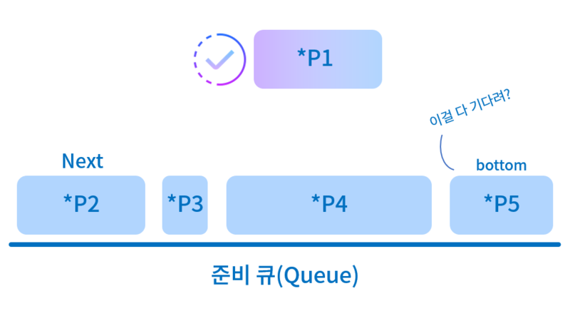
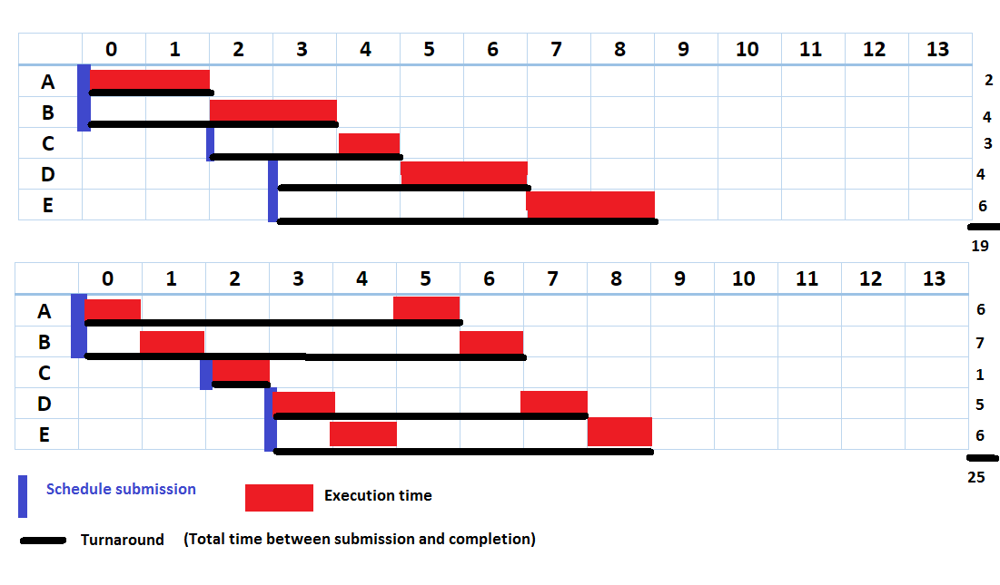
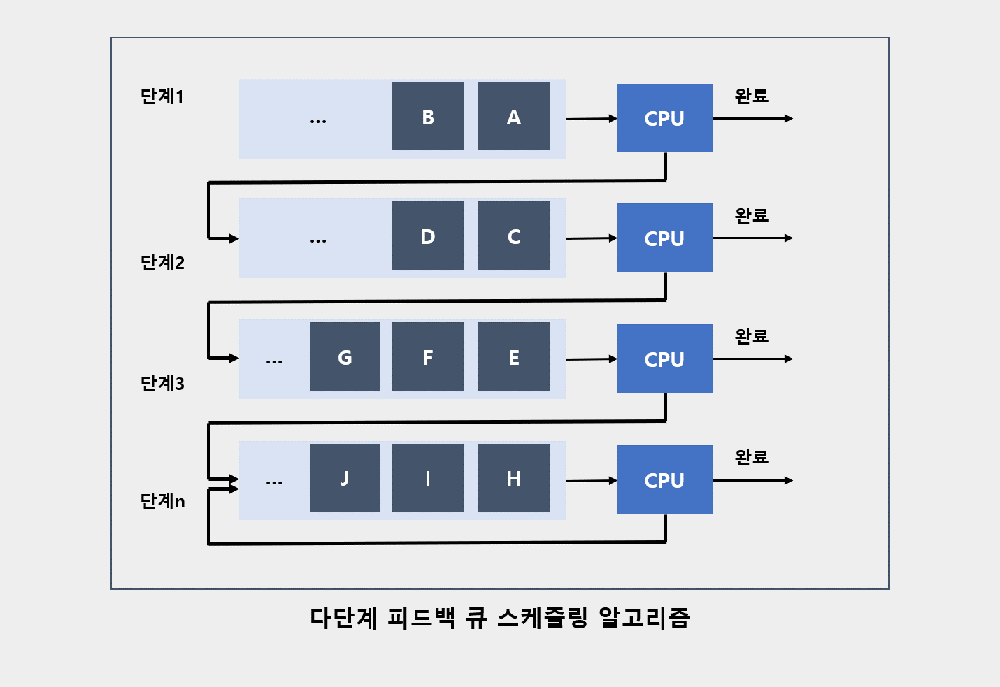

# 33. 운영체제 [CPU 스케줄링 알고리즘]

*출처 : 면접을 위한 CS전공지식 노트(책 / 강의)*

## CPU 스케줄링 알고리즘

#### 어떤 프로세스를 먼저 처리하는지 결정해 주는 알고리즘이다

#### 비선점형과 선점형으로 나뉜다

### 비선점형

> #### 프로세스가 CPU를 점유하고 있으면, 뺐을 수 없다
>
> - 즉 프로세스가 CPU를 점유하면, 끝날때까지 다른 프로세스가 CPU를 점유할 수 없다
>
> #### 컨텍스트 스위칭에 인한 부하가 적다

#### FCFS (First Come First Served)

- 먼저 들어오는 프로세스를 먼저 처리하는 알고리즘이다
- 중간에 길게 실행되는 프로세스 때문에, '준비 큐'에서 오래 기다르는 현상 (**Convoy Effect**)가 발생한다

#### SJF (Shortest Job First)

- 실행 시간이 제일 짧은 프로세스부터 실행하는 알고리즘이다
- SJF에서는 긴 실행 시간을 가지고 있는 프로세스가, 오랫동안 '준비 큐'에서 기다려야 하는 **starvation**현상이 일어난다
  - 중간에 실행 시간이 짧은 프로세스가 들어오면, 그 프로세스는 '준비 큐'의 앞 부분으로 들어간다
  - 즉 제일 뒤에 있는 프로세스는 지속적으로 실행이 안 될 수도 있다 (무한 대기가 발생한다)
- 실행 시간은 정확하게 알 수 없다. 그래서 과거의 실행 시간을 기반으로, 추측을 해서 사용한다

.png)

#### 우선순위

- '준비 큐'에서 더 오래 있을 수록, 우선순위를 더 높이는 알고리즘이다
- SJF의 **starvation**을 해결하고자 만든 알고리즘이다
- FCFS를 활용하여 만들기도 한다

### 선점형

> #### 프로세스가 CPU를 할당 받아 실행 중이더라도, 운영체제가 이를 강제로 뺐을 수 있는 방식
>
> #### CPU 처리 시간이 긴 프로세스의 CPU 사용 독점을 막을 수 있다
>
> #### 잦은 Context Switch로 오버헤드가 커질 수 있다

#### 라운드 로빈

- 각 프로세스에게 동일한 할당 시간을 주고, 그 시간이 끝나면 바로 다음 프로세스로 넘어가는 것이다
  - 여기서 만약에, 프로세스 실행 시간이 다 끝나지 않고, 종료가 되었을 때, 다시 준비 큐의 뒤로 가는 알고리즘
  - 이 것을 프로세스 실행 시간이 모두 끝날 때까지, 순회를 한다
- 예) 아래 이미지에서 A, B, C, D, E가 있고 모두 라운드 로빈을 통해 1초씩 실행 시간이 할당이 된다
  - C 같은 경우 1초면 프로세스 실행이 완료되어서 한번만 돌리면 된다
  - A는 1초가 끝나면 1초가 남기 때문에 준비 큐의 맨 뒤로 가게 된다
  - 이렇게 B, D, E도 같이 준비 큐 맨 뒤로 간다
  - 그리고 한번 더 1초 씩, A, B, D, E를 실행한다

#### SRF ()

- 비선점형의 SJF와 달리, 중간에 더 짧은 작업이 들어오면, 기존 프로세스를 중단하고, 더 짧은 작업을 실행한다

#### 다단계큐

- 준비 큐를 여러 개 갖는 것이다
- 즉 '준비 큐'를 위주로 우선순위를 주는 것이다
  - 준비 큐 마다, 각자만의 알고리즘을 적용할 수 있다
- 하지만 '준비 큐'간에 프로세스가 이동이 안 된다
- 그리고 다단계큐에서도 starvation 현상이 발생한다

