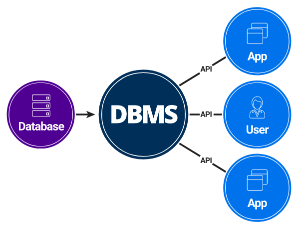
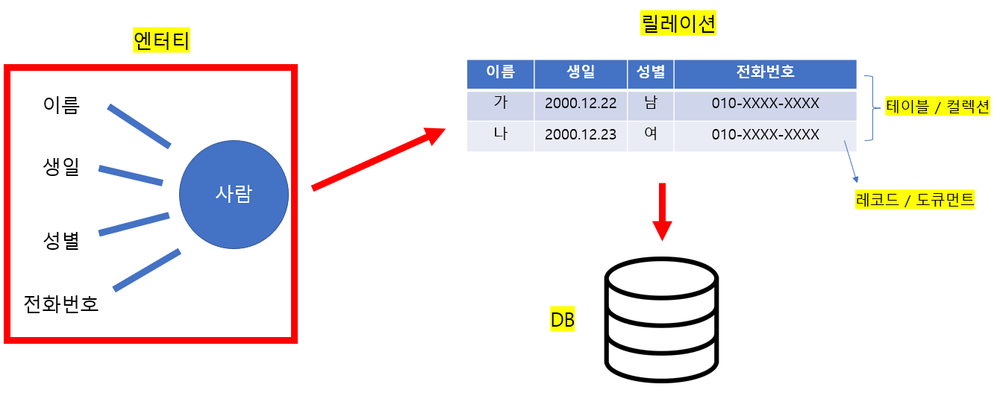
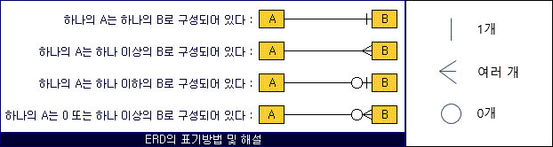
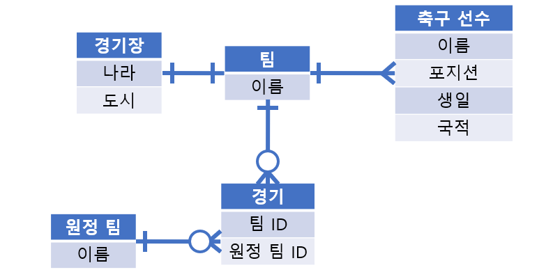
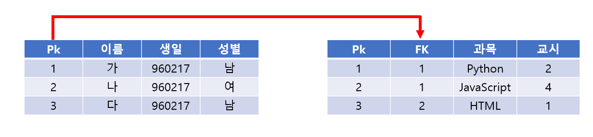

# 34. 데이터 베이스 [데이터 베이스의 기본]

*출처 : 면접을 위한 CS전공지식 노트(책 / 강의)*

## 데이터 베이스의 기본

> #### 데이터 베이스란?
>
> - 데이터의 저장소, 즉 데이터의 집합이다
>
> #### DBMS란?
>
> - DataBase Management System으로 데이터베이스를 관리하고 운영하는 소프트웨어다
> - 특정 DBMS마다 정의된 쿼리 언어 (query language)를 통해 데이터를 삽입, 조회, 수정, 삭제 (CRUD)를 할 수 있다
> - DBMS는 MySQL, PostgreSQL등이 있다
>
> MangoDB 같은 경우 NoSQL 데이터베이스로, SQL을 사용하지 않고 함수를 이용하여 데이터를 끄집어낸다

### 엔터티 (Entity)

- **실체, 객체라고 할 수 있다**
- 개념, 장소, 사건 등을 가리킨다
- 저장되고, 관리되어야 하는 데이터다
- 고유의 식별자가 있어야 한다. ex) 학번, ID
- 속성이 있어야 한다. ex) 학번, 이름, 학점, 전공
- **약한 엔터티 / 강한 엔터티**
  - **약한 엔터티** : 혼자서 존재가 불가능 하다
  - **강한 엔터티** : 혼자서 존재가 가능하다
  - 방은 건물 안에 존재한다. 방은 건물 없이는 존재할 수 없어, **약한 엔터티**다. 그리고 건물은 **강한 엔터티**다

### 릴레이션 (Relation)

- 엔터티에 관한 데이터를 데이터베이스에서 릴레이션 하나에 담아서 관리한다
  - 즉 엔터티가 데이터베이스에서 관리가 될 때에는 릴레이션으로 변화된다
- 관계형 데이터 베이스에서는 릴레이션을 **'테이블'**
  - 관계형 데이터베이스는, 레코드가 쌓이고, 테이블이 쌓여서 데이터베이스가 된다
  - **레코드 - 테이블 - 데이터 베이스**
- NoSQL 데이터 베이스에서는 릴레이션을 **'컬렉션'**
  - NoSQL 데이터 베이스는, 도큐먼트가 쌓이고, 컬렉션이 쌓여 데이터베이스가 된다
  - **도큐먼트 - 컬렉션 - 데이터베이스**
  - 꼭 이런 것은 아님. Redis 같은 경우 도큐먼트가 아닌 set, hash 등 여러 개가 있다

### 속성

- 필요한 정보다
- 위를 예로 들으면, 이름, 생일, 성별, 전화번호가 '사람'에 대한 **속성**이다

### 도메인 (Domain)

- 각각의 속성들이 가질 수 있는 값의 집합이다
- 예를 들어 성별 같은 경우 {남, 여}라는 집합이 있다

### 필드와 레코드

> #### 엔터티 정의하고 데이터 베이스에 넣을 때, 데이터베이스에서는 필드와 레코드로 구성된 테이블을 만든다
>
> - 레코드는 튜플로 불리기도 한

#### 엔터티를 데이터 베이스에 넣을 때, 속성에 맞는 타입을 정의해야 한다

- **INT, VARCHAR, CHAR, DATE, DATETIME** 등의 타입을 속성에 맞게 정의할 수 있다

#### 필드 타입 (MySQL 기준)

- 숫자 타입
  - **TINYINT, SMALLINT, MEDIUMINT, INT, BIGINT**
    - 숫자의 범위가 다르다 (INT : 4바이트, -21억 ~ 21억)
- 날짜 타입
  - **DATE** : 3 바이트로, 날짜 부분만 값으로 활용한다 
    - 1000-01-01 ~ 9999-12-31
  - **DATETIME** : 8 바이트고, 날짜와 시간 모두 표현한다
    - 1000-01-01 00:00:00 ~ 9999-12-31 23:59:59
  - **TIMESTAMP** : 4 바이트고, 날짜와 시간 모두 표현하지만, DATETIME보다 범위가 적다
    - 카운트 값이다. 예) 1970-01-01 00:00:01 은 1초
    - 1970-01-01 00:00:01 ~ 2038-01-19 03:14:07
- 문자 타입
  - **CHAR** : () 을 추가해서, 몇 자까지 입력하는지 정할 수 있다 (0~255사이)
    - 용량이 () 안에 들어간 수를 고정 값으로 정한다
    - 예) CHAR(30) 이면, 20자를 넣든, 28자를 넣든 30 바이트로 고정된다
  - **VARCHAR** : () 을 추가해서, 몇 자까지 입력하는지 정할 수 있다  (0~65,535사이)
    - 들어간 문자열 수 만큼, 길이기록요 1바이트만 더해서 용량에 넣는다
    - 예) VARCHAR(30)이면, 20자를 넣으면 21바이트, 28자를 넣으면 29바이트로 용량에 저장된다
  - **TEXT** : 큰 문자열을 저장할 때 사용된다 (본문 같은)
  - **BLOB** : 이미지, 동영상 데이터 등 큰 데이터를 저장할 때 사용된다
    - 하지만 주로 CDN을 사용해서, 서버에 파일을 올리고 경로를 VARCHAR로 저장한다
    - 더 빠르게 이미지를 불러올 수 있다

### 관계

> #### 데이터 베이스에는 여러 테이블이 존재한다
>
> #### 그리고 이 테이블끼리 서로 관계가 정의되어 있다

#### 1:1 관계

- 하나의 '**팀**'은 하나의 '**경기장**'을 사용한다

#### 1:N 관계

- 하나의 '**팀**' 안에는 여러 명의 '**축구 선수**'가 있다

#### N:M 관계

- 경기는 하나의 팀이 여러 번, 다수의 팀들과 진행을 한다
- **팀**과 **원정팀**을 바로 연결하지 않고, 중간에 '**경기**'라는 테이블로 두 팀들을 연결시킨다

### 키

> #### 인덱스를 위해 설치된 장치
>
> #### 테이블 간의 관계를 더 명확하게 연결할 수 있고, 키를 통해 더 빠르게 튜플 (레코드)를 찾을 수 있다

.png)

#### 유일성 : 중복되는 값이 없음

- 슈퍼키 / 후보키 / 기본키 / 대체키

#### 최소성 : 필드를 조합하지 않고 최소 필드만 써서 키를 형성

- 후보키 / 기본키/ 대체키

#### 기본키

- PK (Primary Key)라고 많이 불리고, 유일성과 최소성을 만족하는 키다
- PK는 레코드 마다 모두 다른 고유의 값으로 이루어져 있다 (PK는 중복되는 값이 있으면 안 된다)
- 그리고 PK 값만 있는 필드로 PK가 만들어진다
- **자연키 / 인조키**를 고를 수 있다
  - 자연키 : 언젠가는 바뀌는 속성이 있다
    - 예) 960217 이라는 주민등록번호가 있는데, 2096년에 960217을 사용할 수 없게 된다
    - 즉 960217은 2096년에는 바뀔 것이다 (PK로 설정했을 때, 둘은 같은 값이 되는 것을 막아야 한다)
  - 인조키 : 인위적으로 생성한 키다 (대부분 기본키는 인조키다)

#### 외래키

- FK (Foriegn Key)라고 불린다
- 다른 테이블의 PK, 기본키를 그대로 참조하여, 테이블의 관계를 이어주는 역할을 한다

#### 후보키

- 기본키가 될 수 있는 유일성과 최소성을 만족하는 키다

#### 대체키

- 후보키가 두 개 이상일 때에, 하나를 기본키로 설정하고, 남은 후보키를 대체키로 불린다

#### 슈퍼키

- 유일성만 갖춘 키다
