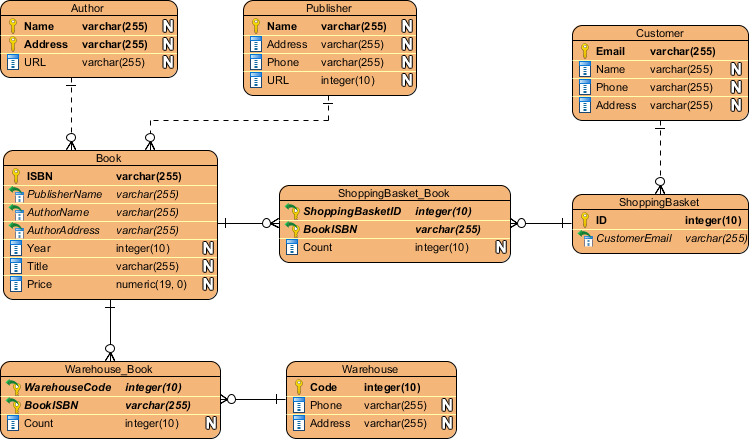

# 34. 데이터 베이스 [ERD]

*출처 : 면접을 위한 CS전공지식 노트(책 / 강의)*

## ERD (Entity Relation Diagram)

#### 데이터 베이스를 구축할 때에 가장 기본적으로 뼈대 역할을 한다

#### 데이터 베이스 안에 있는 테이블 간의 관계를 정의한다

#### 사용자 또는 시스템의 요구 사항을 기반으로 작성이 된다

