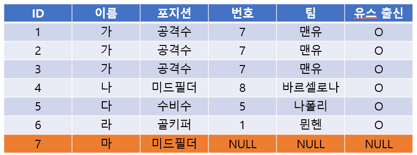
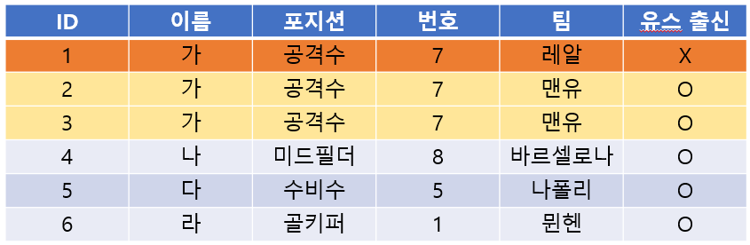
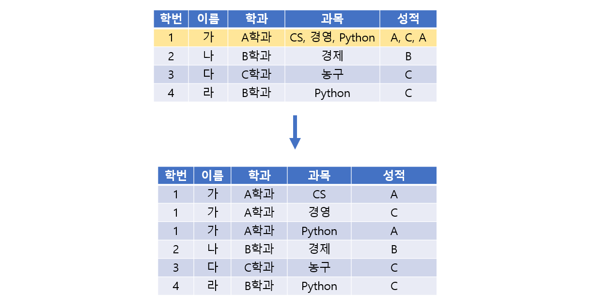
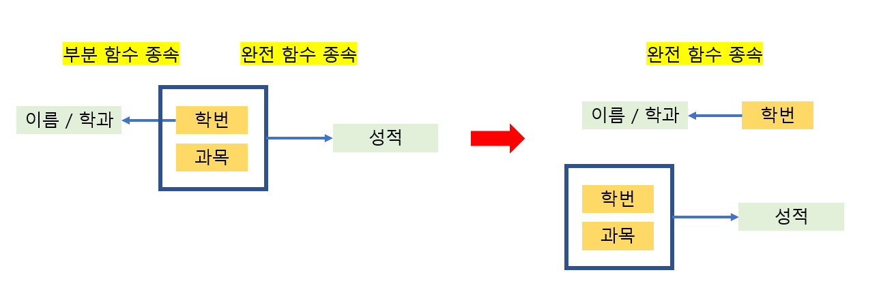
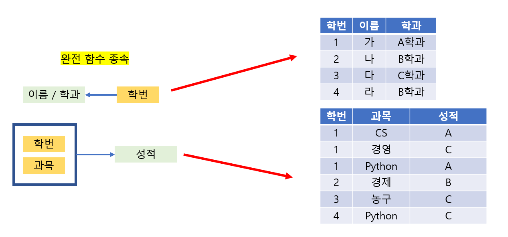
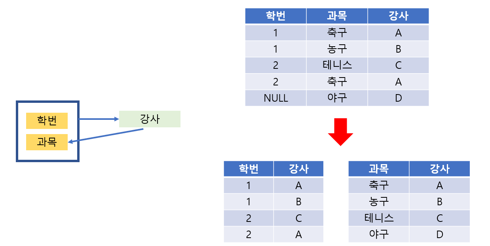

# 35. 데이터 베이스 [ERD, 정규화 과정]

*출처 : 면접을 위한 CS전공지식 노트(책 / 강의)*

## ERD (Entity Relation Diagram)

#### 데이터 베이스를 구축할 때에 가장 기본적으로 뼈대 역할을 한다

#### 데이터 베이스 안에 있는 테이블 간의 관계를 정의한다

#### 사용자 또는 시스템의 요구 사항을 기반으로 작성이 된다

## 정규화 과정 (Normalization)

> #### 정규화 과정은 테이블/릴레이션을 나누는 것이다
>
> - 저장 공간을 효율적으로 사용할 수 있다
>   - 테이블을 조인 하면서 느려질 수도 있지만, 대체로 성능이 더 좋아질 수 있다
> - 이상현상을 해결한다
> - 함수적 종석성을 통해 정규화 과정을 진행한다

#### 이상현상 (Anomaly)?

- 데이터의 삽입, 갱신, 삭제를 할 때에 테이블/릴레이션에 부작용이 일어나는 것
  - 불필요한 데이터가 중복으로 삽입되거나, 필요한 데이터가 삭제가 되거나, 같은 값을 가진 레코드들인데, 하나만 갱신이 되거나
- **삽입 이상**
  - 삽입을 할 때, 불 필요한 데이터가 추가해야 될 , 삽입 이상이라고 한다
    - ID 7번은 선수만 등록하고, 팀이 없을 때다
    - 이때, 이름과 포지션만 등록하여, 번호, 팀, 유스 출신에는 NULL 값으로, 불필요한 데이터가 추가됬다

- **갱신 이상**
  - 중복 레코드가 있을 때, 일부만 변경하여 데이터가 불일치 되는 문제
    - '가'라는 공격수가 레알로 이적했다
    - 1~3은 '가'에 대한 정보인데, 1번만 데이터가 갱신이 되었다
    - 원래는 1~3 모두 데이터가 갱신되어야 하는 불편함이 있다

- **삭제 이상**
  - 레고드를 삭제할 때, 필요한 데이터까지 삭제를 하는 것
    - 은퇴를 해서 팀과, 유스 출신 정보만 없애면 되는데, 레코드 자체를 없애야 할 때

### 함수적 종속성

> #### DB 속성들간의 종속 관계를 말한다
>
> #### 테이블의 필드들의 종속 관계를 알아야, 불필요한 데이터를 줄일 수 있고, 더 논리적으로 만들 수 있다

#### '학번'을 통해 학생의 '학년'/ 이름 등을 알 수 있다

- 학번은 중복될 수 없다 / 즉 학년 또는 이름이 같더라도, 학번이 달라서, 다른 학생으로 취급된다
- **'학번'은 학생의 '학년' 또는 '이름'을 결정한다**

#### 완전 함수 종속 / 부분 함수 종속

- **학번, 과목번호    ▶️    성적**
  - **완전 함수 종속** : 학번, 과목번호 모두 알아야 성적을 알 수 있다
  - 즉 Y가 X의 전체에 종속된 것

- **과목번호, 학번    ▶️    학년**
  - **부분 함수 종속** : 학년을 알기 위해서는 과목번호까지는 몰라도 된다
  - 즉 Y가 X의 부분만 종속된 것

### 제 1 정규형

> #### 원자값이 아닌 도메인을 분해한다

- '가'의 '과목'과 '성적'에서 값들이 두개 이상을 가지고 있다
- 값들을 다른 레코드로, 분리해서 다시 테이블을 만든다

### 제 2 정규형

>  #### 부분 함수 종속 제거
>
> - 부분 함수 종속이었던 것을 완전 함수 종속으로 만들면 된다
>
> #### 릴레이션을 분리할 때에, 나중에는 릴레이션들이 다시 분해 전의 릴레이션으로 복원이 가능해야 한다

- 전에는 성적은 {학번, 과목}의 완전 함수 종속이었고, '이름/학과'은 {학번, 과목}의 부분 함수 종속이었다
- '이름/학과'을 학번과 직접적으로 연결시켜 완전 함수 종속으로 바꾼다

- 두 개의 릴레이션은 학번으로 연결시킬 수 있다

### 제 3 정규형

>  #### 이행 함수 종속 제거

.png)

- 모든 릴레이션들이 서로 연결이 되어 있는 것을 제거 하는 것이다
- 위에서 고객 아이디와 할인율의 연결을 제거한다
  - 고객 아이디의 등급을 따라 할인율이 정해질 수 있다
  - 그렇다고 고객 아이디마다 할인율을 넣게 되면, 할인율이 바뀔때마다, 모든 고객 아이디의 할인율을 변경해야 한다

### 보이스 / 코드 정규형 (BCNF)

> #### 모든 결정자가 후포키인 상태를 말한다
>
> - 비결정자에 의해 함수 종속 관계를 해결하는 것이다
> - 즉 모든 속성이 모든 후보키에 대해 만족할 만한 함수 종속 관계를 유지시킨다

- **강사는 후보키가 아니지만, 과목을 결정하는 결정자 역할을 한다**
- BCNF를 사용하면 좋은 점
  - 제일 처음 D 강사가 야구라는 과목을 만들었지만, 아무도 안 듣는 경우
  - 한 테이블에 NULL이란 값으로 레코드를 추가하지 않아도 된다
  - 과목을 다루는 테이블에 과목과 강사 이름만 추가하면 된다

> 고급 정규형 4, 5 정규형도 있지만 중요하지 않다
>
> - 제 4 정규형 : 다중치 종속 제거
> - 제 5 정규형 : 후보키를 통하지 않은 조인 종속 제거

