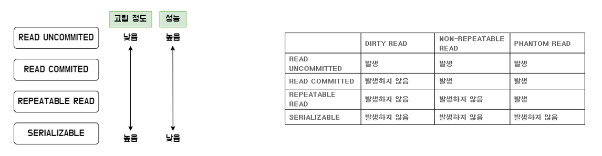

# 36. 데이터 베이스 [트갠잭션과 무결성]

*출처 : 면접을 위한 CS전공지식 노트(책 / 강의)*

## 트랜잭션 (Transaction)

> #### 하나의 논리적 기능을 수행하기 위한 작업의 단위
>
> - 쿼리를 통해 데이터 베이스를 접근한다 / **여러 개의 쿼리들을 하나로 묶는 단위가 트랜잭션이다**

.png)

### Commit 과 Rollback

- **Commit** : 여러 쿼리가 성공적으로 처리된 상태다
  - 즉 트랜잭션이 성공적으로 완료되었다는 것이다

- **Rollback** : 쿼리를 실행하던 중 오류가 발생하고, 트랜잭션이 일어나기 전 상태로 돌아가는 것
  - 즉 오류가 발생하기 전에 실행했던 모든 쿼리들을 undo한다
  - Rollback에서 해당 트랜잭션을 다시 시작하거나, 없앤다

### ACID

> #### 트랜잭션의 4개의 특징이 있다

- **Atomic (원자성)**
  - 트랜잭션은 완전히 성공하던지, 완전히 실패하던지 두 종류가 있다
  - 트랜잭션 일부분만 성공을 한다는 것은, 트랜잭션이 실패를 했다는 것이다
    - 일부분만 성공했어도, 이용자는 결과물이 실패로 뜨는 것을 본다

- **Consistency (일괄성)**
  - 트랜잭션의 작업 처리 결과가 항상 일관성이 있어야 한다
  - '허용된 방식'으로만 데이터를 변경해야 한다
  - 트랜잭션이 성공적으로 완료하면 언제나 일관성 있는 데이터베이스 상태로 변환한다
    - 트랜잭션 중 업데이트가 일어나도, 처음에 트랜잭션을 진행하기 위해 참조한 데이터베이스로 트랜잭션을 진행한다

- **Isolation (독립성, 격리성)**
  - 트랜잭션 중, 다른 트랜잭션이 일어나지 않도록 한다
    - 즉 두 개 이상의 트랜잭션이 한번에 진행될 수 없다 / 한번에 하나씩

- **Durability (지속성)**
  - 성공적으로 트랜잭션을 수행했다면, 수행된 트랜잭션의 데이터베이스에 영구적으로 반영이 되어야 한다
  - 체크섬, 저널링, 롤백을 통해 데이터베이스에 시스탬 장애가 발생해도 원래 상태로 복구할 수 있다
    - 체크섬 : 중복 검사를 하여, 오류 정정을 통해 송신된 자료의 **무결성**을 보호하는 방법이다
    - 저널링 : commit 하기 전에 로깅을 하고, 트랜잭션 등 변경 사항에 대한 로그를 남기는 것이다
  - **무결성** : 정확성, 일관성, 유효성을 유지한다 (데이터의 신뢰도를 높이는 것)
    - **개체 무결성** : 기본키는 빈 값을 가지면 안 된다
    - **참조 무결성** : 참조 관계에 있는 두 테이블의 데이터는 항상 일관된 값을 유지한다
    - **고유 무결성** : 고유한 조건을 가진 데이터는, 모두 고유한 값을 가진다
    - **NULL 무결성** : NULL이 들어갈 수 없다면, NULL이 속성으로 들어가면 안 된다

#### 

#### Isolation Detail (격리성을 자세하게)

> 격리성을 통해 트랜잭션이 수행될 때, 다른 트랜잭션이 간섭을 못 한다
>
> 하지만, 이렇게 되면, 앞에 트랜잭션을 기다려야 하는 시간 때문에 성능이 떨어진다
>
> 그래서 격리성 수준을 낮춰서, 한번에 여러 트랜잭션을 진행하면서, 성능을 높이는 단계가 있다

#### 격리 수준에 따른 현상

- **팬텀 리드 (Phatom Read)**
  - 한 트랜잭션 내에 동일한 쿼리를 두 번 이상 보냈을 때, 조회 결과가 다른 경우
  - 테이블 전체의 기준

- **반복 가능하지 않은 조회 (Non-Repeatable Read)**
  - 한 트랜잭션 내에 같은 행에 두번 이상 조회가 발생했는데, 값이 다른 경우를 가리키는 경우
  - 행/ 레코드의 기준

- **더티 리드 (Dirty Read)**
  - 커밋이 되지 않은 데이터까지 읽는 것이다
    - 롤백이 발생해도, 롤백이 발생하기 전에 완료된 트랜잭션의 데이터를 읽을 때 발생한다

##### Serializable

> 트랜잭션을 순차적으로 진행하는 것이다

- 가장 성능이 떨어지지만, 트랜잭션이 겹치지 않는다

##### Repeatable Read

> 커밋이 완료된 데이터에 대해서만 조회가 가능하다

- 두 개 이상의 트랜잭션이 발생할 때, 같은 행에 대한 데이터를 한번에 수정할 수 없도록 막아 준다
- 하지만, 서로 새로운 행을 추가하는 것은 막지 않는다
- 팬텀 리드가 발생할 수 있다
- MySQL 8.0의 innoDB 기본값

##### Read Commited

> 가장 많이 사용되는 격리 수준이다 (PostgreSQL, SQL Server)

- 한 트랜잭션에서 변경 내용이 커밋이 되어야만 다른 트랜잭션에서 조회가 가능하다
- 하지만 어떤 트랜잭션에서 접근한 행에, 다른 트랜잭션이 접근하여 수정을 할 수 있다

##### Read Uncommited

> 격리 수준이 가장 낮지만, 성능은 가장 빠르다

- 커밋되지 않은 트랜잭션의 정보도 읽을 수 있다
- 팬텀 리드, 반복 가능하지 않는 조회, 더티 리드 모두 일어날 수 있다
