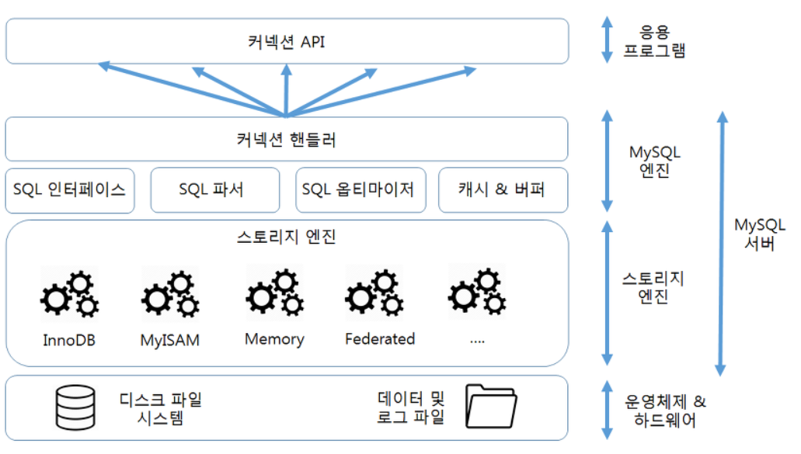

# 37. 데이터 베이스 [데이터 베이스의 종류]

*출처 : 면접을 위한 CS전공지식 노트(책 / 강의)*

## 관계형 데이터 베이스

> #### RDBMS (Relational Database Management System) 라고도 한다
>
> 대표적으로 MySQL, postgreSQL 이 있다

#### 행과 열을 가지고 테이블 형태로 데이터를 저장한다

#### SQL 언어를 사용하여 테이블을 조작한다

### MySQL

> 가장 많이 사용되는 데이터베이스다

- 테이블과 테이블 간의 조인을 빠르게 한다
- 최대 64개의 인덱스를 제공한다
- 대용량 데이터베이스를 위해 설계되어 있고 롤백, 커밋, 이중 암호 지원 보안 등의 기능을 제공한다
- **MySQL 스토리지 엔진 아키텍쳐**
  - 다양한 스토리지 엔진을 고를 수 있다
  - 쿼리 캐시가 있어, 같은 쿼리를 다시 사용했을 때에, 빠르게 결과값을 처리해준다

### PostgreSQL

- 최대 테이블의 크기는 32TB 이다
- JSON을 사용하여 데이터에 접근할 수 있다
- 지정 시간에 복구하는 기능, 로깅, 접근 제어, 중첩된 트랜잭션, 백업 등을 할 수 있다

## NoSQL 데이터 베이스

> #### Not Only SQL 로 SQL을 사용하지 않는다
>
> 대표적으로 MongoDB와 Redis 등이 있다

### MongoDB

- NoSQL의 대표적인 데이터 베이스다
- JSON을 통해 데이터를 접근하고, Binary JSON 형태 (BSON)로 데이터가 저장된다
- 와이어드타이거 엔진이 기본 스토리지 엔진이고 key-value 데이터로 저장이 된다
  - 일일이 key도 저장을 해야 되서, 저장 공간이 조금 더 필요하다
- 확장성이 뛰어나고, 빅데이터를 저장할 때 성능이 좋다
- 유연한 스키마를 가지고 있다
  - 다양한 도메인의 데이터베이스를 기반으로 분석, 로깅을 할 수 있다
- 아래와 같이 기본키가 만들어 진다 (타임스탬프, 랜덤값, 카운터)

- 2차원 좌표 인덱싱을 지원한다

### Redis

- key-value 데이터 모델 기반의 데이터베이스다
- set, hash도 지원한다
- 기본적인 데이터 타입은 문자열로 512MB까지 저장할 수 있다

- 채팅 시스템, 실시간 순위표 서비스, 세션 정보 관리, 캐싱 계층 등에 사용이 된다

## 스토리지 엔진

> #### 대표적으로 innoDB, MyISAM, wiredtiger가 있다

