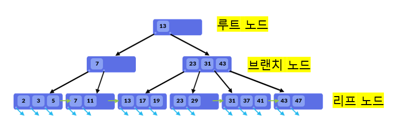
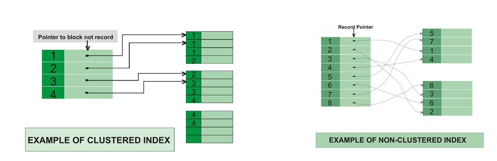

# 38. 데이터 베이스 [인덱스]

*출처 : 면접을 위한 CS전공지식 노트(책 / 강의)*


## 인덱스

> #### 인덱스는 데이터의 위치를 빠르게 찾게 해 주는 자료구조다
>
> - 데이터의 위치를 빠르게 검색하면, Update, Delete의 성능도 향상될 수 있다


#### 인덱스는, 책의 목차 페이지와 비슷하다

- 원하는 정보의 위치를 목차에 넣어두면, 빠르게 페이지를 찾을 수 있다


#### 반대로 인덱스를 사용하지 않으면, 데이터 하나하나 모두 탐색을 해야 한다

- 즉 테이블을 조회하는 속도와 성능을 증가시킨다
- 시스템의 부하를 줄일 수 있다
- **단점**
  - 인덱스 관리를 위해 약 10%의 저장공간이 필요하다
  - 인덱스 관리를 위해 추가 작업이 필요하다
  - 인덱스를 잘못 사용하면, 오히려 성능이 저하된다


#### 인덱스는 균형잡힌 B-Tree 기반으로 구축이 되어 있다

- 자식 노드가 2개 이상이다
- 루트 노드, 리프 노드, 브랜치 노드로 이루어져 있다
- 찾는 숫자의 **같거나 큰 기준 ( <= )**으로 탐색을 한다




#### 대수확장성

- 리프 노드 수가 매우 느리게 성장한다
- 인덱스가 한 깊이씩 증가할 때마다 최대 인덱스 항목의 수는 4배씩 증가한다
- 즉 아래와 같이, 트리 깊이 10개로 100만 개의 레코드를 검색할 수 있다

| 트리 깊이        | 1    | 2    | 3    | 4    | 5    | 6    | 7     | 8     | 9      | 10      |
| ---------------- | ---- | ---- | ---- | ---- | ---- | ---- | ----- | ----- | ------ | ------- |
| 인덱스 항목의 수 | 4    | 16   | 64   | 256  | 1024 | 4096 | 16384 | 65536 | 262144 | 1048576 |


## 인덱스 최적화 기법

> #### 데이터 베이스마다 조금씩 다르지만, 기본적인 골조는 똑같다


### MongoDB 최적화

> #### 비용

- 인덱스 리스트, 컬렉션 순으로 탐색을 한다 (2번 탐색)
  - 컬렉션을 수정하면, 인덱스도 수정해야 한다
  - B-트리 높이도 균형 있게 조절해야 한다
  - 데이터를 효율적으로 조회할 수 있도록, 분산 시키는 비용도 들어간다
- 쿼리에 있는 필드에 인덱스를 무조건 설정하지 않아도 된다 (비용 줄이기)


> #### 테스팅 하기

- EXPLAIN 함수를 통해 쿼리를 테스트 하고, 테스트 시간을 최소화 시킨다


> #### 같음, 정렬, 다중 값, 카디널리티 순

- **==** 또는 **equal** 이라는 쿼리를 제일 먼저 인덱스로 설정한다
- 정렬은 주로 마지막에 넣는다
- **>** 또는 **<** 를 써야 하는 쿼리는 나중에 인덱스를 설정한다
- 유니크한 값의 정도가 카디널리티다. 카디널리티가 높은 것을 기준으로 인덱스를 생성한다


```mysql
SELECT * FROM table_name
WHERE age = 2

SELECT * FROM table_name
WHERE age = 2
ORDER BY name ASC

SELECT * FROM table_name
WHERE age > 2
ORDER BY name ASC

SELECT * FROM table_name
WHERE email = 'jejoonlee@naver.com'
ORDER BY name ASC
```


## Clustered Index vs Non Clustered Index




### Clustered Index

- 유일성과, 최소성을 가진다
- Clustered Index는 테이블 당 한개씩 존재한다
- 노드 마다 실제 데이터 테이블이 존재한다
- 인덱스를 생성할 때마다, 데이터 페이지를 정렬한다
  - 반대로 데이터가 추가될 때마다 모든 테이블을 정렬을 해서, 삽입, 삭제, 수정이 느리


### Non Clustered Index

- Non Clustered Index는 테이블 당 여러 개가 존재가 가능하다
- 노드 마다 데이터 페이지에 대한 포인터만 있고, 실질적인 데이터는 없다

- 정렬이 되어 있지 않아서 탐색이 비교적 느리다
  - 반대로 데이터의 삽입, 삭제, 수정이 더 빠르다


