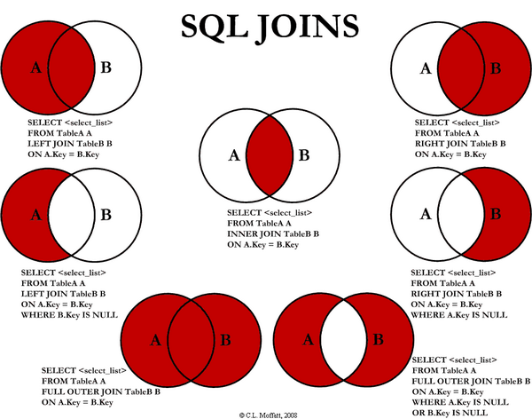

# 39. 데이터 베이스 [조인]

*출처 : 면접을 위한 CS전공지식 노트(책 / 강의)*


## 조인 (Join)

> #### 조인은 두 개 이상의 테이블을 합쳐서, 하나의 결과물을 만드는 것이다
>
> #### MySQL에서는 JOIN을 사용한다




#### 내부 조인 (Inner Join)

- 교집합 : A와 B에 같은 데이터들을 가지고 온다

```mysql
SELECT * FROM Table A as A
INNER JOIN Table B as B ON
A.key = B.key
```


#### 왼쪽 조인(Left Outer Join)

- A 테이블의 행이 모두 표출되는 것이다 (A테이블 = 왼쪽 테이블)

```mysql
SELECT * FROM Table A as A
LEFT JOIN Table B as B ON
A.key = B.key
```


#### 오른쪽 조인 (Right Outer Join)

- B 테이블의 행이 모두 표출이 된다 (B테이블 = 오른쪽 테이블)

```mysql
SELECT * FROM Table A as A
RIGHT JOIN Table B as B ON
A.key = B.key
```


#### 합집합 조인 (Full Outer Join)

- A와 B 테이블의 모든 행이 모두 표출된다

```mysql
SELECT * FROM Table A as A
FULL OUTER JOIN Table B as B ON
A.key = B.key
```


