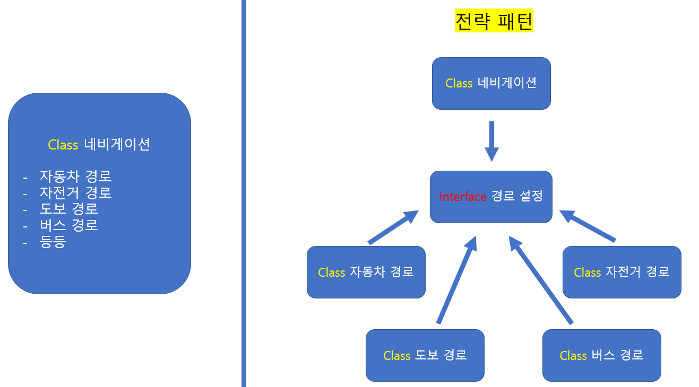
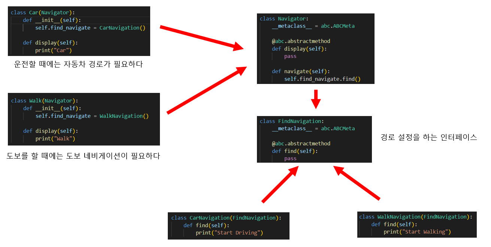
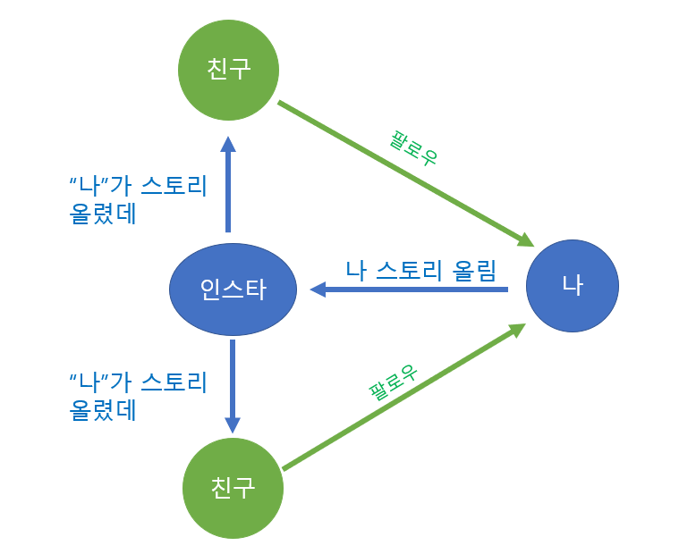

# 3. 디자인 패턴 (전략 패턴, 옵저버 패턴)

*전략 패턴, 옵저버 패턴*


## 전략 패턴 (정책 패턴)

> #### 캡슐화한 알고리즘을 통해, 서로 교환해서 사용할 수 있는 패턴이다
>
> #### 즉 다양한 메소드들을 캡슐화를 한 후, 필요할 때마다 교환하여 사용하는 것이다
>
> - 캡슐화는 클래스를 정의할 때, 내부의 속성과 메서드를 묶어서 하나의 단위로 처리하는 것이다.



- 전략 패턴이 없을 때에는 모든 메서드가 하나의 클래스에 들어간다
  - 메서드가 많이 없을 때에는 괜찮지만, 많아질 경우 에러가 발생할 수 있다
- **전략 패턴**
  - 네비게이션 (컨택스트, context)을 이용할 때에, 다양한 방법으로 경로를 찾을 수 있다 (자동차 경로, 도보 경로 등)
  - 각각의 경로들을 캡슐화를 하여, 각각의 클래스로 만들어 준다
  - 경로 설정 인터페이스를 통해 어떠한 경로를 사용할 수 있을지 정해준다


#### 위와 같이, 캡슐화를 하면, 나중에 추가 기능을 만들 때에, 새로운 클래스만 만들면 된다

#### 다른 예시로는, 인터넷 쇼핑

- 결제 방법 (카카오 페이, 삼성 페이, 네이버 페이 등등)
- 각각의 전략 (결제 방법)을 선택해서 결제를 할 수 있다


```python
import abc

class Navigator:
    __metaclass__ = abc.ABCMeta

    @abc.abstractmethod
    def display(self):
        pass

    def navigate(self):
        self.find_navigate.find()

class Car(Navigator):
    def __init__(self):
        self.find_navigate = CarNavigation()

    def display(self):
        print("Car")

class Walk(Navigator):
    def __init__(self):
        self.find_navigate = WalkNavigation()

    def display(self):
        print("Walk")

class FindNavigation:
    __metaclass__ = abc.ABCMeta

    @abc.abstractmethod
    def find(self):
        pass

class CarNavigation(FindNavigation):
    def find(self):
        print("Start Driving")

class WalkNavigation(FindNavigation):
    def find(self):
        print("Start Walking")

car = Car()
walk = Walk()

car.display()
car.navigate()
print("-------------------")
walk.display()
walk.navigate()

# Car
# Start Driving
# -------------------
# Walk
# Start Walking
```




## 옵저버 패턴 (Observer Pattern)

> #### 주체가 어떤 객체의 관찰된 상태를 객체를 팔로우, 구독 등을 하고 있는 옵저버들한테 메서드 등을 통해 상태를 알려주는 패턴이다.
>
> - 카카오 프로필을 바꿀 때마다, 나와 친구인 사람들은 내가 카카오 프로필을 바꿨다고, 업데이트 목록을 통해 볼 수 있다
> - 또는 모바일 폰 제조업체를 구독하여, 핸드폰이 새로 나올때, 알림을 받을 수 있게 설정을 할 수 있다



