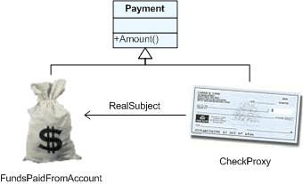
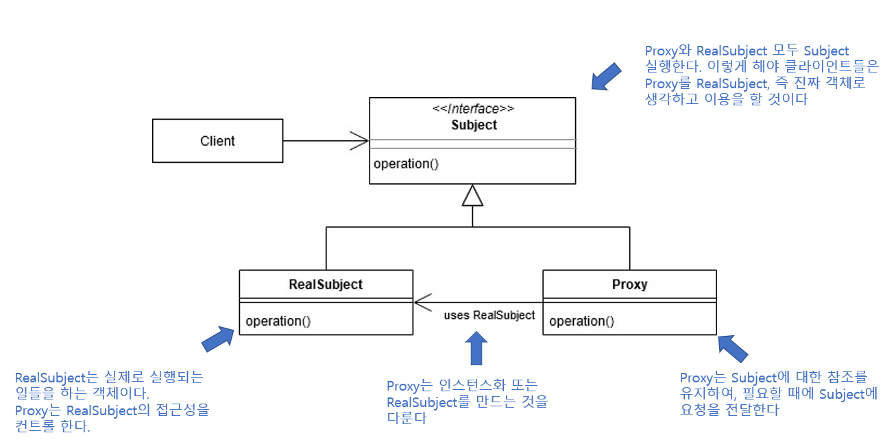
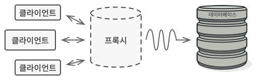

# 4. 디자인 패턴 (프록시 패턴)

*프록시 패턴*

## 프록시 패턴

> #### Proxy : 대변인
>
> #### 클라이언트가 서버에 요청을 하면, 서버 대신, 프록시가 응답을 해준다
>
> #### 즉 클라이언트는 프록시를 통해 서버를 간접적으로 사용하는 것이다 - 프록시 서버

### 프록시의 기능

> 클라이언트로부터 요청이 들어오면, 프록시는 실제 서비스 객체를 생성하고, 모든 작업을 생성한 객체들에게 위임한다
>
> 보안, 데이터 검증, 캐싱, 로깅 (기록)

#### 보안

- 클라이언트, 즉 사용자들이 직접적으로 서비스를 사용하는 것이 아닌, 간접적으로 사용하는 것이다
  - 즉, 익명 사용자들이 직접적으로 서비스를 사용하지 못 하게 하여, 실제 서버를 공격하는 것을 차단할 수 있다
- CloudFlare은 프록시 서버를 통해 DDOS 공격을 방어할 수 있다
  - DDOS : 짧은 기간 동안 네트워크에 많은 요청을 보내, 네트워크를 마비시켜, 웹 사이트의 가용성을 방해하는 사이버 공격 유형 *면접을 위한 CS 전공지식 노트에서*

#### 캐싱

- 데이터 중, 가져오기 비용이 드는 데이터들을 임시로 저장해 두는 것이다
  - 예를 들면, 사진, 동영상 등을 브라우저 또는 클라이언트, 서버 사이의 프록시에 임시로 저장하는 것
- 이렇게 중간에 임시로 저장하게 되면, 나중에 똑같은 데이터를 사용할 때에, 서버와 직접 접속해서 사용할 필요가 없어진다
  - 즉 다시 데이터를 사용할 때에, 사용하는 시간이 줄어든다는 것이다

