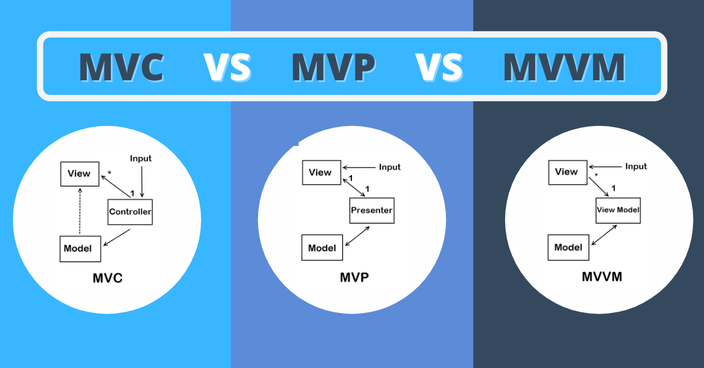

# 5. 디자인 패턴 (MVC, MVP MVVM 패턴)

*MVC, MVP MVVM 패턴*

## MVC 패턴

> #### Model, View, Controller

### Model

> 어플리케이션의 정보, 데이터를 나타낸다

- 어플리케이션이 **무엇**을 할 것인지 정의한다
  - 데이터, DB와 상호작용 (CRUD), 알고리즘 등

### View

> 텍스트, 체크박스 등, 데이터를 유저들이 볼 수 있도록 시각화 하는 것이다 (UI)

- 모델이나 컨트롤러가 보여주려고 하는 모든 것들을 보여 준다
- 데이터가 존재해도, 유저가 읽을 수 없거나, 볼 수 없으면 무의미하

### Controller

> 데이터와 비즈니스 로직 사이의 상호 동작 관리한다
>
> 이벤트, 매인 로직을 담당한다

- 사용자의 요청에 따라, 모델을 변경할 수 있다
- 컨트롤러와 관련된 뷰가 있으면, 모델이 어떻게 시각화 되는지 변경할 수 있다

### MVC 패턴의 장점

- **역할 분배가 잘 되어 있다**
  - Model, View, Controller 라는 세가지 역할들이 정확이 나눠져 있다
  - 즉 개발을 할 때에, 한 역할에 집중을 하여 개발을 할 수 있다
- **재사용과 확장이 가능해 진다**

### 단점

- 복잡한 대규모 프로그램을 개발하게 되면 문제점이 생긴다
  - 뷰와 모델 사이의 의존성이 높다

## MVP 패턴

> #### Model, View, Presenter

#### MVC와 똑같다

#### 단 Controller 대신 Pattern을 사용하고, View와 Pattern이 1 대 1 관계다

- Presenter를 통해 Model에서 데이터를 받아, View와 Model의 의존성을 없앴다
- 단, Model과 Presenter 사이의 의존성이 높아졌다 (단점)

## MVVM 패턴

> #### Model, View, View Model

#### 위와 같은 패턴이다

#### Command패턴과 Data Binding 패턴을 사용하여, View와 View Model 사이의 의존성을 없앤다

