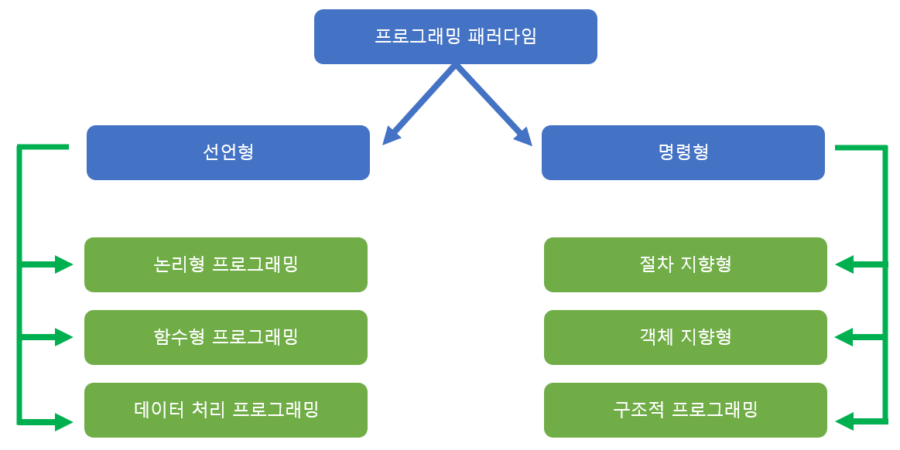
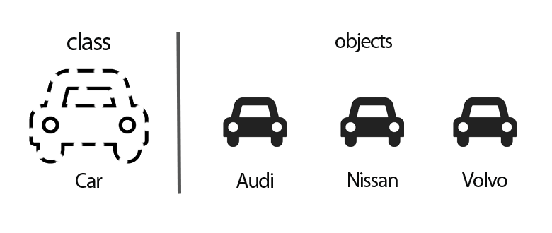

# 프로그래밍 패러다임

*CS 노트*


## 프로그래밍 패러다임이란?

> #### 프로그래밍 언어의 특징에 따라 분류를 하는 것이 프로그래밍 패러다임이다




### 명령형 프로그래밍 : 어떻게 (How) 할 것 인지를 설명하는 방식

### 선언형 프로그래밍 : 무엇을 할 것 인지를 설명하는 방식


## 선언형 / 함수형 프로그래밍

> #### 순수 함수로 이루어진 프로그램이다

```javascript
// 그냥 코드를 사용하여 결과값을 출력할 수 있다
for(int i = 1 ; i < 10; i++){
    System.out.println(i);
}

// 선언형은, 위와 같은 코드를 함수화 시키고
// 아래와 같이 함수를 선언해서, 결과값을 추출해 낸다
process(10, print(num));
```

- 함수형 프로그래밍을 사용하게 되면, 함수 안에 들어오는 값만 영향을 받고, 그 외의 값들은 영향을 받지 않는다. **(순수 함수)**
  - 즉, **부수 효과**가 없다
    - 부수 효과는 변화 또는 변화가 발생하는 작업
- 함수가 함수를 매개변수, 즉 값처럼 입력을 받아 사용될 수 있다 **(고차 함수)**


## 명령형 / 객체지향 프로그래밍


### 객체란? Object?

> #### 클래스라는 모형틀이 있고, 그 모형틀 안에 재료를 넣어주면, 특정 모형이 만들어진다
>
> #### 여기서 만들어지는 모형들을 객체라고 한다
>
> - 붕어빵 예시) 붕어빵 틀에 밀가루와 팥을 넣으면 붕어빵이라는 객체가 나온다. 여기서 붕어빵 틀이 클래스

​                                                                                                                                                                                                                                                                                                                                                                                                                                                                                                                                                                                                                                                                                                                                                                                                                                                                                                                                                                                                                                                                                                                                                                                                                                                                                                                                                                                                                                                                                                                                                                                                                                                                                                                                                                                                                                                                                                                                                                                                                                                                                                                                                                                                                                                                                                                                                                                                                                                                                                                                                                                                                                                                                                                                                                                                                                             


### 객체지향 프로그래밍이란?

> #### 단순히 데이터와 처리 방법으로 나눈 것이 아니다.
>
> #### 객체라는 기본 단위를 나누고, 객체들이 상호작용을 표현한다.

```python
class Run:
    def __init__(self, person):
    	self.person = person
        
    def speed(distance, time):
        speed = distance / time
        return speed
        
run_speed = Run(Alex)
print(run_speed.speed(10, 1))
```

- `Run`이라는 클래스를 만들고 `run_speed`라는 객체를 만들었다
- `run_speed.speed()`에 뛴 거리와, 시간을 넣어서 속도를 반환하는 메서드를 만들었다


### 객체지향 프로그래밍의 특징

> #### 추상화

- 클래스를 정의하는 것을 추상화라고 할 수 있다
- 즉 속성, 기능 등의 객체들의 공통적인 특징을 도출하는 것이다


> #### 캡슐화

- 속성과 메서드를 하나로 묶어 외부로부터 감출 수 있다
- 클래스를 만들게 되면, 따로 클래스 안에 있는 코드를 볼 필요 없이, 객체를 만들고, 속성 또는 메서드를 호출하면 된다
- 객체들이 같은 클래스를 사용하지만, 각각 독립적으로 다른 속성 값 또는 메서드를 가질 수 있다


> #### 상속성

- 이미 존재하는 클래스를 그대로 새로운 클래스에 사용할 수 있다
- 즉 상속성을 통해 상위와 하위 클래스가 만들어질 수 있다
- 하위 클래스에서는 상위 클래스의 속성과, 메서드를 가지고 와서 재사용 하거나, 확장을 할 수 있다
- 똑같은 코드를 다시 입력할 필요가 없어, 매우 편리해 졌다


>  #### 다향성

- 다양한 방법으로 동작하는 함수 / 메서드 / 클래스 이름을 동일하게 호출하는 것이다
- **오버로딩** 그리고 **오버라이딩**이 있다


#### 오버로딩

> 같은 이름을 사용하는 함수이지만, 다른 기능들을 가지고 있다

자바 예시...

```java
class Overloading{
    public void same(int param){
        System.out.println("숫자를 출력하는 함수입니다.");
    }
    public void same(String param){
        System.out.println("문자를 출력하는 함수입니다.");
    }
}
 
public class OverloadingDemo {
    public static void main(String[] args) {
        Overloading o = new Overloading();
        o.same(1);
        o.same("one");
    }
```

- 같은 `same`이라는 메서드고, 하나의 클레스에 들어가 있다
- 단 하나는 integer를 받고 하나는 string을 받기 때문에, 각각 출력하는 값이 다르다


#### 오버라이딩

> 상위 클래스로부터 상속을 받아, 하위 클래스에서 사용하는 것

```python
class Football:
    def __init__(self, person):
        self.person = person
        
    def kick(self):
        return self.person
   	
class Basketball(Football):
    def kick(self):
        warning = f"{self.person} is not allowed to kick"
        return warning
    
player1 = Football(Rashford)
player2 = Basketball(Lebron)

print(player1.kick())
print(player2.kick())
```

- `print(player1.kick())` 은 `Rashford`를 출력했을 것이다
- `print(player2.kick())`은 `Lebron is not allowed to kick`을 출력했을 것이다
  - 같은 `kick()` 메소드지만, `Basketball` 클레스의 `kick()`은 `Football`에서 상속 받은 `kick()`이다


## 명령형 / 절차 지향형 프로그램

> #### 이름 그래도, 순차적으로 일을 처리하는 프로그램이다
>
> #### 즉 순서대로 일을 처리해서, 컴퓨터 처리 구조와 같아 실행 속도가 빠르다
>
> - 하지만 유지 보수가 매우 어렵다
> - 엄격한 순서 때문에, 순서가 하나라도 바뀌면, 결과가 달라진다
