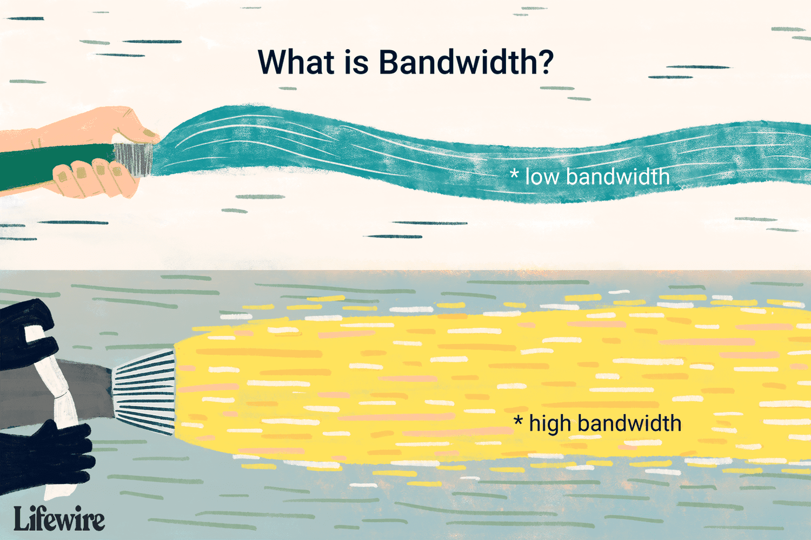
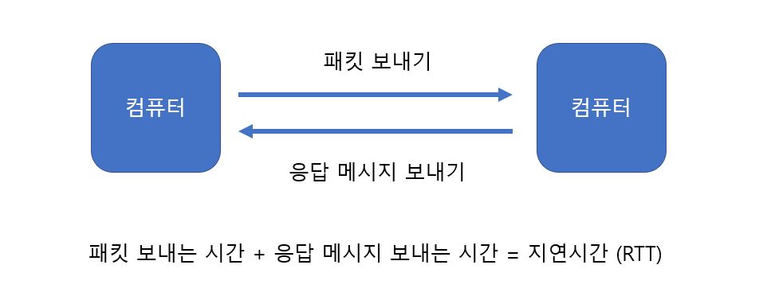

# 네트워크의 기초

*CS 노트*

## 네트워크, 처리량, 트래픽, 대역폭, RTT

### 네트워크

> #### 노드와 링크의 집합

노드는 서버, 라우터, 스위치, 기기가 될 수 있다

링크는 노드와 노드를 이어주는 선, 즉 무선, 또는 유선이 될 수 있다

- 유선 : 와이파이

### 트래픽 (Traffic)

> #### 노드들 사이에서 일정 시간 내에 흐르는 데이터의 양
>
> - 단위로는 bps(bits per second)를 사용한다

- 트래픽이 많다는 것은, 서비스 이용자 수가 많아서, 전송하는 데이터의 양이 많다는 것이다

10KB 이미지를 10명이 다운로드 받을 때에 누적 트래픽은 100KB가 된다 (10KB * 10)

### 처리량 (Throughput)

> #### 흐르는 데이터 중, 데이터를 얼만큼 처리를 했는지 알려준다
>
> - 단위로는 bps(bits per second)를 사용한다

- 처리량은 트래픽, 대역폭, 에러 또는 하드웨어 스펙에 영향을 받는다
  - 트래픽이 커지면 커질수록, 또는 동시에 보내야 하는 데이터가 증가할 수록 서버가 마비가 되어 처리량이 줄어들 수 있다
  - 에러가 많거나, 낮은 하드웨어 스펙일 수록 처리량이 줄어들 수 있다

### 대역폭 (Bandwidth)

> #### 주어진 시간 안에 얼마나 데이터를 보낼 수 있는지를 계산해준다 (최대 트래픽을 뜻한다)

- 호스가 얇으면, 나오는 물의 양이 줄어들지만, 호스가 넓을 수록 물의 양이 늘어난다
- 이처럼 대역폭이 넓으면, 주어신 시간 안에 더 많은 데이터를 보낼 수 있다

### 지연 시간 RTT (Round Trip Time)

> #### 노드에서 다른 노드로 패킷을 보내고, 패킷 수신 여부를 출발 노드가 받는 시간

