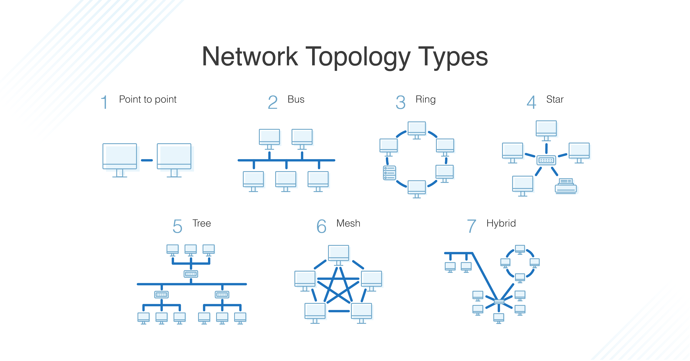
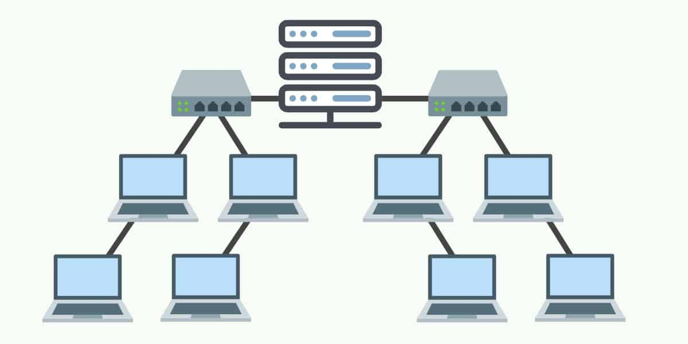

# 네트워크의 기초

*CS 노트*

## 네트워크 토폴로지

#### 네트워크 토폴로지는, 네트워크의 설계를 말하는 것이다

#### 즉 노드와 링크가 어떤 식으로 연결이 되어 있는지를 알려준다

### 버스 토폴로지

##### 특징

- 하나의 회선 통해서 여러 노드들이 연결이 되어 있다

- 노드를 추가 또는 삭제하기 쉽다

##### 장점

- 노드를 추가 또는 삭제하기 쉽다
  - 회선에 연결되어 있는 노드를 그냥 설치하거나, 빼면 된다
- 비용이 적다
- 하나의 노드에 에러가 생겨도, 다른 노드에 영향을 미치지 않는다

##### 단점

- 하나의 회선을 사용하기 때문에, 회선에 문제가 생길 경우, 모든 노드에 문제가 발생한다
- 트래픽이 매우 한정되어 있다
  - 모든 노드들이 하나의 회선을 사용한다. 즉 제한된 대역폭에서 노드끼리 데이터를 서로 주고 받는다.
  - 대한민국 국민이 사용할 수 있는 고속도로가 딱 한 개 밖에 없다고 생각하면 된다

### 스타 토폴로지

##### 특징

- `버스`와 비슷한데, 버스는 하나의 회선으로 노드들을 연결 했으면, `스타`는 중앙 노드를 기준으로 노드들이 연결되어 있다

- 그림처럼, 중앙의 노드를 기준으로 여러 노드들이 연결이 되어 있다

- 중앙 노드에 연결하는 것이라서, `버스`처럼 설치 또는 삭제가 쉽다

##### 장점

- 중앙 노드 외에, 다른 노드에 문제가 발생하더라도, 다른 노드에 영향을 미치지 않는다
  - 링크도 같다
- 왠만해서 중앙 노드를 통해 에러를 발견하거나, 데이터 간의 충돌을 막을 수 있다
  - 즉 에러 제어를 할 수 있

##### 단점

- 중앙 노드에서 문제가 발생하면, 전체 노드에 영향을 미친다
- 설치하는 비용이 매우 비싸다

### 트리 토폴로지

##### 특징

- 계층형 토폴로지라고도 한다
- 버스와 스타 토폴로지의 하이브리드 형태이

##### 장점

- 최하단 노드 (리프 노드)의 추가 또는 삭제가 쉽다
  - 즉 노드 확장이 가능하다
- 제일 최하단 노드 (리프 노드)에 문제가 발생해도, 다른 노드에 영향을 미치지 않는다

##### 단점

- 최하단이 아닌 다른 노드에 문제가 발생하면, 그 노드 기준으로 하위 노드들에게 영향을 미친다
  - 즉 루트 노드에 문제가 발생하면, 네트워크 전체에 문제가 발생하는 것이

### 링 토폴로지

##### 특징

- 각각의 노드가 양 옆의 노드로 연결되어, 하나의 링을 만든다

##### 장점

- 노드를 추가 또는 삭제를 쉽게 할 수 있다
  - 링크를 잘라서 두 노드 사이에 노드를 추가한다
  - 노드 연결을 삭제하고, 양 옆에 있던 노드들끼리 연결 시키면 된다
- 데이터 손실이 없다 / **토큰 기반으로 데이터를 전송한다**
  - 데이터가 노드들을 거치면서 통신권한 여부를 따지고, 권한에 따라 데이터를 받거나, 받지 않고, 다음 노드에 넘겨준다
- 모든 노드가 링 형태로 연결이 되어 있기 때문에, 고장난 노드를 빠르게 찾을 수 있다

##### 단점

- 고장난 노드 또는 링크를 빠르게 찾을 수 있지만, 문제가 생기면 전체 네트워크에 영향을 미친다
- 토큰이 없는 노드는 데이터 공유가 안 된다

### 메시 토폴로지

##### 특징

- 모든 노드가 연결되어 있다

##### 장점

- 모든 노드가 연결이 되어있기 때문에, 트래픽을 분산시킬 수 있다
- 하나의 노드에 문제가 발생해도, 네트워크에 영향을 끼치지 않는다

##### 단점

- 노드 추가 삭제가 어렵다
  - 모든 노드들이 연결되어 있기 때문에, 노드를 추가 할 때에는, 네트워크에 연결되어 있는 모든 노드들과 연결을 해야 한다
  - 노드를 삭제할 때에는, 연결되어 있는 모든 노드들과 연결을 끊어야 한다
  - 위 그림 예시) `Node 1`을 삭제할 때에, `Node2` , `Node 4`, `Node 3`, `Node 5`와 연결을 끊어야 한다
- 풀 메시 토폴로지는, n * (n-1) / 2 의 회선이 필요하다
  - 즉 비용이 많이 든다는 것이다

## 병목 현상

#### 웹 상에서도, 갑자기 많은 이용자가 서비스를 사용하게 된다면 서버를 마비시킬 수 있다

- 이러한 병목 현상을 개선하기 위해, 토폴로지를 보게 된다
- 네트워크 토폴로지 내에, 병목 현상이 보이는 링크를 찾아서, 링크를 늘려서 트래픽을 분산시킬 수 있다

## 네트워크 성능 분석 명령어

> #### 네트워크 상 문제가 있는지 없는지 테스트를 할 수 있는 명령어들이다

#### 주로 네트워크 상에 문제의 원인은 병목 현상이다

### ping (Packet Internet Groper)

> 네트워크 상태를 확인하려고 하는 노드 대상에게 일정한 패킷을 보내는 명령어다

- 네트워크가 잘 연결이 되어 있으면, 패킷의 수신 상태와 도착할 때까지 걸린 시간을 확인할 수 있다
- TCP/IP 프로토콜 중 ICMP 프로토콜을 통해 작동하여, ICMP 프로토콜을 지원하지 않으면 작동이 안 된다
- traceroute을 차단하는 대상도 ping이 불가능하다

### netstat

> 네트워크 스탯으로 접속되어 있는 서비스들을 확인하는 명령어다

### nslookup

> DNS, 도메인 네임 시스템에 관련된 내용을 확인한다

원래 서비스마다, 숫자로 된 주소가 있다

이 주소를 사람들이 읽기 쉽도록 도메인 네임 시스템을 도입했다

예시) 구글의 도메인 네밍 = www.google.com / 원래 주소 =  **8.8.8.8**

### tracert

> 목적지 노드까지의 경로를 추적해주는 것이다
