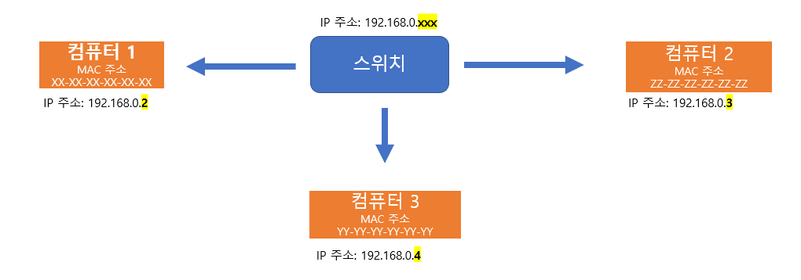

# 네트워크의 기초

*CS 노트*

## 네트워크 분류 [LAN, MAN, WAN]

### LAN (Local Area Network)

> #### 비교적 짧은 거리에 연결되어 있는 노드와 링크들의 집합이다
>
> - 사무실 내, 빌딩 내, 캠퍼스 내 네트워크가 될 수 있다

- MAN과 WAN보다, 즉 소규모 네트워크고, 근거리 통신망이라서 높은 안정성과 속도를 가지고 있다

#### 하나의 IP 주소를 가지고 여러 MAC 주소를 구별하는 네트워크다

- MAC은 기기에게 주어진 변하지 않는 물리적 주소다
- IP 주소는 논리적 주소로, 변경이 가능하다
  - 즉 하나의 IP 주소가 MAC 주소를 통해 여러 기기들을 구별할 수 있다

### MAN (Metropolitan Area Network)

> #### 대도시 규모 (서울)의 노드와 링크들의 집합이다

#### 2개 이상의 LAN이 연결되어 있다

#### 라우터, 브리지 등을 통해 연결이 된다

### WAN (World Area Network)

> #### 전국, 전세계 규모의 네트워크이다
>
> #### 인터넷을 WAN으로 구분할 수 있고, INTERNET은 네트워크와 네트워크가 연결되어 있다
