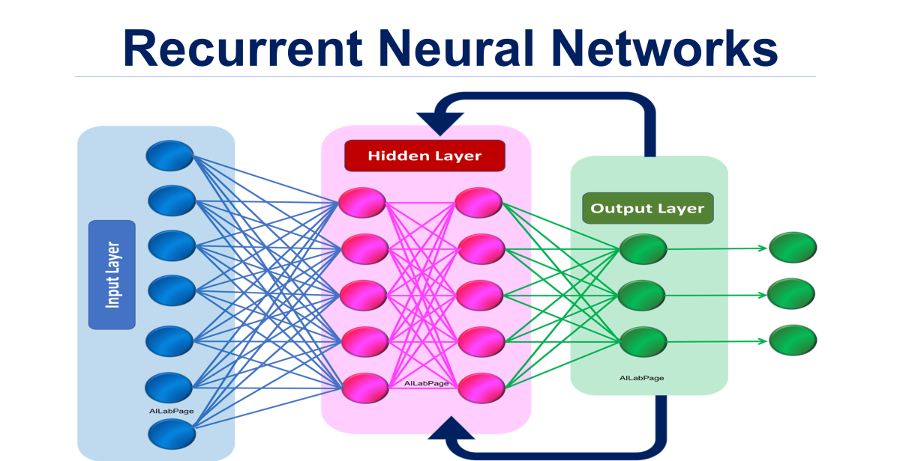

# 인공지능 - 뇌와 신경망 모델

*K-MOOC 인공지능 만들기*

## 뇌와 컴퓨터

#### 1943년 McCulloch & Pitts 는 사람 뇌의 신경세포들이 논리회로의 AND OR NOT 게이트 연산을 수행할 수 있다고 했다

- 즉 컴퓨터가 뇌처럼 계산하고 문제를 해결할 수 있다고 생각하기 시작했다

### 컴퓨터

- 빠르고 상당히 정확하다 (논리소자)
- 디지털 회로망 (전자 회로망) / 주소기반 메모리 (국지적 / 독립적)
  - 어느 파일에서 어떤 것이 저장이 되어 있는지 꺼내서 사용을 한다
- 논리 / 산술적 연산 (조작적)
  - 기호로 symbol을 정해 표현을 한 다음, 그것을 조작하여 추론을 한다
- 중앙집중식 순차 처리
- 프로그래밍기반 명시적 지식
  - 지식을 넣을 수는 있지만, 학습을 못 하는 것이 단점이다

### 뇌

- 부정확하고 속도도 느리다 (신경세포)

- 아날로그 회로망 / 내용기반 메모리

  - 정확히 어떤 뉴론에서 뭐가 저장되어 있는 것인지 기억하지 않는데
  - 즉 내용기반으로 기억을 한다

- 패턴 / 연상기반 연산 (연관적)

  - 어떠한 패턴을 통해서, 정보를 추출해 낸다

- 분산적 병렬 처리

- 학습 (경험 / 데이터) 기반 암묵적 지식

> #### 즉 컴퓨터는 주어진 데이터로는 학습을 잘 하지만, 그런 지식들은 모두 암묵적인 지식이다
>
> #### 즉, AI가 명시적인 지식을 습득할 수 있게 만드는 것이 새로운 미션이다

## 신경망과 머신러닝 역사

> #### 1970 - 1958 : Neural Networks

- 일부의 신경망을 연구한 연구자들이, 규칙 기반에 사람이 지식을 넣어 주는 논리 기반의 AI를 주로 연구를 했다
- Symbolic한 AI를 주로 다루었다

> #### 1958 - 2010 : Machine Learning

- 신경망 기반이 아닌, 통계학적이고 확률적인 방식의 머신러닝이 같이 연구가 되었다

> #### 2010 - 현재 : Deep Learning

- 어려운 문제, 영상처리, 음성인식 같은 문제를 풀면서 학습이라는 것이 인공지능에서 메인 페러다임이 된다
- 신경망의 구조를 더 연구하면서, 인공지능에 적용을 하기 시작했다

## 인공지능과 신경망

#### Input Layer

- 입력 뉴런들은 정보를 받아낸다

#### Multiple hidden layer

- 복잡한 패턴을 특징 같은 것을 히든 뉴런들이 추출한다

#### Output Layer

- 그리고 히든 뉴런들이 추출한 정보를 기반으로 의사결정을 하거나 결과를 제시한다

### 재귀 신경망

- 결과에 대한 feedback 구조를 가진다
- 결과에 대해 다시 생각해보거나, 기억을 해내는 것이다
- 인간의 뇌에서 일어나는 일에 제일 가까운 인공지능 방식이라고 할 수 있다'
- 하지만 아직 연구 중인 모델 중 하나이다
