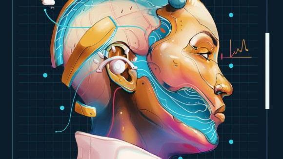

# 생성형 AI

***written by 이제준***

2022년 7월, 개발이란 것을 처음 시작하고, IT 쪽에 더 관심이 생기기 시작했다. 하루는 개발 강의를 다 듣고, 저녁을 먹으러 거실을 지나갔다. 거실에는 뉴스가 틀어져 있었다. 그리고 그 날, 생성형 AI 관련된 뉴스가 나오고 있었다. 인공지능이 알아서 그림을 그려준다는 내용이었고, 정말 신기했던 나의 모습이 기억에 남는다.

그리고 최근 들어, "AI가 표현해주는 내 얼굴"이라고, 인스타그램, 틱톡 등 사진들이 떠돌아 다니는 것을 볼 수 있었다. 이런 것을 보면, 얼마나 빠르게 인공지능, IT기술이 발전을 하고 있는지 새삼 느낄 수 있었다. 그리고 얼마나 빠르게 우리들의 삶에 자연스럽게 녹아들고 있는지, 신기하면서도 무서워졌다.

## 🖼️ 생성형 AI란?

AI, Artificial Intelligence, 인공지능은 인간 지능을 기계에 구현하는 것이다. 
