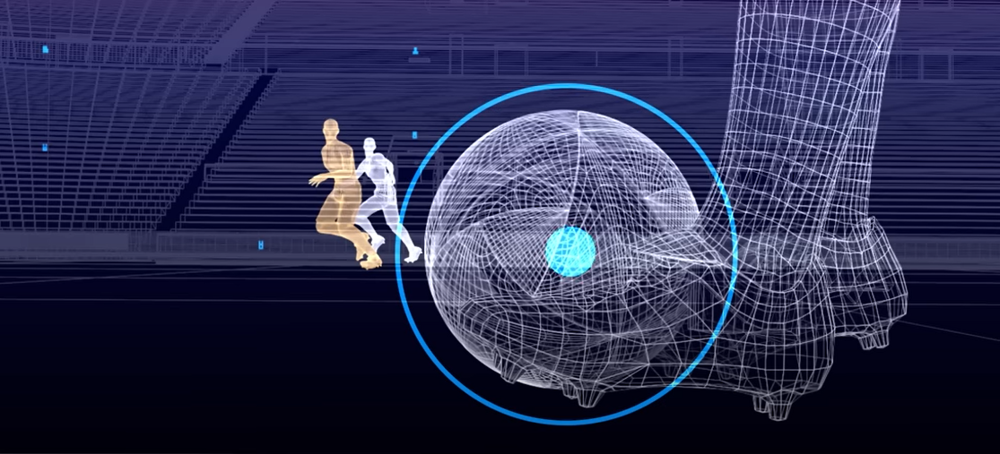
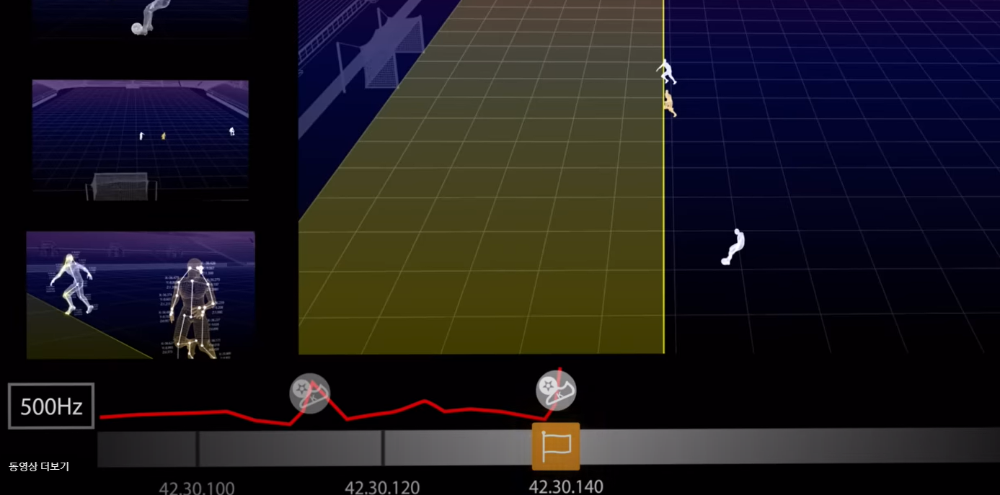

# ⚽ 월드컵과 IT 기술 - Semi-Automated Offside Technology  ⚽

*images from FIFA.com*

2022년 12월 19일, 메시와 아르헨티나가 3번째 우승을 하며, 2022년 카타르 월드컵은 막을 내렸다. 축구 팬으로서, 정말 각본 없는 드라마, '메시의 라스트 댄스'를 보며 내가 왜 축구를 사랑하는지 다시 한번 느낄 수 있었다.

월드컵 (공식 명칭 FIFA World Cup)은 1930년부터 시작을 하여 매 4년 마다 열리는, 매가 이벤트이다. 2018년 러시아 월드컵의 시청자 수가 35억 명이 넘을 정도로 스포츠 이벤트 중 제일 인기 있는 토너먼트다. 모든 축구 선수들은 월드컵을 뛰는 것이 꿈이고, 팬들은 월드컵을 직접 보는 것이 꿈일 것이다.

축구를 사랑하는 팬으로서, 그리고 개발을 공부하는 취업 준비생으로서, 월드컵 뿐만 아니라 스포츠에 사용되고 있는 IT 기술들에 대해서 기록을 해보고 싶었다. 그리고 그 시작을 월드컵으로 시작을 했으면 좋겠다는 생각을 했다.

### 월드컵은 IT 기술의 시험대

`오심`은 축구에서 정말 있으면 안 되는 일이다. 한 축구 경기를 위해 땀을 흘리는 선수들, 그리고 그 경기를 보기 위해 시간을 쓰는 팬들의 노력을 무시하는 격이 된다. 그러기 위해, FIFA는 IT 기술을 도입하기 시작했다. 그리고 월드컵을 통해, IT 기술들을 공식화했다. 내가 기억하는 것은, 2014년 브라질 월드컵의 **Goal Line Technology**, 2018년 **Video Assistant Referee**, 2022년 **Semi-Automated Offside Technology**가 있다. 이런 기술들을 통해 심판들이 더 공정하고, 정확한 판정을 할 수 있게 되었다.

## Why Semi-Automated Offside Technology?

> 오프사이드란?
>
> 1) 공을 선수가 공격 진영으로 찬 시점.
> 2) 공을 받는 선수가 상대 제일 뒤에 있는 수비수보다 뒤에 있을 때 오프사이드이다.
>
> 단 공을 받는 선수가 상대 진영에 있었을 때만 적용이 된다.
>
> 손과 팔을 제외한 신체부위가 앞서 있을 때 오프사이드 반칙이 선언된다.

Semi-Automated Offside Technology는 반자동 오프사이드 기술을 얘기한다. 축구에서 가장 많이 나오는 오심은 오프사이드이다. 비디오 판독이 사용 되어도, 오프사이드 오심은 지속적으로 나왔다. 그 이유는 비디오 판독은 중계 카메라를 통해, 오프사이드 여부를 판단하는 것이다. 즉 아무리 줄을 그어도, 줄이 수평이 아닐 수 있을 수도 있고, 공을 찬 시점도 영상을 멈춰서 보는 것이기 때문에 정확도가 떨어질 수 있다.

이러한 오프사이드 오심을 줄이기 위해 반자동 오프사이드 기술이 적용이 되었다. 그리고 개인적으로는 2022년 카타르 월드컵에서 제일 깔끔했던 판정 중 하나가 오프사이드 판정이었다.

## How Semi-Automated Offside Technology Work?

#### 공 (Official Match Ball) - Senor

- 이번 월드컵의 공 안에는 센서가 들어가 있었다. 그 센서는 VAR실에 현재 일어나는 공에 관련된 데이터를 초당 500개를 보낸다고 한다.
- 오프사이드 상황이 발생했을 때에, VAR실에서는 공이 전달하는 데이터를 통해, 공이 차인 정확한 시점을 알 수 있다.
- 그 차인 시점을 통해 선수들의 위치를 보고, 오프사이드 여부를 알 수 있다.

#### 트래킹 카메라

- 이번 월드컵 경기장 마다 12개의 트래킹 카메라들이 지붕에 설치가 되어 있었다.
- 이 트래킹 카메라들은 선수들과 공을 추적한다.
- 트래킹 카메라들은 각 선수마다 29개의 데이터 포인트를 초당 50번씩 추적하며, 선수들의 위치를 파악한다.
  - 여기서 각 선수마다 29개의 데이터 포인트를 추적하는 이유는, 카메라는 2D이다. 즉 각 선수들의 위치를 파악하기 위해서는 선수들의 몸이 어디에 있는지 계산을 따로 해야 한다. 

#### 실시간 정보

- 공과 트래킹 카메라의 정보는 AI (인공지능)이 실시간으로 분석을 한다.
- 인공지능은 오프사이드 상황이 발생하면 VAR실에 있는 심판들에게 알림을 준다.
- 이 모든 데이터들을 심판들이 보고 판단을 하여, 오프사이드 판정을 내린다.

> 최종 판정은 심판들이 내리는 것. 그래서 **반자동** 오프사이드 기술이다.

## Fast and Accurate Decision

Before

- 심판들이 오프사이드 판정을 내릴 때, 공이 차인 시점과, 선수들의 움직임을 직접 영상을 통해 추적해야 했다.
  - FIFA는 비디오 판독을 통한 오프사이드 판정은 평균 70초가 걸린다고 한다.
- 심판들이 그은 선들의 정확성에 대해 의문이 많았다.

After

- 공이 차인 시점과, 선수들의 움직임이 실시간으로 전달이 된다.
- 심판들은 영상을 돌려보지 않고, 인공지능을 통해 받은 오프사이드 상황만 분석하면 된다.
  - FIFA는 반자동 오프사이드 기술을 통해 판정을 전보다 훨씬 더 빠르게 할 수 있다고 한다. 
- 그 상황을 애니매이션으로 만들어 관중들에게 보여주어, 팬들이 판정에 대해 이해를 할 수 있도록 할 수 있다. 