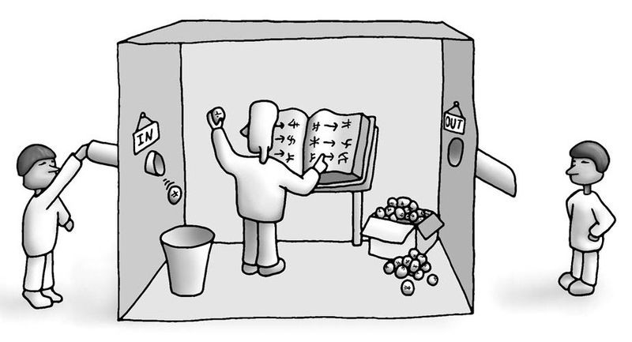

# 인공지능 - 인공지능의 개념과 역사

*K-MOOC*

> ### AI (Artificial Intelligance), 인공지능은, 인간처럼 생각하고 행동할 수 있는 기계
>
> ### 사람처럼 행동하고 생각하게 + 합리적으로 행동하고 생각하게 연구를 한다

- 여기서 기계는 대체적으로 컴퓨터를 뜻한다
- 그 외에는 소프트웨어 또는 로봇이 될 수 있다

## 지능이란?

#### 심리학에서는 지능은 새로운 정보, 또는 불확실한 정보 하에서 새로운 문제를 해결하는 능력이다

- 이러한 능력을 위해서는 문제를 **지각**해야 하고, 그 문제에 대한 **생각**을 통해, 해결을 하려는 **행동**을 해야 한다

## 인공지능이란?

#### 사람처럼 생각하고 행동하는 기계를 만드는 연구 분야

#### 사람처럼 보고, 듣고, 말하고, 행동하는 기계를 만드는 연구 분야

#### 사람이 하면 지능을 필요로 하는 일을 기계가 할 수 있도록 하는 연구 분야

#### 사람이 기계보다 잘 하는 일을 기계가 할 수 있게 하는 연구 분야

## 접근 방법

#### 사람처럼 생각하기

- 사람들이 어떻게 생각하고, 기억하고, 의사결정을 하는지를 초점으로 접근하는 것

#### 사람처럼 행동하기

- 인공지능이 외면적으로 행동을 할 때에 인간처럼 보이는 기술
- 튜링 테스트 (Turing Test)

> Imitation Game

`평가자가 봤을 때, 어느 쪽이 사람인지 알아 맞추지 못 할 정도로 기계가 대답해야, 테스트가 성공을 한다`

#### 합리적으로 생각하기

- 합리적 사고, 논리, 생각하는 법칙을 논리를 통해 합리적인 의사결정을 하게 하는 접근

#### 합리적으로 행동하기

- 최적의 목표를 향해 나아가는 행동을 보여주는 접근 방법
- 지능형 에이전트 

## 기계가 사람과 동등한 지능을 가질 수 있을까?

#### 강인공지능

- 기계가 사람과 동등한 지능을 가질 수 있다는 사람들

#### 약인공지능 Narrow AI

- 기계의 지능은 유용하지만, 인간 지능의 일부를 흉내 내는 것이라서, 동등할 수 없다
- 여기서 인간 지능의 일부는 문제를 잘 푸는 능력 같은 지능을 말한다

#### 중국어방 논쟁

> **왼쪽 사람**
>
> - 중국어로 질문을 한다 (INPUT)
>
> **가운데 사람** 
>
> - 중국어를 아예 모른다
> - 하지만, 중국어 교본을 통해 질문에 대한 규칙을 찾아서 대답을 만들고 밖으로 전달한다
>
> **오른쪽 사람**
>
> - 중간 과정을 거친 대답을 받게 된다
> - 이 사람은 방 안에 있는 사람이 중국어를 이해했다고 판단을 했다

##### 여기서의 논쟁

- 가운데 사람은 그냥 규칙을 통해 대답을 만든 것이라서, 중국어를 아예 이해를 못 했으니 중국어 지능이 없다고 판단
- 반대로 중국어를 잘 하는 사람들도 규칙을 적용해서 중국말을 하고 있을 수도 있다

> **즉 인공지능은 데이터를 이해하는 것이 아니라, 데이터의 형태를 보고, 규칙을 판단하는 것 이라는 점에 대해 인공지능이 인간과 동등한 지능을 가지고 있는지에 논쟁이 있는 것이다**
>
> 
>
> **인공지능이 인간과 같은 지능을 가지고 있다는 주장**
>
> - 인간들도 데이터의 형태를 보고 규칙을 판단해서 의사 결정을 한다
>
> **반대하는 주장**
>
> - 인간들은 데이터를 이해를 하고 의사 결정을 내린다
> - 하지만 인공지능은 데이터의 형태를 보고 규칙을 찾아서 의사 결정을 내리는 것
> - 즉 인공지능은, 데이터가 뭔지 모른다

## 인공지능의 역사

#### 1950 - 1970 : 태동기

- 튜링 테스트 (1950)
- 인공지능이란 말이 탄생 (1956)
- 처음에는 많은 투자가 이루어졌지만, 기계 번역 같은 게 잘 안 되자, 냉각기를 갖게 됬다

#### 1970 - 1990 : 제 1차 AI 산업

- 규칙 기반의 시스템을 가지고 Expert System을 만들었다 (1975 - 1985)
  - 좁은 도메인 안에서 문제를 잘 푸는 인공지능 기술을 개발했다
  - 이것을 '전문가 시스템'이라고 하는데, **특정 전문 영역의 문제를 잘 풀기 때문에 한계**가 있었다
- 사람들이 아는 지식을 기계한테 입력하는 것이기 때문에, 사람 만큼은 잘 할 수 있었지만, 그 이상을 할 수 없어, 다시 냉각기에 돌입했다

#### 1990 - 2010 : 과학적 방법의 도입

- 지식을 직접적으로 넣는 것이 아닌, 기계가 혼자서 학습을 할 수 있는 **머신러닝**이 연구되기 시작했다 (1986)
- 확률적인 유연한 의사결정을 위해, 확률적인 추론 방법들을 인공지능이 연구를 하기 시작했다 (1988)
- 환경을 지각하고 행동하면서 문제를 풀는 에이전트 (로봇같이) 개념을 도입한 인공지능 기술을 연구하기 시작했다 (1997)

#### 2010 - 현재 : 제 2차 AI 산업화

- 인터넷과 웹을 통해 많은 데이터들이 디지털화가 되었다 (빅데이터)
  - 이 데이터를 기반으로 머신러닝을 통해 AI가 학습을 할 수 있는 환경이 만들어졌다
- 예시) 구글 자율주행차, 삼성 빅스비 (대화형 비서)

