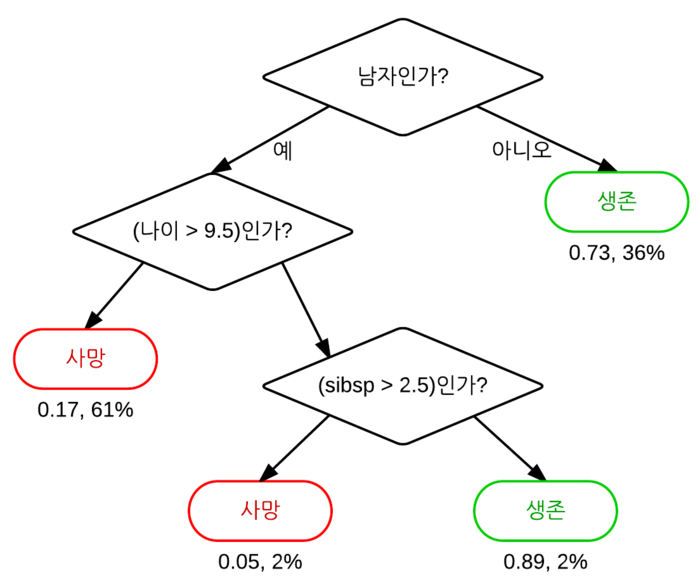
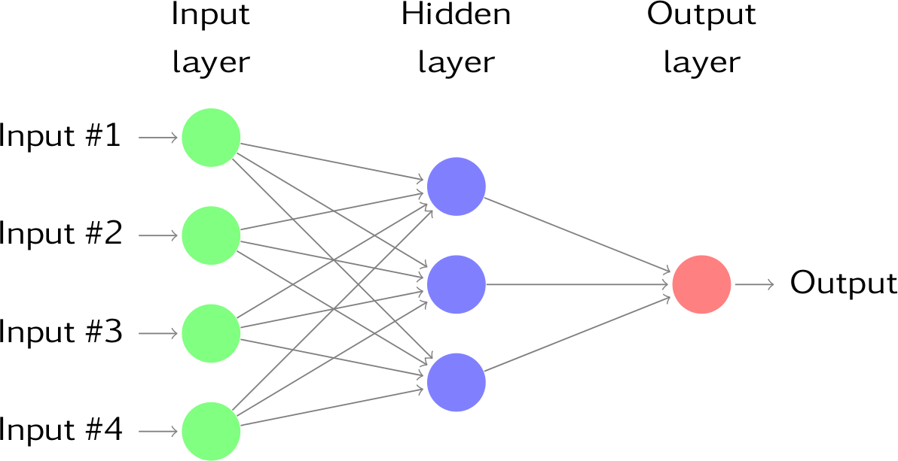
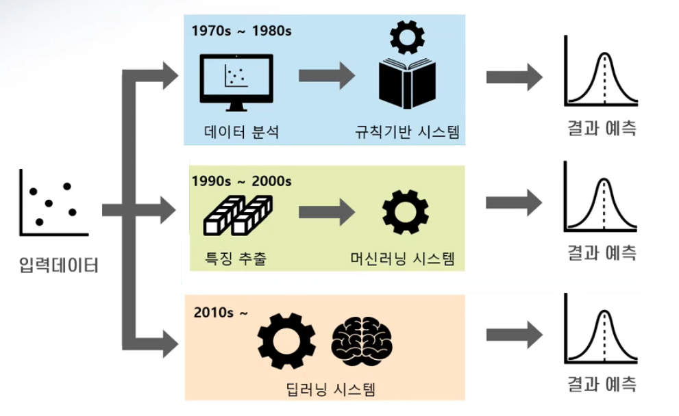

# 인공지능 - 인공지능 패러다임 

*K-MOOC 인공지능 만들기*

## 인공지능 연구 패러다임

> #### 지금까지 크게 2가지가 연구가 되었다고 볼 수 있다

#### 기호주의 - 논리규칙 모델

- ##### 지식기반

- 고전적인 인공지능 기법이다

- 사람들의 지식을 **로직이나 규칙**으로 표현해서 프로그래밍을 하면, 컴퓨터가 알아서 문제를 풀 수 있다

- 하지만, 사람들도 항상 지식을 잘 모르는 경우도 있거나, 프로그래밍을 하는 것이 어려울 수도 있다.

#### 연결주의 - 뇌신경망 모델

- ##### 학습기반

- **기계가 스스로 학습**을 유도하는 방법이다 (**머신 러닝**)

- 사람의 뇌의 신경망이 연결되어 있는 것처럼, 연결주의 인공지능 기법을 연구하고 있다

## 지식기반 시스템과 학습기반 시스템

#### 지식기반 시스템

- 사람들이 아는 규칙을 기계한테 프로그래밍을 해주는 것

#### 학습기반 시스템

- 머신러닝 : 데이터 또는 문제에 있는 데이터에서 특징을 추출해서 기계가 학습할 수 있도록 하는 것

#### 딥러닝

- 데이터를 통째로 주면 기계가 알아서 자동으로 학습을 해서 의사결정을 내리는 것

## 큰 틀의 인공지능 연구 패러다임

#### 기호주의 AI

- ##### 합리론 / 연역적인 추론

  - 과거의 있었던 데이터를 기반으로 규칙을 찾아서 문제를 해결한다

- ##### bottom-up 방식 (하향식)

  - 여러 지식들을 모아 문제를 해결하는 것

- ##### 지식 기반

  - 지식 시스템, 전문가 시스템을 만들어 AI의 산업화를 이루었다

#### 연결주의 AI

- ##### 경험론 / 귀납추론

  - 데이터를 기반으로 규칙을 찾는 것이 **귀납적 추론**
  - 연역적 추론과 다른 점은, **귀납적 추론은 새로운 지식을 발견해 낼 수 있다**

- ##### top-down 방식 (상향식)

  - 문제 지속적으로 세분화해서 작은 문제로 나눠서 문제를 해결하려고 한다

- ##### 학습 시스템

  - 다양한 데이터를 AI가 학습을 하여 문제를 해결하기 시작했다
  - 여기서 데이터는 디지털화 된 데이터로, 영상, 사진, 음성 등을 뜻한다

> 위에 두 가지 방식의 단점
>
> - 데이터가 바뀌고 환경이 바뀌는 불확실성에 대한 상황을 대처하기 쉽지 않다

#### 인지주의 AI

> 변화하는 상황에서 새로운 지식을 만들어야 한다
>
> 만든 지식을 통해 가설 (증명되지 않은 이론)을 만들어야 한다
>
> 그리고 가설을 검증하기 위해서 데이터를 통해 학습을 해야 한다

- ##### 구성론 / 동적추론

  - AI는 더욱 더 동적으로 발전을 해야 한다

  

- 인지주의 AI 연구를 해도, 위에 기호주의 또는 연결주의 AI도 지속적으로 연구가 될 것이다
