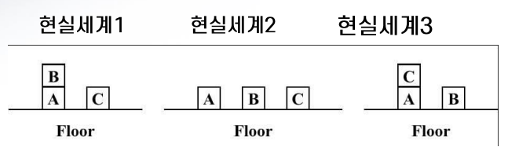
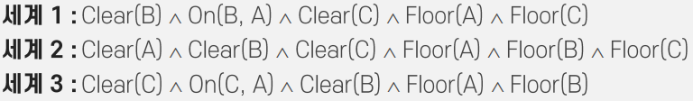

# 인공지능 - 논리, 사고, 지식

*K-MOOC 인공지능 만들기*

## 사고, 논리, 지식

#### 인공지능이 인간의 사고 과정을 모사하는 방법

- 기호 논리를 이용하여 현실 세계를 모델링 한다
  - 문제와 전제를 기술하는 것
- 논리 규칙을 적용한다. 문제를 추론하고, 결론을 만들어낸다

예시)

- 위에 상자들이 놓여 있다
- 이것을 인공지능은 논리 언어로 정리를 한다

- 세계 1 같은 경우 순서대로
  - B 상자 위에 비어 있다 (Clear)
  - B는 A 위에 쌓여있다 (On)
  - C 상자 위에는 아무것도 없다 (Clear)
  - A 상자는 땅 위에 있다 (Floor) / C 상자는 땅 위에 있다 (Floor)
- 이처럼, 논리식으로 인공지능은 현실 세계를 **표상(representation)**한다 
- 이러한 논리식을 가지고, 상자들의 움직이는 과정을 추론하고 생각할 수 있다

## 기호 논리와 지식 표현

> 크게 기호 논리로 명제 논리 또는 술어 논리를 사용한다

#### 명제 논리

- 참, 거짓을 평가할 수 있는 문장이다

#### 술어 논리

> 명제 논리를 더 간략화 해서, 더 표현하기 좋게 만들었다

- 상수 (Constant) : 객체, 관계, 함수의 이름을 뜻한다
  - 예시) 위 상자를 논리식으로 표현했을 때
    - 상자 : A, B
    - 위치 : On, Clear, Floor
- 술어 (Predicate) : 참과 거짓을 갖는 관계
  - 예시) On(B, A) - 위에 상자 논리식에서 현실세계 1에, 상자 B가 상자 A 위에 있어 참이다
- 연결자 (Connective) : ⋀, ⋁, ¬ , →
  - 순서대로 and, or, not, 그 다음

## 추론의 종류

#### 연역법

- 확실하게 참과 거짓이 정해져 있다
- "A면 B다"
- 즉 A가 참이면, B도 참인 규칙을 찾아낼 수 있는 것이다
- 예) 컴퓨터를 하고 있으면, 무조건 게임을 한다

#### 귀납법

- 여러 번의 관측을 통해, 사실로부터 일반적인 규칙이나 지식을 추론하는 것이다
- "A면 B일 수도 있다"
- 규칙을 찾아냈기 때문에, 높은 확률로 A가 참이면 B가 될 수도 있다
- 예) 컴퓨터를 하고 있으면, 게임을 할 수 있는 확률이 높다
  - 하지만 컴퓨터를 하고 있어도, 꼭 게임만 하는 것이 아니다.

#### 귀추법

- 진단을 할 때에 쓰는 추론 방법

- 가정을 선택하는 추론의 방법이다. 
- "B라는 결과의 원인이 A"라고 추론하는 방식이다

- 예) 게임을 하고 있다
  - 게임을 하고 있으니, 컴퓨터를 하고 있다는 생각을 할 수 있다

