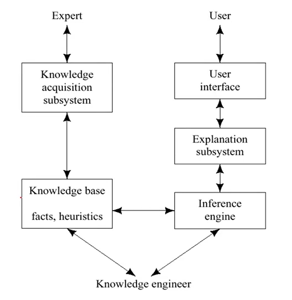

# 인공지능 - 규칙 기반 시스템

*K-MOOC 인공지능 만들기*

## 규칙 기반 시스템

> #### 규칙 형태로 된 표현을 써서 어떤 시스템을 모델링 하는 방법

## 지식

#### 선언적 지식

- 사실, 문제

#### 절차적 지식

- 방법, 쇼핑 절차
  - 쇼핑을 할 때에 어떤 것을 살지 고르고, 계산하는 것

#### 도메인 지식

- 추론의 대상, 구조, 관계

#### 전략적 지식

- 추론하는 방법
- 어떤 추론 방법을 적용하는 것이 맞을까?

## 전문가 시스템

> #### 규칙 기반 시스템으로 인공지능 역사에서 산업화가 성공한 예
>
> #### 도메인 영역에서, 지식의 폭을 좁히고, 그 분야의 전문가의 많은 지식을 기계한테 넣는다
>
> #### 기계는 그 지식을 통해 추론을 한 후, 의사결정을 할 수 있도록 한다

**Knowledge Base (KB)  지식 베이스**

- 데이터 베이스에, 지식을 데이터화해서, 넣어둔 것
- 이 지식 (knowledge)는 규칙 형태로 주어진다
  - 예시) `if then` 형태로
- 이런 지식들은 예전에는 인간들이 수작업으로 넣어줬다. 하지만 최근에는 기계가 스스로 지식을 만들도록 유도하는 **딥러닝** 방식을 사용한다 (위 그림 Knowledge Acquisition Subsystem 부분)

**Inference Engine (IE) 추론엔진**

- 위에 지식 베이스를 이용해서, 추론 규칙 즉 알고리즘을 구현한다
- 위 그림 Explanation Subsystem : 추론한 것을 기계가 내린 결론을 설명해주는 시스템이다

> 이렇게 KB와 IE를 분리하면, 일반적인 추론 방법이 제공이 되어 도메인에 따라 지식 베이스 교체가 가능하다
>
> 꼭 한 분야에서만 쓰는 것이 아닌, 다른 분야에서도 사용될 수 있다

## 전방향/ 역방향 추론

### 전방향 추론

- 데이터 ▶️ 규칙
- 상향식 추론 (Bottom-up)
- 데이터 기반 추론
- 결과 예측
- 주어진 데이터에 대해 다양한 결론들을 도출
- 비효율적일 수도 있으나 새로운 결과 발견 가능성 있음

예) 몸에서 열이 난다 ▶️ 코로나인가? 몸살인가? 그냥 날씨가 더워서 그런가?

### 역방향 추론

- 규칙 ▶️ 데이터
- 하향식 추론 (top-down)
- 가설기반 추론
- 원인 진단
- 가설과 관련되는 규칙만을 사용하여 효율적으로 추론
- 추론이 효율적이나 새로운 결과 발견 가능성 적음

예) 코로나가 걸렸다 ▶️ 몸에서 열이 날 것이다, 기침을 할 것이다, 목이 따가울 것이다

