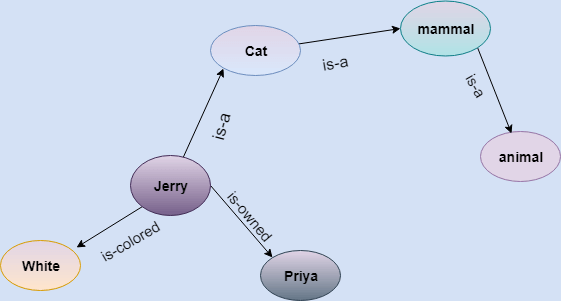
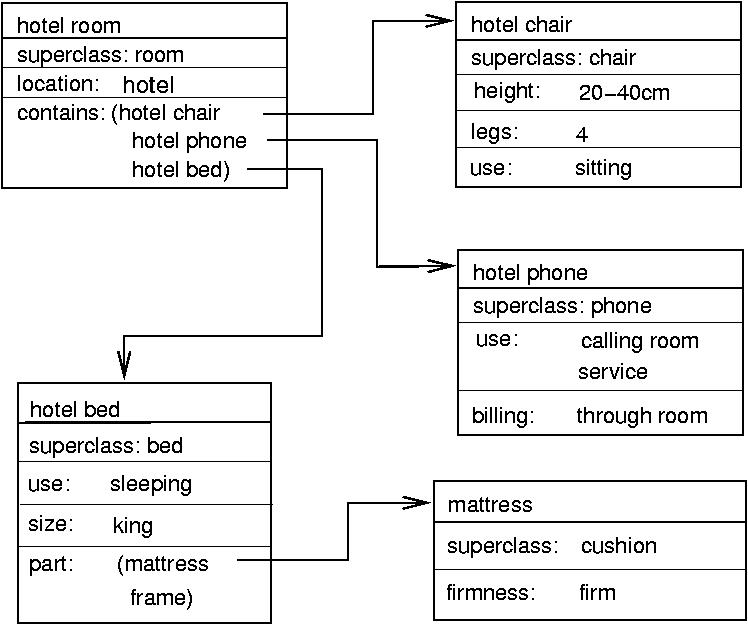
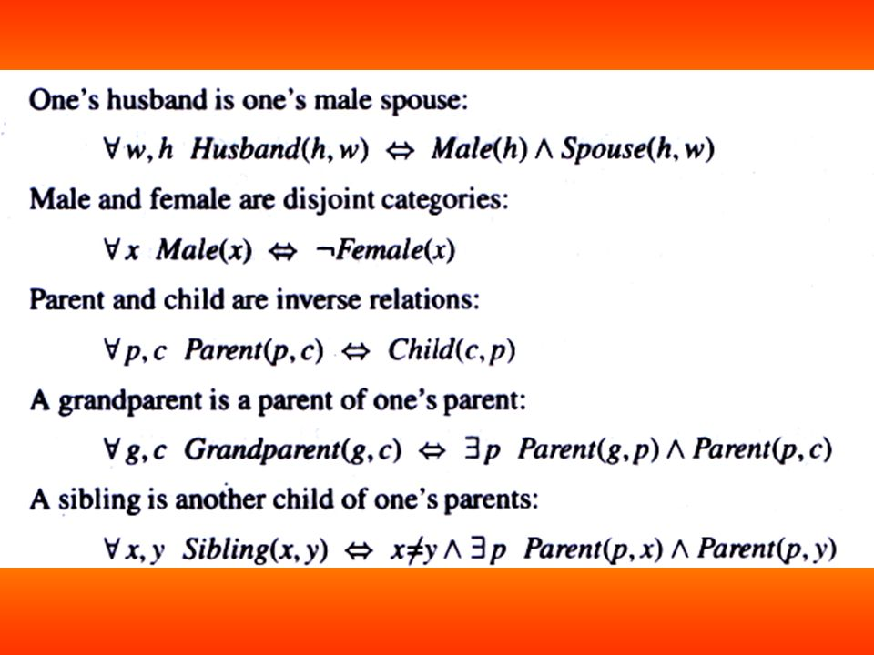

# 인공지능 - 지식 표현

*K-MOOC 인공지능 만들기*

## 상식적 지식

> 기계가 인간들의 일반 상식을 가지게 할 수 있는지가, 아직 풀리지 않은 숙제이다

- 인간들에게는 너무나도 당연한 것은 기계들을 추론을 못 할 수 있다

  - 예) 컵이 떨어지면, 컵이 깨진다는 인간들에게는 너무 당연한 것이다. 하지만 로봇은 아직 컵이 떨어지면, 컵이 깨진다는 추론을 못 할 수도 있다

  

## 지식 표현의 세 가지 방법

#### Semantic Network (의미망)

- 인공지능에서 지식 표현을 위한 그래프 구조
- 노드와 링크로 구성된 그래프 구조다
  - 위 같은 경우 Jerry가 동물이란 것을 알기 위해, Jerry는 고양이라는 노드로 옮기고, 고양이는 mammal이라는 노드로 옮기고, 그리고 mammal은 동물이다 라는 노드까지 가야, Jerry가 동물이다 라는 것을 확신할 수 있다
- 즉 각 노드의 관계를 비교하는 것이다
- if then 구조로 볼 수 있다

#### 프레임

- 각 노드는 의미망보다 더 세분화 되어 있다

- 위와 같이 각 노드에 추가 정보가 있고, 그 추가 정보를 다른 노드랑 연결 시킬 수 있다

#### 논리식

- 술어 논리로 기술한 symbol을 정의 한 후 관계들을 연결 시키는 것이다

## 지식 표현과 상식 추론

#### 위와 같이, 논리식을 더 유용하게 만들기 위해 사용된 것이 프로그래밍 언어이다 

#### 프로그래밍 언어는 Object Oriented Programming이고, 이것은 인공지능에서 온 아이디어이다.

- 예를 들어) printer라는 object를, 클래스라는 것을 정의 하고, 그 클래스 안에는 다양한 정보가 들어가 있을 수 있다

#### Script (스크립트)

- 기계에 이벤트 시퀀스를 넣어주는 것이다
- 어떠한 상황에 기계가 반응을 할 수 있도록 정보를 입력해주는 것이다
- 하지만, 입력된 특정 상황에서만 제대로 작동해, 아직 보완할 것이 많다
