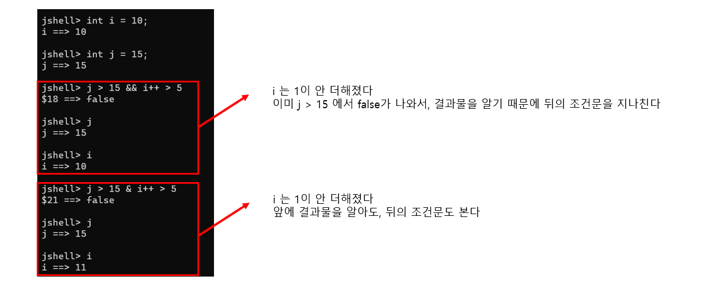

# 10. Java 기본 데이터 타입 (Boolean, char)


## 지금까지 배운 것

#### Integer

- byte, short, int, long

#### Floating Point

- float, double

#### Boolean

- boolean

#### Character

- char


## Boolean

> #### 무조건 true 또는 false 이다
>
> - True, False를 사용하면, 작동이 안 된다
>
> #### if문 같이 상태를 나타날 때에, 즉 로직을 만들 때 중요하게 사용한다


#### ==, >, >=, <=, <, != 등을 사용할 수 있다

- true 또는 false를 반환한다


#### &&

- **A && B**
  - A와 B가 모두 정답이어야 true
  - 둘 중의 하나만 정답이거나, 둘 다 정답이 아니면 false


#### ||

- **A || B**
  - A와 B 모두 정답이거나, 둘 중에 하나만이라도 정답이면 true
  - 둘 다 정답이 아니면 false


#### ^

- **A ^ B**
  - A만 정답이거나, B만 정답일 때 true
  - A와 B 모두 정답이거나, 모두 정답이 아니면 false다


#### !true

- false
- ! 는 not 과 같다 / 즉 true의 반대를 출력하는 것


#### !false

- true
- ! 는 not 과 같다 / 즉 false의 반대를 출력하는 것


#### Short Circuit



- 즉 **&&** 을 **&**로 사용해도 되고, **||**를 **|** 로 사용해도 된다
  - 즉  **i ++ > 5 && j > 15**, 이렇게 순서를 바뀌면 **i** 에 1을 더하게 된다


## char

> #### 문자열 데이터 타입이다

```java
jshell> char ch = 'a'
ch ==> 'a'

jshell> char ch = 'ab'
|  Error:
|  unclosed character literal
|  char ch = 'ab'
|            ^
    
// 유니코드로도 사용이 가능하다 \u 를 먼저 써야한다
jshell> char ch2 = '\u00A2'
ch2 ==> '?'
    
// 숫자를 사용해서 데이터를 저장할 수 있다
// 유니코드에서 알파벳 번호를 사용하는 것
jshell> char ch = 65
ch ==> 'A'

jshell> ++ ch
$29 ==> 'B'
    
jshell> (int)ch
$30 ==> 66
```


## Char 연습

```java
public class MyChar {
	
	private char ch = 0;
	
	MyChar (char ch) {
		this.ch = ch;
	}
	
	public boolean isvowel() {
		if (this.ch == 'a' || this.ch == 'e' || this.ch == 'i' || this.ch == 'o' || this.ch == 'u' || this.ch == 'A' || this.ch == 'E' || this.ch == 'I' || this.ch == 'O' || this.ch == 'U') {
			return true;
		}
		return false;
	}
	
	public boolean isDigit() {
		if (48 <= ch && ch <= 57) {
			return true;
		}
		return false;
	}
	
	public boolean isAlphabet() {
		if ((65 <= ch && ch <= 90) || (97 <= ch && ch <= 122)) {
			return true;
		}
		return false;
	}
	
	public boolean isConsonant() {
		if (isAlphabet() && !isvowel()) {
			return true;
		}
		return false;
	}
	
	void printLowerCaseAlphabets() {
		for (char ch = 97 ; ch <= 122 ; ch++) {
			System.out.println(ch);
		}
	}
	
	void printUpperCaseAlphabets() {
		for (char ch = 65 ; ch <= 90 ; ch++) {
			System.out.println(ch);
		}
	}
}
```


### Runner

```java
public class MyCharRunner {

	public static void main(String[] args) {
		
		MyChar myChar = new MyChar('z');
		
		System.out.println(myChar.isvowel());
		System.out.println(myChar.isDigit());
		System.out.println(myChar.isAlphabet());
		System.out.println(myChar.isConsonant());
		myChar.printLowerCaseAlphabets();
		myChar.printUpperCaseAlphabets();

	}

}
```

