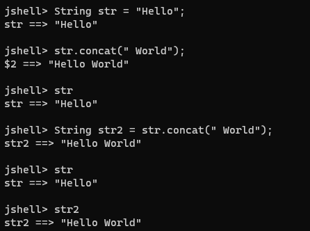
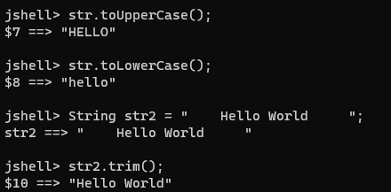

# 13. Java Reference Types, 내장 String 클래스


## 메모리에 저장


### Reference Types

- 생성되는 모든 클래스가 Reference Type이다

```java
// planet은 reference type
class Planet {
    
}
```

- 그 외에 이미 자바에 만들어진 reference types는
  - String, BigDecimal 등이 있다


### Reference Variable

- 클래스를 토대로 만든 변수를 reference variable이라고 한다

```java
class Planet {
}

Planet jupiter = new Planet();
// 여기서 jupiter는 reference Variable이다
```


- reference variable은 힙에 저장이 된다
  - 더 나아가, 스택에는 value에는 메모리 공간이 저장이 되고, 변수 이름이 저장 된다
  - **즉, stack에는 reference variable이 힙의 메모리 공간의 경로를 표시한다**
- 반대로 primitive variable, 즉 기본 변수는, 스택에 저장된다


## String Class (String으로 저장된 변수 확인하기)

#### 


#### String은 클래스이고, 생성자가 필요가 없다

```java
BigDecimal bd = new BigDecimal("1.0");

String str = "Test";
```

- BigDecimal 같이 **new BigDecimal("1.0")**, 생성자가 필요 없이 바로 변수를 만들 수 있다


#### String은 인덱스가 0부터 시작한다

```java
String str = "Test";

str.charAt(0);
//output : 'T'

str.charAt(2);
//output : 's'

String biggerString = "This is a lot of text";
biggerString.substring(5);
//output : "is a lot of text"

biggerString.substring(5, 13);
//output : "is a lot"

biggerString.indexOf("lot");
//output : 10
```

- **A.charAt(인덱스)**
  - 해당 인덱스에 있는 단어, 또는 값을 반환해준다


- **A.substring(시작 인덱스, 미만 인덱스)**
  - 슬라이싱이 가능하다
  - 즉 특정 인덱스부터 반환해주거나, 반환하고 싶은 값의 인덱스의 범위를 지정해 줄 수 있다


- **A.length()**
  - 문자열의 길이를 반환해준다


- **A.indexOf("문자열")**
  - 입력한 문자열의 시작점의 인덱스를 반환해준다
  - 같은 문자가 있다면, 제일 처음에 등장하는 문자열의 인덱스를 반환해준다


- **A.lastIndexOf("문자열")**
  - 문자열을 넣었을 때, 중복되는 문자가 있을 수 있다
  - 그 중복되는 문자 중, 제일 마지막에 있는 문자의 인덱스를 반환해 준다


- **A.contains("문자열")**
  - **A** 안에, 해당 문자열이 있는지 확인해준다
  - true or false로 반환


- **A.startsWith("문자열")**
  - **A** 가 해당 문자열로 시작하는지 확인해준다
  - true or false로 반환


- **A.endsWith("문자열")**
  - **A** 가 해당 문자열로 끝나는지 확인해준다


- **A.isEmpty()**
  - **A** 가 비어 있는지 없는지 확인해준다


- **A.equals("문자열")**
  - **A** 가 해당 문자열과 같은지 확인해준다


- **A.equalsIgnoreCase("문자열")**
  - 대소문자를 무시한채로, **A** 와 문자열이 같은지 확인해준다


## String의 불변객체

#### 문자열의 값은 바뀔 수 없다





- **.concat("문자열")** 
  - 문자열을 추가해서 출력만 해주는 것이다
  - 즉 기존 문자열의 값을 바꾸는 것이 아니다
  - 해당 값을 사용하려면, 새로운 변수에, 해당 값을 저장해야 한다




- **.toUpperCase()**
  - 모든 알파벳을 대문자로 만들어 준다
- **.toLowerCase()**
  - 모든 알파벳을 소문자로 만들어 준다
- **.trim()**
  - 문자열 양 옆에, 빈 공간이 있으면, 그 빈 공간을 없애준다


## String Concatenation

> #### 결합 하는 것


```java
jshell> 1 + 2
$12 ==> 3

jshell> "1" + 2
$13 ==> "12"

jshell> 1 + 2 + "3"
$14 ==> "33"

jshell> "3" + "7"
$15 ==> "37"
    
jshell> System.out.println("The Value is " + 20 + 20)
The Value is 2020

jshell> System.out.println("The Value is " + (20 + 20))
The Value is 40
```

- 숫자끼리는 그냥 더해진다
- 숫자와 문자열이 있으면, 문자열로 바뀐다


```java
jshell> String.join(",", "2", "3", "A");
$18 ==> "2,3,A"

jshell> String.join(",", "A", "B", "C");
$19 ==> "A,B,C"

jshell> String.join(",", "A");
$20 ==> "A"
```

- 어떻한 문자, 또는 부호로, 값들을 나누고 싶으면 **String.join** 을 사용한다
  - 제일 첫 argument를 통해, 값들을 나눠준다


```java
jshell> "abcd".replace("a", "z");
$23 ==> "zbcd"

jshell> "aaabbcd".replace("a", "z");
$24 ==> "zzzbbcd"

jshell> "aaabbcd".replaceFirst("a", "z");
$25 ==> "zaabbcd"
```

- 특정 알파벳을 바꿔주는 것이다
  - 그냥 **.replace()** 만 사용하면, 모든 알파벳을 바꿔준다
- **.replaceFirst()** : 제일 먼저 나오는 알파벳을 바꿔준다


