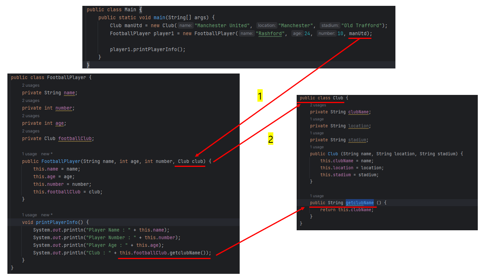
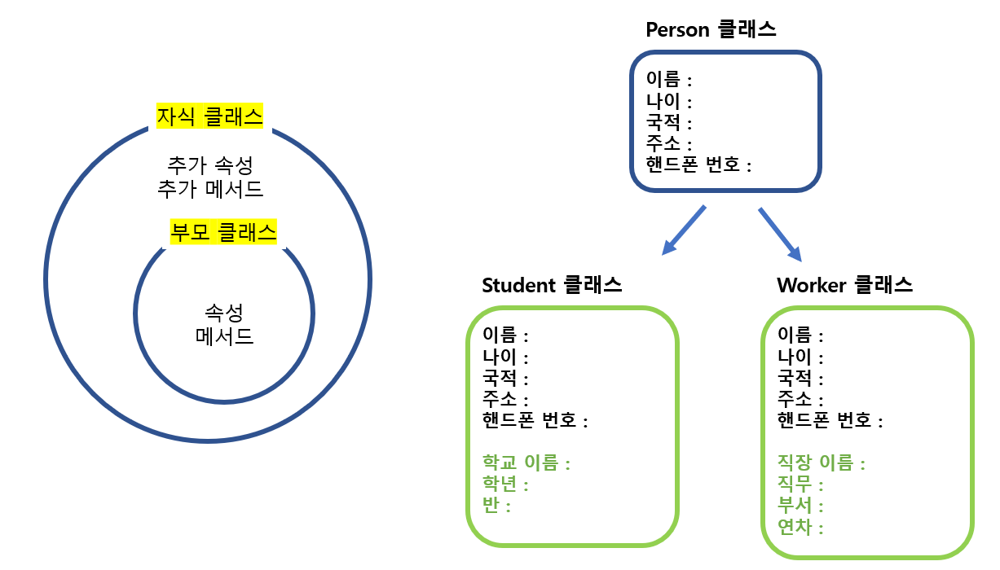
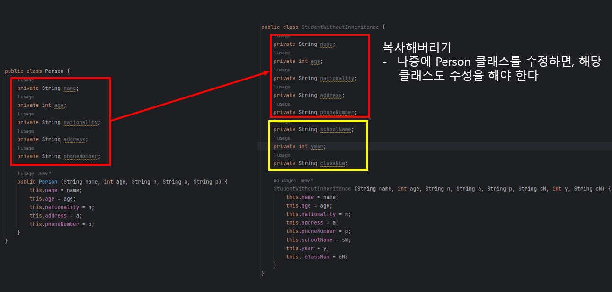
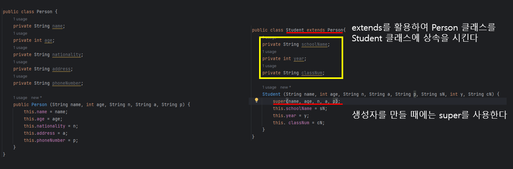
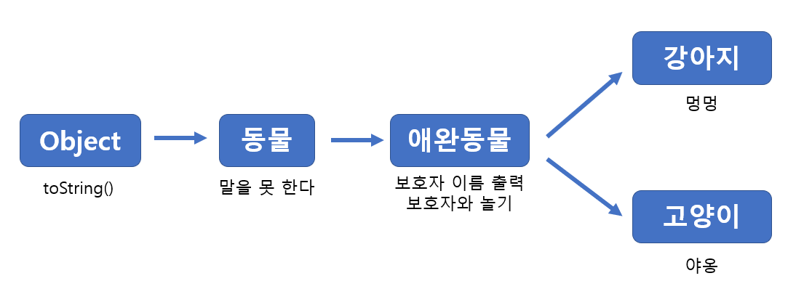

# 18. Java 클래스 (속성)


## 객체

> #### 객체는 상태와 행동이 있다 (State and Behavior)


#### 클래스를 만들 때에는 state, constructor 그리고 Behavior를 설정해 놓는 것이 좋다

- 상태, 생성자, 행동/메서드


### 선풍기의 예시

- state 는 선풍기의 기본적인 상태이다
- constructor는 객체를 만들면서, 선풍기의 상태를 지정해준다
- Behavior는 객체가 할 수 있는 행동이다

```java
public class Fan {

    // state (상태)
    private String make;
    private double radius;
    private String color;
    private Boolean isOn = false;
    private int speed;

    // constructor
    Fan (String make, double radius, String color) {
        this.make = make;
        this.radius = radius;
        this.color = color;
    }

    // Behavior (행동)
    public void switchOn() {
        this.isOn = true;
        this.speed = 10;
        System.out.println("The fan is on: " + this.isOn);
    }

    public void switchOff() {
        this.isOn = false;
        this.speed = 0;
        System.out.println("The fan is on: " + this.isOn);
    }

    public void setSpeed(int speed) {
        this.speed = speed;
        System.out.println("The Speed is now " + this.speed);
    }
}
```


## 객체 컴포지션

> 객체 안에 객체를 넣는 것




- **manUtd** 라는 **Club** 클래스를 통해 만든 객체를 **player1** 에다 넣는다
  - **player1** 은 **FootballPlayer** 클래스를 통해 만든 객체이고, 해당 클래스 내에서는 **Club** 객체를 넣어야 한다
- 선수에 대한 정보도 있지만, 축구 팀에 대한 자세한 내용도 담을 수 있는 클래스를 사용할 수 있다
  - 이렇게 되면, 선수를 계속 생성할때마다, 축구 팀에 대한 똑같은 정보를 반복적으로 입력할 필요가 없다
  - 즉, manUtd 라는 팀에 대한 클럼 객체를 한 번 만들면, 그 객체 하나를 가지고 여러 선수들에게 넣을 수 있다


## 상속

> 특정 클래스를 상속을 안 할 경우, Object 클래스을 기본적으로 상속한다
>
> 다중 상속은 하면 안 된다



- 똑같은 속성과 메스드를 사용해서 새로운 클래스를 만들 경우, 아예 새로 만들 필요가 없다
  - 위의 Person 클래스에 있는 속성들을 가지고, Student 또는 Worker 클래스에 넣고, 추가로 필요한 속성을 만들면 된다
- 위와 같이 하게 된다면, 변경 사항이 있을 때에는 Person 클래스만 변경을 하면, 다른 상속 클래스들도 자동으로 변경이 된다


### 상속 x




### extends를 활용한 상속






#### 한번에 여러 개의 클래스를 상속은 못 해도, 단계별로 상속을 받을 수 있다

- 강아지가 한번에 동물과 애완동물을 상속 받을 수 없다

- 강아지 클래스를 통해 만들어진 객체는, **toString(), 말을 못 한다, 보호자 이름 출력, 보호자와 놀기, 멍멍 메서드**를 모두 할 수 있다
- 고양이도 강아지와 같이, 앞에 상속한 모든 메서드를 할 수 있지만 '멍멍'은 못 한다


#### 강아지 클래스를 물려받은 객체는, 애완 동물과 애완 동물의 객체라고도 할 수 있다

