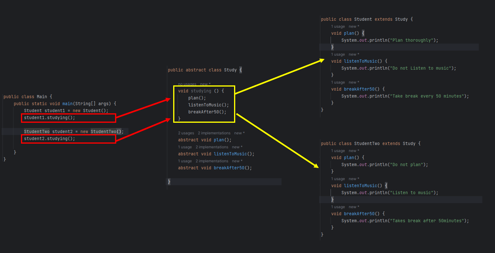
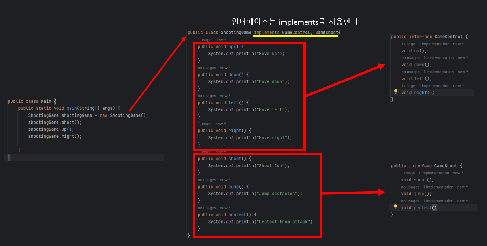

# 19. Java 클래스 (추상 클래스, 인터페이스)


## 추상 클래스

> #### 추상화 클래스는 객체를 만들 수 없다


```java
public abstract class PlayerMovement{
    abstract void kick();
}

public class Player extends PlayerMovement{
    public void kick() {
        System.out.println("Kick");
    }
}
```


#### 어떠한 특정 행동을 해도, 사람마다 다 다르게 행동한다

- 공부를 할 때에, 계획을 먼저 세운다음 공부를 하는 사람이 있고
- 그냥 공부하는 사람이 있고
- 노래를 들으면서 공부하는 사람과, 그렇지 않은 사람들이 있다





#### 위처럼, 큰 틀에서는 같은 행동을 하지만, 자세한 부분에서 차이점이 있으면, 추상화를 통해 큰 틀을 만들고, 그 클을 자식 클래스에 상속 시키면 된다


## 인터페이스




#### 추상 클래스와 매우 흡사하다

#### 인터페이스 안에 인터페이스를 상속할 수 있다

- 상속된 인터페이스가 있을 때에, 특정 인터페이스를 사용하고 싶으면, 추상 클래스를 따로 만들어서, 인터페이스를 상속받아 사용하면 된다


## 자바 인터페이스 vs 추상 클래스

#### 인터페이스는 변수/ 속성을 가질 수 없다

#### 인터페이스는 모두 public 이다, private일 수 없다

#### 추상 클래스는, 2개의 추상 클래스를 상속 받을 수 없다 / 반대로 인터페이스는 한번에 다중 상속이 가능하다


