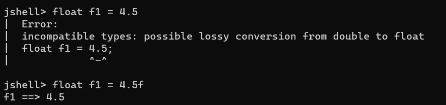

# 2. Java 기초


## 변수 (variable)

> #### 파이썬과 달리, 자바스크립트와 비슷하게 데이터 타입을 변수 이름과 함께 명시해야 한다
>
> - integer 는 int
> - float 는 float
> - string 은 str


```java
int number_1 = 2
int number_2 = 4

System.out.printf("%d * %d = %d", number_1, number_2, number_1 * number_2).println()
// output : 2 * 4 = 8
    
number_2 = 100
    
System.out.printf("%d * %d = %d", number_1, number_2, number_1 * number_2).println()
// output : 2 * 100 = 200
```


```java
// 문자열도 더하기를 통해서, 여러 문자열을 합칠 수 있다
// 여기서 문자열과, 숫자를 더하게 되면, 하나의 문자열로 출력해준다

"1" + 2 + 3
// output : "123"
    
"ABC" + "DEF"
// output : "ABCDEF"
```


#### 변수와 메모리 (변수가 어떻게 메모리에 저장되는가?)

- 변수의 값은 바뀔 수 있다
- 변수가 만들어지면 아래와 같이 메모리 저장 공간에 참조가 된다
  - 그리고 변수와 함께 값이 저장이 된다
- **즉 변수는 메모리 저장 공간의 이름이라고 보면 되고, 값은 메모리 저장 공간에 저장되는 데이터**
  - 인간이 5000, 5001을 외우는 것보다, 변수 이름을 외우거나 읽는 것이 더 편하다

| 메모리 저장 공간 | 변수     | 값   |
| ---------------- | -------- | ---- |
| 5000             | number_1 | 10   |
| 5001             | a        | 7    |
| 5002             | b        | 9    |


#### 변수 이름 만들기

- **문자열**, **숫자**, '**$**'와 '**_**' 를 사용하여 변수의 이름을 만들 수 있다
- 변수 이름은 숫자로 시작할 수 없다
- 키워드가 변수 이름일 수 없다 (int, str, 메서드 이름 등)
- 주로 camelCase를 사용한다 (시작은 소문자로, 새로운 단어를 넣어야 할 때에는 대문자로 시작해야 한다)
  - 예시) leeJeJoon, firstGoal, helloWorld
- 어떤 값이 메모리에 저장되었는지 변수의 이름을 잘 지정해야 한다


#### 변수 타입

- ##### integer 로 표현할 수 있는 변수 타입이다

  - **byte** : 8 비트 (-128 ~ 127)
    - 예시 ) 축구 경기의 점수를 데이터로 저장할 때에 byte로 데이터를 저장하는게 좋을 것이다
  - **short** : 16 비트 (-32,768 ~ 32,767)
  - **int** : 32 비트 (-2,147,483,648 ~ 2,147,483,647)
  - **long** : 64 비트

- **float** : 실수 (32비트)

```java
float f1 = 4.0f
float f2 = 4.5f
// float에서 데이터를 변수에 넣을 때 f 를 포함해야 한다
```




- **double** : 다른 float의 데이터 타입이다 (실수, 64비트)

```java
double dbl = 4.5
double db2 = 4.0
// double의 f를 안 넣어도 된다
```


- **char** : 문자열

- **boolean** : true or false


> ##### float와 double은 정확하지 않다. 그래서 정말 중요한 데이터를 다룰 때는 float와 double을 사용 안 하는게 좋다
>
> - float 보다 double이 더 정확하다


#### 대입 연산자 (Assignment Operators)

> #### 하나의 변수의 값을 다른 변수에 넣는 것이다

```java
int i = 10
int j = 15
    
i = j
// j의 값이 i에 넣어진다. 즉 i는 15가 된다
    
j ++
// j + 1 이다
    
j --
// j - 1 이다
```

