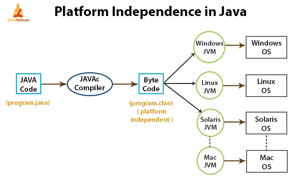
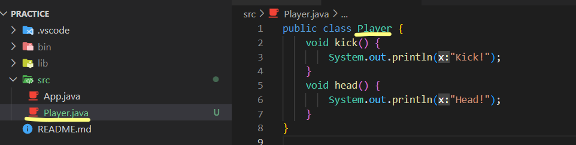
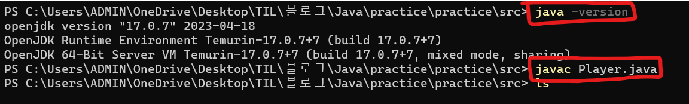
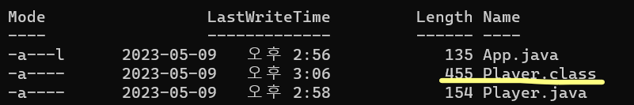
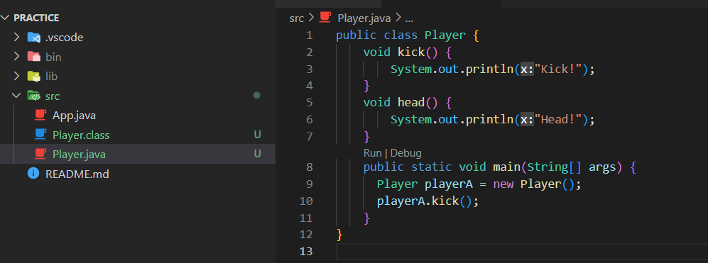
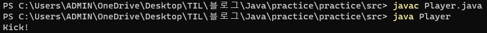

# 5. Java Platform


## 자바 플랫폼 개요



- **컴퓨터는 0과 1만 이해한다**
  - 이것을 **basic instructions** 이라고 한다
  - 즉 자바를 사용하든, 다른 프로그래밍 언어를 사용하든, 모두 0과 1로 만들어진다
- 각 OS (운영 체제)들은 각자만의 basic instructions를 가지고 있다
  - 즉 자바 언어로 코드를 작성할 때에, 특정 OS를 맞춰서 자바 코드가 0과 1로 바뀌어야 한다


1. 자바 코드를 작성한다
2. 자바 코드를 컴파일링을 통해 ByteCode로 만든다
   - 여기서 ByteCode는 운영체제와 관계없이 공통적인 포맷을 취한다
3. JVM (Java Virtual Machine)이라는 소프트웨어를 통해 ByteCode를 특정한 운영체제에 맞도록 만들어준다
   - JVM은 운영체제마다 모두 다르다


## 자바 클래스 / 오브젝트 / 메서드

#### 클래스

- 탬플렛과 같다 (블루프린트, 붕어빵 틀)
- 클래스를 사용해서 객체를 만들 수 있다

```java
// 클래스 만들기
class Player {
    void kick() {
        System.out.println("Kick!");
    }
    void head() {
        System.out.println("Head!");
    }
}

// 객체, instance/object 만들기
Player playerA = new Player();

// 클래스 안의 메서드 불러오기
playerA.kick();
// output : Kick!

playerA.head();
// output : Head!

```


## 자바 클래스 컴파일하기



- 클래스와 이름이 같은 java 파일을 생성한다




- 위에 만들었던 **Player.java** 폴더로 이동한다
  - 여기서 java가 설치되었는지 확인할겸 **java -version**을 해본다
- **javac Player.java** 를 하면 Player.class가 생성된다




- **Player.class** 가 생성된 것을 확인 할 수 있고, 이 파일에 **Player.java** 안에 있는 코드가 컴파일된 ByteCode가 있다


## 자바 클래스 실행하기



```java
public static void main(String[] args)
```

- 위의 코드가 없으면 터미널에 **java Player** 을 실행하면, 에러가 뜬다

  



- **javac Player.java** 를 통해 **Player.class**를 업데이트 해준다
  - 안하면, **Player.java**를 수정하기 전의 파일로 컴파일이 되어 있다
- **public static void main(String[] args)** : 이 메서드 안에, 실행하고 싶은 코드를 넣고 업데이트를 해주면된다
- **java Player**를 하게 되면, **Player** 클래스가 실행이 된다


## JDK vs JRE vs JVM

#### JVM (Java Virtual Machine)

- Java 코드가 컴파일 된 ByteCode를 운영체제에 맞게 만들어 주는 소프트웨어


#### JRE (Java Runtime Environment)

- JVM + Libraries + Other Components
- 자바 안에 이미 만들어진 Libraries를 함께 사용하는 것 (in-built Java Classes)
- 어플리케이션 유저가 JRE를 이용할 것이다


#### JDK (Java Development Kit)

- JRE + Compilers + Debuggers
- 자바 프로그램을 개발할 때에 필요한 것이다
- 어플리케이션 개발자가 JDK가 필요할 것이다


