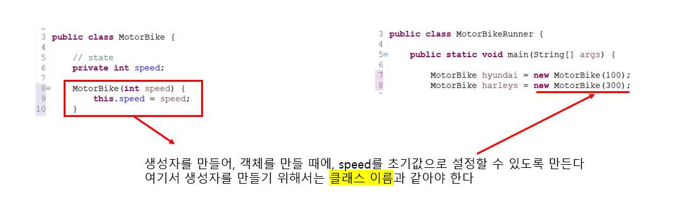

# 7. Java 객체 지향 프로그래밍


## 절차적 프로그래밍

> #### 과정, 메서드, 함수 위주로 생각하는 프로그래밍이다


## 객체 지향 프로그래밍

> #### 객체, object가 어떤 데이터를 포함하는지, 어떤 행동을 할 수 있는 프로그래밍을 하는 것이다
>
> - 데이터는 바뀔 수 있다


### Class

```java
public class Planet {
	name, location, distanceFromSun; //data
    revolve(), rotate(); //actions/behaviors
};
```

- 클래스는 탬플렛, 즉 객체를 만드는 틀이다
- 클래스 안에, 만들어질 객체에 어떤 데이터를 넣을 수 있는지, 또는 어떤 행동을 할 수 있을지 설정을 한다


### Object

```java
public class Planet {
	name, location, distanceFromSun; //data
    revolve(), rotate(); //actions/behaviors
};

Planet earth = new Planet();
Planet venus = new Planet();
```

- 객체, object는 클래스라는 틀로 만들어졌다
  - **earth**와 **venus**는 **Planet** 이라는 클래스, 즉 틀을 통해 만들어진 변수이다


### Encapsulation

- '캡슐화'는 변수와 함수를 클래스로 묶고, 외부에서 쉽게 접근 못 하도록 은닉하는 것이다
  - 즉 객체가 제공하는 필드와 메소드를 통해서만 내부 정보를 접근할 수 있다
- 다른 객체를 통해, 현재 객체의 데이터가 바뀌는 것을 막아 줄 수 있다
- 객체의 속성을 캡슐화를 하여 메서드를 통해서 변수의 데이터를 바꾸는 로직을 짤 수 있다
  - 예) 음수를 데이터에 넣기 싫으면, 메서드의 if문을 통해 로직을 짠다
  - 유저가 변수를 음수로 잘 못 저장했을 때, 로직 때문에, 데이터가 수정이 안 된다


```java
public class MotorBike {
	
	// --------------- state -------------
	private int speed;
	
    // speed의 기본 설정
	MotorBike() {
		this(10)
	}
	
	MotorBike(int speed) {
		this.speed = speed;
	}
	

	
	// -------------------- behavior----------------------
    // 속도 초기 세팅하기
	void changeSpeed(int speed) {
		if (speed >= 0) {
			this.speed = speed;
		} else {
			System.out.println("This Can not be a speed");
		}
	}
	
    // 속도 추가하기
	public void increaseSpeed(int speed) {
		if (speed >= 0) {
			changeSpeed(this.speed + speed);
		} else {
			System.out.println("You can only INCREASE speed");
		}
	}
	
    // 속도 줄이기
	public void decreaseSpeed(int speed) {
		if (speed >= 0) {
			changeSpeed(this.speed - speed);
		} else {
			System.out.println("Negative value can not be an input");
		}
	}
    
    // 현제 속도 반환하기
	int getSpeed() {
		return this.speed;
	}
	void start() {
		System.out.println("Start the Bike");
	}
	
	void stop() {
		System.out.println("Stop the Bike");
	}
}
```

- **private int speed**
  - 외부에서 **speed**라는 변수를 직접적으로 접근할 수 없다 (private을 사용)
- **void changeSpeed(int speed)**
  - 이 함수를 통해 **speed**를 바꾼다
  - **if 문**을 사용하며, 음수는 **speed**가 될 수 없는 것을 설정한다
- **this.speed = speed;**
  - **this.speed** 는 클래스 안에 만들어진 **speed** 속성
- **int getSpeed()**
  - 속도를 반환해준다


> #### 메서드를 이용해서 클래스 안에 있는 speed라는 변수를 바꿔주고, 반환을 했다


### 추상화

- 자동차를 운전하기 위해서는, 자동차 안에 모든 부품에 대해 알 필요가 없다
- 이와 같이 프로그래밍도 디테일 적인 부분들은 모두 추상화가 되어 있다
  - 우리는 자바 코드를 작성한다
  - 코드를 작성하면, 코드가 컴파일 되어 ByteCode로 만들어 지고, JVM을 통해 각 운영체제에 맞춰 실행이 된다
  - **우리는 자바 코드를 작성하면 되지, 컴파일부터 JVM까지 할 필요가 없다 (모두 추상화가 되어 있다)**
- 즉 메서드를 이용할 때에, 메서드가 어떤 기능을 하는지만 알면 되고, 자세한 로직까지 알 필요 없이 사용이 가능하다
  - 로직은 추상화가 되어 있다


### 생성자

> #### 객체를 만들 때에, 속성의 값을 미리 설정을 해 놓는 것이다





