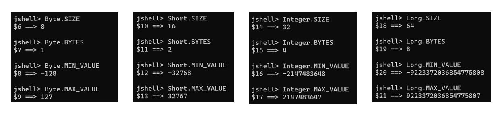
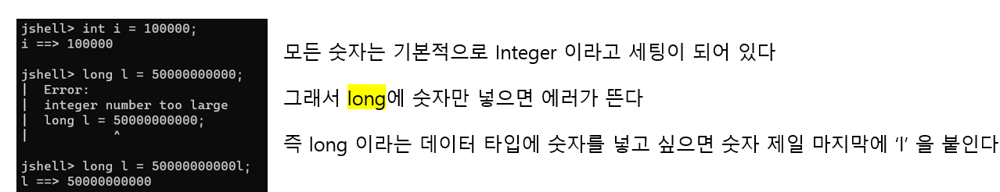
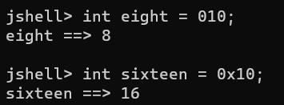
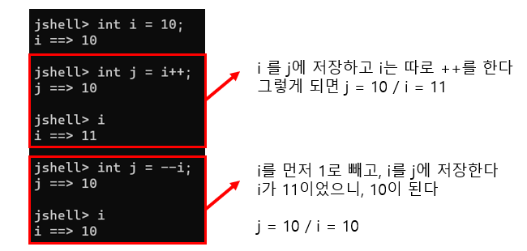

# 8. Java 기본 데이터 타입


## 지금까지 배운 것

#### Integer

- byte, short, int, long

#### Floating Point

- float, double

#### Boolean

- boolean

#### Character

- char


## Integer 기본 데이터 타입



- MIN_VALUE와 MAX_VALUE에 따라 특정 데이터 타입을 선택한다





### Casting

> 타입을 변환하는 것이다


- 큰 값을 작은 값에 넣을 수 없다
- 큰 값을 작은 값에 넣기 위해서는 explicit 변환을 해줘야 한다
  - **i = (int) l**  :  **l** 은 큰 값
- 반대로 작은 값을 큰 값에 넣을 수 있다
  - 이때는 implicit 변환을 해준다
  - **l = i**


### 8진수, 16진수

- 0 으로 시작하는 숫자는 8진수이다
- 0x 로 시작하는 숫자는 16진수이다
  - 0 ~ 9, A, B, C, D, E, F
  - A = 10 / B = 11 / C = 12 / D = 13 / E = 14 / F = 15




### 증감연산자




## 연습

```java
public class BiNumber {
	private int num1;
	private int num2;
	
	BiNumber (int num1, int num2) {
		this.num1 = num1;
		this.num2 = num2;
	}
	
	public int add() {
		int addNumber = this.num1 + this.num2;
		return addNumber;
	}
	
	public int multiply() {
		int multNumber = this.num1 * this.num2;
		return multNumber;
	}
	
	public void doubleValue() {
		this.num1 *= 2;
		this.num2 *= 2;
	}
	
	public int getNumber1() {
		return this.num1;
	}
	
	public int getNumber2() {
		return this.num2;
	}
}
```


### Runner

```java
public class BiNumberRunner {

	public static void main(String[] args) {
		
		BiNumber numbers = new BiNumber(2, 3);
		System.out.println(numbers.add());
		System.out.println(numbers.multiply());
		numbers.doubleValue();
		System.out.println(numbers.getNumber1());
		System.out.println(numbers.getNumber2());
	}

}

// output
// 5
// 6
// 4
// 6
```

