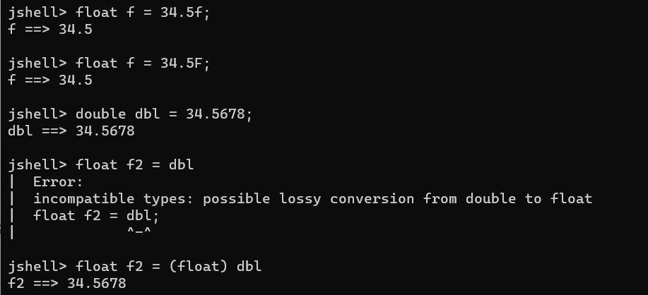
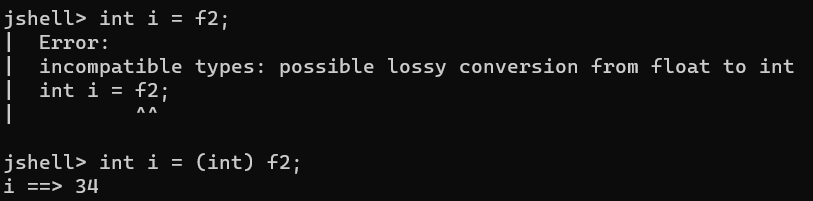
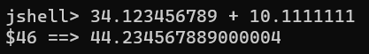
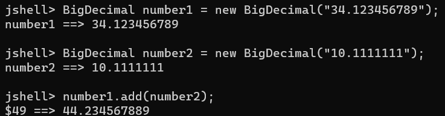
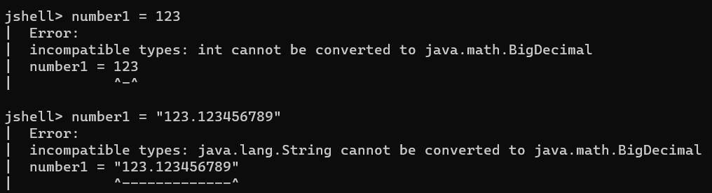
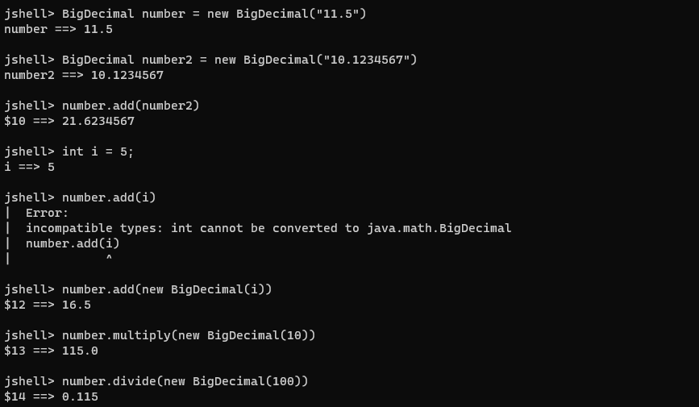

# 9. Java 기본 데이터 타입 (Float, BigDecimal)


## 지금까지 배운 것

#### Integer

- byte, short, int, long

#### Floating Point

- float, double

#### Boolean

- boolean

#### Character

- char


## Float

> #### Integer + Decimal


#### 그냥 34.5 는 double 에 해당한다

- 그래서 float로 저장할 때에는, f 나 F 를 숫자 마지막에 포함해야 한다
- Integer처럼 float는 double보다 작은 데이터 타입이다
  - float 는 4 바이트
  - double 은 8 바이트





#### double 로 저장된 값을 float 변수에 저장하기

- **float f2 = (float) dbl**  :  dbl을 float로 형변환을 시켜줘야 한다


#### Integer에서 사용했던 연산자들을 모두 사용할 수 있다


### float => Integer

- 원래 **float** 데이터 타입을 **int**로 강제로 형변환을 시킨 후, **int** 변수에 저장을 해야 한다




- 반대로 integer => float 는 바로 가능 하다
  - **float f = i**


## BigDecimal

> #### 정말 정확한 계산이 필요할 때에는 float나 double을 사용하지 않는게 좋다



- 원래 답은 44.234567889 이다
- 근데 뒤에 다른 숫자가 따라오면서, 정확한 계산이 안 되었다




#### BigDecimal은 자바 안에 내장된 클래스이다

- 소수를 문자열로 저장해야 한다
  - 문자열이 아니면 정확하게 숫자가 저장이 안 된다
- 나오는 값이 정확한 것을 알 수 있다


#### BigDecimal로 객체를 만들었으면, 그 객체에 저장된 숫자는 바꿀 수 없다

- 즉 **number1** 을 다른 숫자로 저장할 수 없다




### BigDecimal 을 이용해서 계산하기

- **BigDecimal**로 만들어진 객체끼리만 계산이 가능하다
- 그래서 **number.add(i)**를 했을 때, 에러 메세지가 뜬다
  - i 는 integer 이다
- **number.add(new BigDecimal(100))**
  - 이렇게 클래스를 이용하여, integer을 계산을 해야 한다




## 연습하기

#### BigDecimal을 이용하여 간단한 이자 계산하기 구하기

```java
import java.math.BigDecimal;

public class SimpleInterestCalculator {
	BigDecimal principal;
	BigDecimal interest;
	
	public SimpleInterestCalculator(String principal, String interest) {
		this.principal = new BigDecimal(principal);
		this.interest = new BigDecimal(interest).divide(new BigDecimal(100));
	}
	
	public BigDecimal calculateTotalValue(int year) {
		BigDecimal totalValue = principal.add(
				principal.multiply(interest
				.multiply(new BigDecimal(year))));
		return totalValue;
	}
	
}
```


#### Runner

```java
import java.math.BigDecimal;

public class SimpleInterestCalculatorRunner {

	public static void main(String[] args) {
		SimpleInterestCalculator calculator = new SimpleInterestCalculator("4500.00", "7.5");
		
		BigDecimal totalValue = calculator.calculateTotalValue(5);
		
		System.out.println(totalValue);
	}

}
```

