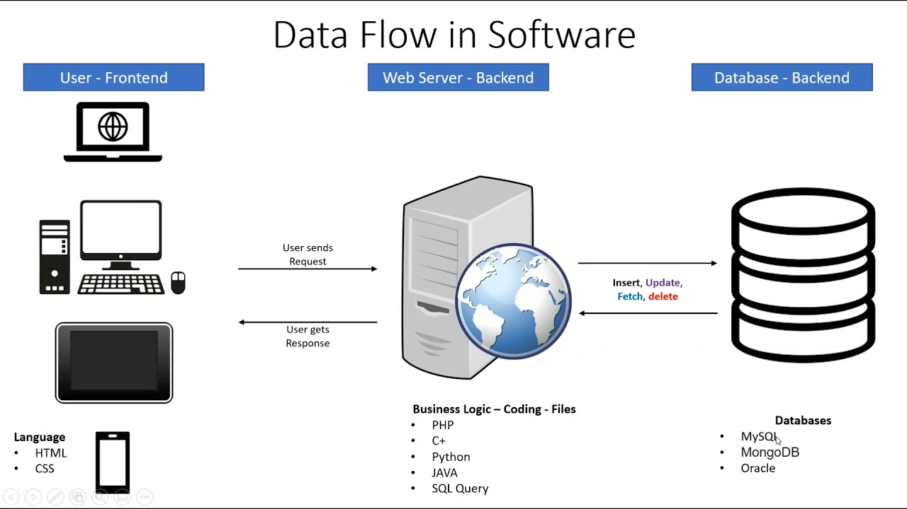
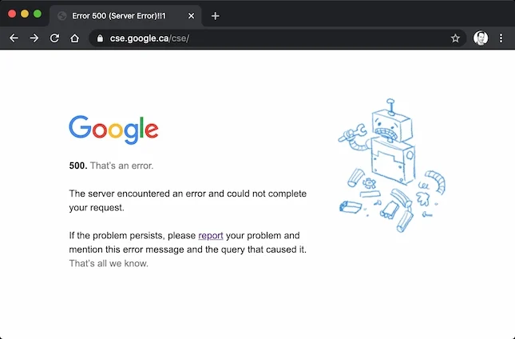

# 프론트엔드와 백엔드 차이

*제로베이스 백엔드 스쿨*

## 내 경험

멀티캠퍼스 풀스택 개발 과정을 배우며, 프론트엔드와 백엔드를 모두 경험할 수 있었다. 

실제로 프로젝트를 할 때에 모두 풀스택으로 참여를 했다.

처음부터 기능을 구현하고, 구현한 기능을 시각화 하는 재미가 있었다.

혼자 모든 것을 구현하니, 시간은 걸렸지만, 성취감은 배로 쌓이게 되었다.

## 프론트엔드와 백엔드 차이

#### 화면

프론트엔드는 화면으로 보여지는 것을 얘기한다. 프론트엔드 쪽을 다루며 UI/UX (User Interface / User Experience)에 대해 많이 들었다. 즉, 유저들이 해당 서비스를 사용할 때에, 직접적으로 상호 작용하는 부분이 프론트엔드이다. 좀 더 생각하면, 프론트엔드를 통해 새로운 유저를 유치하거나, 기존 유저들을 유지시킬 수 있다.

유저들이 직접적으로 상호 작용한다는 것은, 유저들이 원하는 데이터를 요청하게 된다면, 해당 데이터를 시각화 하여 보여주는 역할을 프론트엔드에서 하게 된다. 여기서 **시각화**가 중요한 것은, 데이터는 유저들이 보기 쉬워야, 서비스를 지속적으로 사용할 것이다.

프론트엔드 개발자들은 HTML, CSS, 그리고 JavaScript를 많이 사용한다. HTML을 통해 웹 서비스의 뼈대를 잡고, CSS를 통해 색 또는 모형을 입힌다. 그리고 JavaScript를 통해, 웹 서비스를 동작할 수 있도록 만들어준다.

#### 서버

백엔드라고 하면 주로 서버를 개발하는 분야다. 데이터를 저장하고, 생성하고, 변경하며, 유저들이 필요한 데이터를 백엔드에서 처리를 한다. 유저들과 상호 작용은 프론트엔드에서 하면, 백엔드에서는 유저들이 요청한 데이터를 볼 수 있도록 뒤에서 처리를 해준다.

예를 들어서 유저가 새로운 페이지로 옮겨가기 위해서 링크를 클릭했다. 즉, 유저는 서버에 '새로운 페이지로 들어가줘'라는 요청을 한 것이다. 그렇게 되면 서버에서는 데이터베이스를 확인하여, '새로운 페이지'라는 정보, 즉 HTML 파일을 찾고 유저에게 응답/보내준다.

그 외에도, 백엔드에서는 데이터를 빠르게 처리하는 속도, 웹 사이트의 트래픽을 관리하는 역할도 담당한다. 여기서는 더 빠른 알고리즘을 생각을 해내거나, 트래픽, 즉 서버에 접속하는 인원을 효율적으로 분산을 시켜서 유저들이 웹 사이트를 막힘 없이 사용할 수 있도록 도와준다.

- **User - Frontend**
  - 유저는 어플리케이션/웹 서비스를 이용을 할 때에는 프론트엔드와 상호 작용을 하게된다
  - 화면에 나온 내용들을 볼 수 있고, 그 내용들을 토대로 웹 서비스를 이용하게 된다
- **Request**
  - 유저들을 웹 사이트를 보며, 필요한 데이터를 HTTP 또는 HTTPS를 통해 서버에 요청을 한다
  - HTTP/HTTPS (HyperText Transfer Protocol/ HyperText Transfer Protocol Secure)를 통해 클라이언트 (프론트엔드)와 서버가 소통을 한다
- **Server - Backend**
  - 유저가 HTTP 또는 HTTPS를 통해 요청한 데이터를 백엔드에서 찾거나, 수정을 하게 된다
- **Response**
  - 백엔드에서는 다시 HTTP/HTTPS를 클라이언트에 보낸다
  - 여기서는 성공을 하면, 데이터를 유저에게 보여주고, 실패를 하면 오류를 보내게 된다
    - 400번대 또는 500번대 에러를 볼 수 있다

## 백엔드 개발자가 되고 싶은 이유

개발을 시작하며, 개발자가 되어야겠다고 마음 먹은 것은, 내 자신이 성장을 하는 것이 살면서 처음으로 보였기 때문이다. 마치 게임 캐릭터를 키우듯이, 내 자신이 발전하는 것을 느낄 때 마다, 정말 많은 성취감을 느낄 수 있었다. 그런 점에서 '성취감'이란 것이 직무를 선택할 때 큰 작용을 했다고 생각한다.

프로젝트에서 풀스택으로 활동을 할 때에, 프론트엔드를 하며, 디자인 적으로 어느 정도 감각이 있어야 한다고 생각을 했다. 특히 프론트엔드는 UI/UX가 정말 중요하다고 느꼈다.  그런 점에서는 디자인 감각이 조금 떨어진다고 생각을 했다. 그리고 JavaScript를 혼자서 독학하기 전까지는 HTML과 CSS만 사용을 하며, 개인적인 느낌으로는 갖춰진 틀 안에서 개발을 하는 느낌을 받았다. (물론 JavaScript를 사용하면서, 프론트엔드의 매력을 제대로 느낄 수 있었다)

프론트엔드의 매력을 느끼기 전에는 이미 백엔드에 많은 비중을 두고 있었다. 일단 개발을 처음 시작하면서, 알고리즘 풀이를 통해 개발을 하며 성취감을 느낄 수 있었다. 이렇게 처음 느꼈던 성취감을 통해 지금도 꾸준히 개발 공부를 하고 있게 되었다. 그리고 특히 기능 구현을 하는 것에 재미를 붙이게 되었다. 아무리 웹 서비스 또는 어플리케이션이 디자인이 잘 되어 있어도, 기능이 제대로 구현되어 있지 않으면, 제 기능을 하지 못 한다는 것을 알게 되었다. 그렇게 에러를 찾아가며, 기능을 구현하는 성취감을 통해 백엔드 개발자가 되고 싶어졌다.

풀스택으로 백엔드와 프론트엔드 모두 경험을 할 수 있었던 것은 정말 좋았던 것 같다. 이러한 경험을 통해, 추후에 프론트엔드 개발자와 소통을 더 잘 할 수 있을 것 같다. 그리고 둘 다 모두 중요한 파트지만, 개인적으로는 백엔드를 통해 성취감을 더 많이 느낄 수 있었다. 
