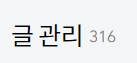

# 앞으로의 백엔드 공부 계획

*제로베이스 백엔드 스쿨*

## 매일 배운 내용, 풀었던 문제 정리해서 블로그에 올리기

#### 성실하게 공부하기

다음 주가 되면, 개발을 배운지 딱 1년이 된다.

처음에는 깃헙에 커밋을 매일 하며, 잔디 심기에 빠져서, 매일 공부한 것을 깃헙에 올리거나 풀었던 문제를 커밋을 했다.

특히 개발을 배우면서, 나중에 내 자신이 배웠던 내용을 까먹었을 때에, 알아볼 수 있도록 다시 정리해 놓는 것이 중요하다고 느꼈다.

그렇게 느끼면서 매일매일 배웠던 내용을 내 자신일 잘 알아볼 수 있도록 정리를 했다.

특히, 새로운 코드를, 라인 하나하나 설명하면서 문서화 하는 작업이 익숙해졌고, 추후에 매우 유용하게 쓰이게 되었다.

그렇게 12월 말에, 깃헙보다는, 좀 더 제대로 정리를 하자는 생각에 티스토리에 글을 올리기 시작했다.

이렇게 나는 매일 공부를 하며, 배운 내용, 그리고 풀었던 문제들을 깃헙 또는 블로그에 문서화를 시켜서 올리게 되었다.

이처럼, 앞으로도 성실하게, 매일 공부하며 배운 내용, 그리고 풀었던 문제들을 문서화 시켜서 블로그에 올릴 것이다.

미래에 내가 다시 볼 때에 이해를 할 수 있도록, 그리고 현재의 내가 성장을 할 수 있도록 성실함을 유지할 것이다.

#### 알고리즘 문제 계속 풀기

코딩 테스트를 몇 번 보았지만, 항상 풀 수 있을 듯,  못 풀었던 문제가 너무 많다.

그렇게 한 번도 코딩 테스트를 통과해본 적이 없다.

그런 점에서, 제로 베이스를 통해, 많은 문제를 풀고, 개인적으로도 매일 문제를 풀며 실력을 늘리고 싶다.

특히, 제로 베이스 슬렉스에 올라온 프로그래머스 총 111 문제를 다 풀어보는 것이 목표다. 

이 것도 풀면서, 내용을 정리해서 블로그에 올릴 것이다.

## 취업 후

취업 후에는, 물론 처음에는 회사에 적응하는 것이 제일 중요하다고 생각한다.

하지만 어느 정도 회사에 적응하고, 새로운 것을 배우고 싶다고 느낄 수 있을 것 같다.

#### 데이터 분석

파이썬 기반으로 취업을 준비할 때에, 데이터 분석 파트가 정말 많이 떴다.

오히려 파이썬은 백엔드보다는 데이터 분석 파트가 훨씬 더 많았고, 그런 점에서 조금씩 관심이 생기게 되었다.

특히 스포츠에는 데이터가 정말 많다.

그런 면에서, 혼자 스포츠 관련 데이터를 분석하며, 블로그에 글을 써보고 싶다는 생각을 가지게 되었다.

이렇게 개발자로서, 내가 좋아하는 것에 대해 더 깊이 생각할 수 있는 기회라고 생각을 했다.

그리고 백엔드 개발자라고 데이터를 안 다루는 것도 아니라고 생각한다.

풀 스택 교육을 들으면서 프로젝트를 할 때에, 데이터를 모아서, 시각화하는 역할을 맡았다.

데이터를 모으는 것부터, 데이터를 가공하는 것까지 모두 하면서, 백엔드 개발자도, 어느 정도 데이터를 다룰 수 있는 능력이 있어야 한다고 느꼈다.

마치 프론트엔드에서 UI/UX를 공부하는 것과 같다고 생각을 했다.

그래서 데이터 분석도 혼자서 학습하면, 추후에 백엔드 개발자로서 더 많은 역할을 할 수 있다고 생각했다.
