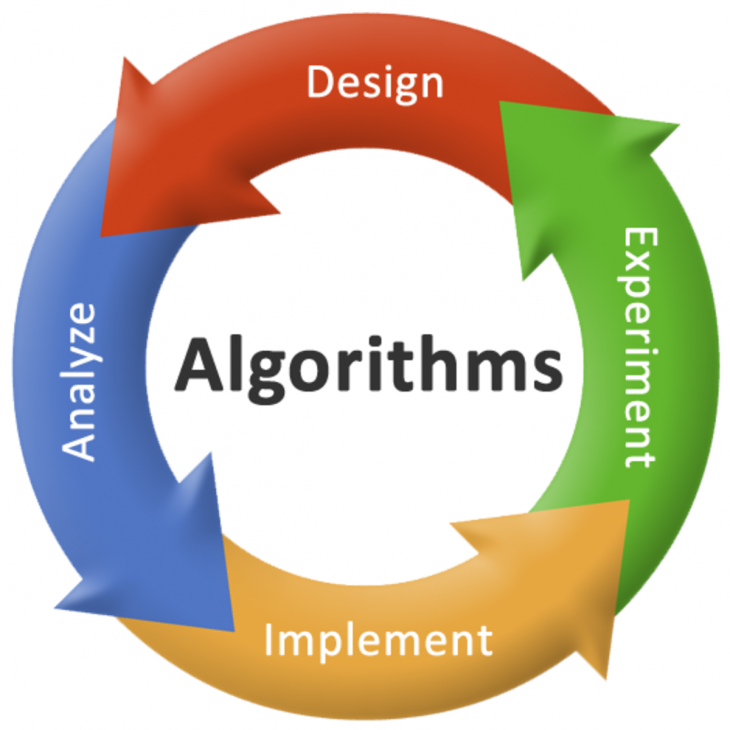

# **백엔드 신입 개발자에게 자료구조와 알고리즘이란**

*제로베이스 백엔드 스쿨*

## 나에게 자료구조, 알고리즘란?

자료구조 그리고 알고리즘을 배우면서, 제일 스트레스를 많이 받으면서, 그만큼 성취감이 제일 컸던 것 같다. 처음 파이썬으로 알고리즘을 배우고, 문제를 풀면서 파이썬이라는 언어에 더 익숙해질 수 있었다. 그만큼 나에게 자료구조, 그리고 알고리즘은 새로운 언어에 익숙해질 수 있는 촉진제 같은 역할을 했다. 알고리즘을 풀면서, 필요한 메서드나 클래스를 찾아가면서 문제를 풀어나갔다. 이렇게 알고리즘을 풀면서 사용했던 클래스나 메서드를 프로젝트에 사용하기도 했다. 그리고 실제로 자료구조를 잘 배워둬서, 나중에 프로젝트를 할 때에 더 편안하게 진행을 했던 부분도 있다.

파이썬은 많은 라이브러리가 있어서, 알고리즘을 풀 때에 정말 편안했다. 반대로 최근에는 자바를 배우며, 알고리즘을 풀고 있다. 라이브러리가 없는 것들도 있어, 직접 구현을 해야 하는 것이 많다고 느꼈다. 이렇게 구현을 하다 보니, 그 전에는 이름 그리고 기능만 알았던 것들을 더 자세하고 구현까지 조금씩 하게 되었다.

이런 것들을 보면, 똑같은 알고리즘 문제를 풀어도, 내 자신이 성장하는 느낌을 받았다. 그리고 자료구조와 알고리즘을 배우며, 새로운 언어, 그리고 알고 있던 언어에도 더 적응을 할 수 있는 매개체가 된 것 같다.

## 백엔드 개발자에게 자료구조와 알고리즘이 필요한 이유

#### 구현 능력

제일 중요한 요소라고 생각한다. 특히, 국비로 개발 과정을 들었을 때, 프로젝트를 하면서 많이 느꼈다. 기능은 구현을 해야 하는데, 만약 자료구조와 알고리즘을 모른 상태에서, 구현하라고 했으면 시간이 배로 걸렸을 것이다. 하지만, 자료구조와 알고리즘을 공부하면서, **'로직'**을 생각해 내는 능력이 생겼던 것 같다. 그런 로직을 통해, 내가 구현하고 싶은 기능들을 구현할 수 있었다. 그리고 데이터를 어떤 자료구조 형식으로 가지고 와서, 화면에 어떻게 전달할지 생각도 하면서, 개발자로서 자료구조와 알고리즘의 필요성을 느끼게 되었다.

#### 문제 해결 능력

이 전에 개발 과정을 들으면서, 제일 인상 깊었던 말이 있다. 개발은 **'일상 생활이나 이 세상의 문제를 찾고, 그 문제를 해결하는 것이다'** 라는 것이었다. 나는 항상 개발자라고 생각하면, 새로운 것을 만들어 내는 사람들이라고 생각했다. 그런 점에서, 강사님이 저렇게 말했던 것은, 내게 정말 신선하게 다가왔다. 최근에도 이모부도 내게 창업 아이템 또는 개발 아이템은 내게 제일 가까운 곳에서 찾을 수 있다고 했다.  (그것이 일상 생활이든, 취미든)

이처럼 자료구조와 알고리즘을 배우며, 문제들을 풀어나가는 것은 단순히 문제만 푸는 것이 아니라고 생각한다. 문제를 풀면서, 문제를 어떻게 풀어야 할지, 생각을 하고, 그 것을 코드로 구현을 해 나간다. 그렇게 문제 해결에 대한 기획부터 실행까지, 아주 짧은 시간이지만, 문제 해결 능력을 조금씩 쌓고 있다고 생각한다. 이렇게 되면, 나중에 문제를 발견할 때에, 어떻게 이 문제를 풀지에 대한 생각을 가질 수 있는 백엔드 개발자로 성장을 할 수 있을 것이라고 생각한다.

#### 공부!

문제를 풀다 보면, 모르는 것들도 나오고, 어떻게 구현을 할 수 있을지는 알지만, 어떤 라이브러리, 클래스 또는 메서드를 쓸지 모를 때가 있다. 그렇게 구글링을 하게 되고, 새로운 것을 배우게 된다. 이처럼 알고리즘을 그냥 문제를 푸는 것이 아닌, 언어를 더 배운다는 생각을 하면서 하려고 노력한다. 문제를 풀면서 자동으로 언어에 대해 공부를 하고, 결과적으로 백엔드 개발자로서 한 단계 더 성장한다고 생각한다.

## 그래서 어떻게 공부할 것인가?

솔직히 알고리즘을 공부하면 공부할 수록 자신감이 많이 떨어지는 것은 사실이었다. 문제는 더 어려워지고, 코딩 테스트를 봤는데도, 잘 안 풀려지면, 지금까지 공부해 온 것에 대해 혼자서 의심이 들었다. 그래도, 자바라는 프로그래밍 언어를 처음 배우는 만큼, 초심을 찾고 지속적으로 열심히 문제를 풀 예정이다. 그리고 문제를 풀면서, 새로 배운 내용들을 정리해서 블로그에 올릴 것이다.

특히 내가 어려워하는 문제 유형들을 빠르게 찾고, 강의를 더 많이 보면서 공부를 할 예정이다.

내가 어려워 하는 알고리즘

- DFS (일반적인 구현은 가능한데, 재귀로 구현하고, 문제에 맞춰서 DFS를 구현하는 것이 어려움) 
  - 애초에 재귀랑 더 친해져야 할 것 같음
- DP (이건 강의도 많이 보고, 많이 풀어봐야 할 것 같다)
- 백트래킹
