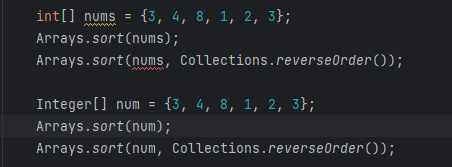

# [TIL] Java (정렬하기)


#### Arrays.sort(배열)

- 배열을 오름차순으로 정렬을 해준다
- 배열이 문자열로 이루어져 있으면, **숫자 => 대문자 => 소문자 => 한글순** 으로 정렬이 된다

```java
import java.util.*;

public class Main {
    public static void main(String[] args) {

        String[] string = {"C", "A", "a", "B", "b", "7", "제", "준", "기", "5", "9", "1"};
        Integer[] num = {3, 4, 8, 1, 2, 3};

        Arrays.sort(string);
        Arrays.sort(num);

        System.out.println("=== 오름차순 정렬 ===");
        System.out.println("배열 (문자열) 정렬 : " + Arrays.toString(string));
        System.out.println("배열 (숫자) 정렬 : " + Arrays.toString(num));
    }
}

/* output
=== 오름차순 정렬 ===
배열 (문자열) 정렬 : [1, 5, 7, 9, A, B, C, a, b, 기, 제, 준]
배열 (숫자) 정렬 : [1, 2, 3, 3, 4, 8]
*/
```


#### Arrays.sort(배열, Collections.reverseOrder())

- 배열을 내림차순으로 정렬을 해준다
- **int[]** 를 사용할 때에는 에러가 뜨지만, 자료형을 **Integer[]** 를 사용할 때에, 제대로 내림차순으로 반환이 된다
- 배열이 문자열로 이루어져 있으면, **한글순 => 소문자 => 대문자 => 숫** 으로 정렬이 된다



```java
import java.util.*;

public class Main {
    public static void main(String[] args) {

        String[] string = {"C", "A", "a", "B", "b", "7", "제", "준", "기", "5", "9", "1"};
        Integer[] num = {3, 4, 8, 1, 2, 3};

        Arrays.sort(string, Collections.reverseOrder());
        Arrays.sort(num, Collections.reverseOrder());

        System.out.println();
        System.out.println("=== 내림차순 정렬 ===");
        System.out.println("배열 (문자열) 정렬 : " + Arrays.toString(string));
        System.out.println("배열 (숫자) 정렬 : " + Arrays.toString(num));
    }
}

/* output
=== 내림차순 정렬 ===
배열 (문자열) 정렬 : [준, 제, 기, b, a, C, B, A, 9, 7, 5, 1]
배열 (숫자) 정렬 : [8, 4, 3, 3, 2, 1]
*/
```


#### Collections.sort(리스트)

- 리스트를 오름차순으로 정렬을 해준다

- 리스트도 배열처럼 문자열로 이루어져 있으면, **숫자 => 대문자 => 소문자 => 한글순** 으로 정렬이 된다

```java
import java.util.*;

public class Main {
    public static void main(String[] args) {

        String[] string = {"C", "A", "a", "B", "b", "7", "제", "준", "기", "5", "9", "1"};
        Integer[] num = {3, 4, 8, 1, 2, 3};

        ArrayList<String> stringList = new ArrayList<String>();
        ArrayList<Integer> numList = new ArrayList<Integer>();

        for (String s: string) stringList.add(s);
        for (int n: num) numList.add(n);

        System.out.println("=== 오름차순 정렬 ===");
        System.out.println("리스트 (문자열) 정렬 : " + stringList);
        System.out.println("리스트 (숫자) 정렬 : " + numList);
    }
}

/* output
=== 오름차순 정렬 ===
리스트 (문자열) 정렬 : [1, 5, 7, 9, A, B, C, a, b, 기, 제, 준]
리스트 (숫자) 정렬 : [1, 2, 3, 3, 4, 8]
*/
```


#### Collections.sort(리스트, Collections.reverseOrder())

- 리스트를 내림차순으로 정렬을 해준다
- 리스트도 배열처럼 문자열로 이루어져 있으면, **한글순 => 소문자 => 대문자 => 숫** 으로 정렬이 된다

```java
import java.util.*;

public class Main {
    public static void main(String[] args) {

        String[] string = {"C", "A", "a", "B", "b", "7", "제", "준", "기", "5", "9", "1"};
        Integer[] num = {3, 4, 8, 1, 2, 3};

        ArrayList<String> stringList = new ArrayList<String>();
        ArrayList<Integer> numList = new ArrayList<Integer>();

        for (String s: string) stringList.add(s);
        for (int n: num) numList.add(n);

        Collections.sort(stringList, Collections.reverseOrder());
        Collections.sort(numList, Collections.reverseOrder());

        System.out.println("=== 내림차순 정렬 ===");
        System.out.println("리스트 (문자열) 정렬 : " + stringList);
        System.out.println("리스트 (숫자) 정렬 : " + numList);
    }
}

/* output
=== 내림차순 정렬 ===
리스트 (문자열) 정렬 : [준, 제, 기, b, a, C, B, A, 9, 7, 5, 1]
리스트 (숫자) 정렬 : [8, 4, 3, 3, 2, 1]
*/
```

