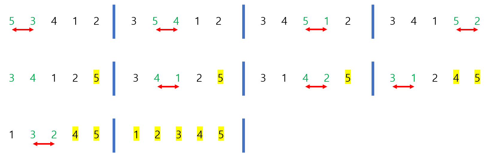

# Udemy - Javascript - 정렬


## 정렬이란?

> #### 데이터가 있으면, 데이터를 숫자 또는 단어별로 오름차순 또는 내림차순으로 나열하는 것이다

- 정렬을 하는 방법은 다양하다.
- 정렬하는 방법마다, 정렬을 하는 시간은 다르다


## 자바스크립트 기본 내장 정렬

#### `.sort()`는 기본적으로 string 기준으로 정렬을 한다

```javascript
function numberCompare(num1, num2) {
    return num1 - num2;
}
array.sort(numberCompare)
```

- `num1 - num2`를 해서 값이 음수가 나오면 num1은 num2보다 앞에 와야 한다 (더 숫자가 작다는 것)
  - 양수가 나오면 num1은 num2 보다 커서 뒤에 나와야 한다
- `num2 - num1` 을 하게 되면 내림차순으로 계산이 된다


## 버블 정렬

> #### 연속되는 2 숫자들을 비교해서, 더 큰 수가 앞에 있으면, 뒤에 있는 수와 바꾸는 것
>
> - 이렇게 하면, 제일 큰 수가 제일 뒤로 가게 된다



```javascript
function bubbleSort(arr) {
    
    // i는 몇 번을 비교하는지 나타내는 숫자이다
    // 3번 -> 2번 -> 1번을 비교하는 것
    for (var i = arr.length; i > 0; i --) {
        var noSwaps = true;
        for (var j = 0; j < i - 1; j ++) {
            if (arr[j] > arr[j + 1]) {
                var temp = arr[j];
                arr[j] = arr[j + 1];
                arr[j + 1] = temp;
                noSwaps = false;
            } 
        }
        if(noSwaps) break;
    }
    return arr;
}

bubbleSort([37, 45, 29, 8])
```

- `noSwaps`를 사용해서, 2번째 for문에서, 숫자를 한번도 안 바꿨으면, function을 끝낸다
  - 숫자를 한번도 안 바꿨다는 것은, 이미 정렬이 되었다는 것이다
