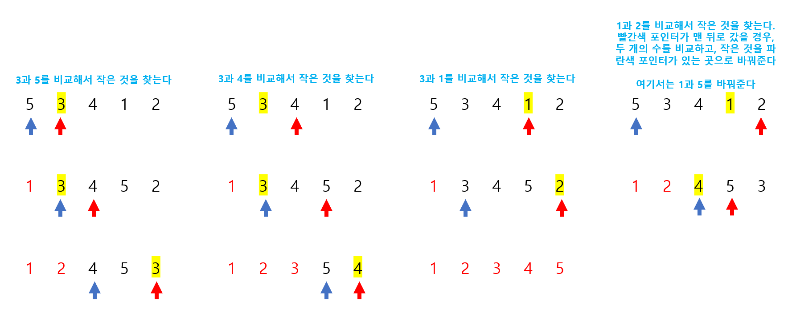

# Udemy - Javascript - 선택 정렬


## 정렬이란?

> #### 데이터가 있으면, 데이터를 숫자 또는 단어별로 오름차순 또는 내림차순으로 나열하는 것이다

- 정렬을 하는 방법은 다양하다.
- 정렬하는 방법마다, 정렬을 하는 시간은 다르다


## 선택 정렬

> #### 버블 정렬과 비슷하다
>
> #### 버블 정렬은 뒤에서 부터 큰 숫자를 나열했으면, 선택 정렬을 작은 숫자를 앞에 나열한다




```javascript
function selectionSort(array) {

    for (let i = 0 ; i < array.length - 1 ; i ++) {
        let small = i
        
        for (let j = i + 1 ; j < array.length ; j ++) {
            if (array[small] > array[j]) {
                small = j
            }
        }

        // i가 제일 작은 숫자일 경우, 숫자를 바꾸지 않는다
        if (i !== small) {
            let temp_num = array[i]
            array[i] = array[small];
            array[small] = temp_num
        }        
    }

    return array
}
```

