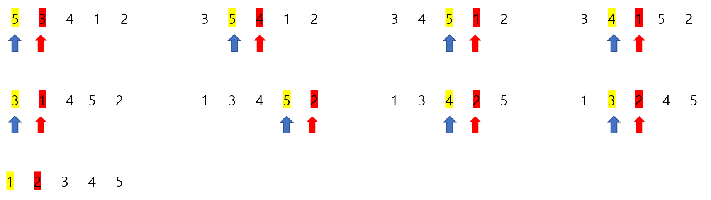

# Udemy - Javascript - 삽입 정렬


## 정렬이란?

> #### 데이터가 있으면, 데이터를 숫자 또는 단어별로 오름차순 또는 내림차순으로 나열하는 것이다

- 정렬을 하는 방법은 다양하다.
- 정렬하는 방법마다, 정렬을 하는 시간은 다르다


## 삽입 정렬

> #### 앞에 숫자보다 작으면 앞에 숫자가 더 크거나 같을 때까지 바꿔준다
>
> #### 실시간으로 숫자가 입력될 때 좋다





#### 내가 짠 삽입 정렬 코드

```javascript
function insertionSort(array) {
    for (let i = 1; i < array.length; i ++) {
        while (array[i] < array[i - 1]) {
            temp = array[i]
            array[i] = array[i - 1]
            array[i - 1] = temp
            i --
        }
    }
    return array
}
```

- while문에서 `i` 기준으로, 그 전 숫자와 비교한다
  - `i`가 작으면, `i` 의 값을 그 전의 숫자와 차례를 바꾸고, `i`를 -1씩 뺀다
  - 이것을 `i`가 `i`의 전 숫자보다 클 때까지 한다


#### Time Complexity

Best :  O(n^2)

Average  :  O(n^2)

Worst  :  O(n^2)


#### Space Complexity

O(1)
