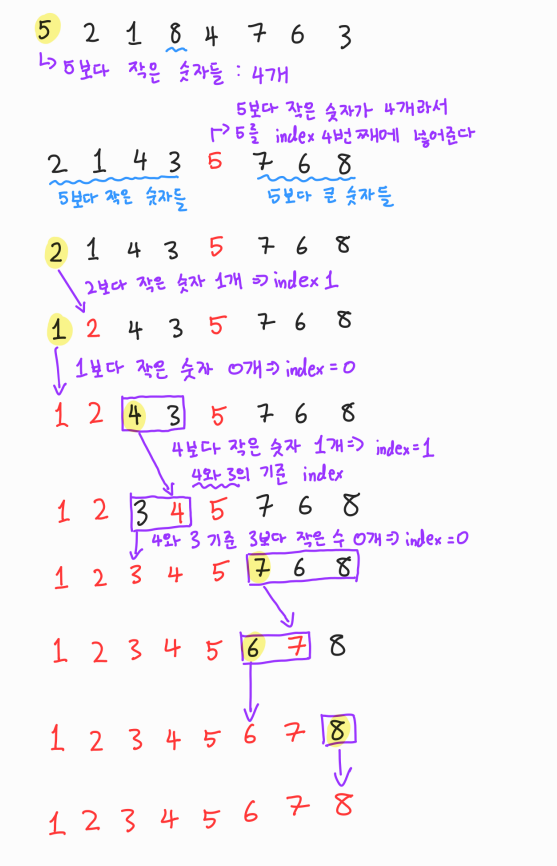

# Udemy - Javascript - Quick Sort


## 정렬이란?

> #### 데이터가 있으면, 데이터를 숫자 또는 단어별로 오름차순 또는 내림차순으로 나열하는 것이다

- 정렬을 하는 방법은 다양하다.
- 정렬하는 방법마다, 정렬을 하는 시간은 다르다


#### 버블, 선택, 삽입 정렬들은 숫자가 계속 늘어날 수록, 속도가 느려진다

#### 반대로 합병 정렬, 퀵 정렬, 지수 정렬은 위의 3개보다 더 빠르다


## 퀵 정렬



- 아무 숫자를 사용해도 된다
- 정한 숫자를 기준으로 그 숫자보다 작은 숫자들의 수를 샌다
- 그리고 그 새었던 수의 인덱스 값에 정한 숫자를 집어 넣으면, 그 index가 정한 숫자의 정렬된 위치라고 볼 수 있다
  - 그리고 그 숫자 기준으로 왼쪽은, 그 숫자보다 작은 숫자들, 오른쪽은 그 숫자보다 큰 숫자들이어야 한


## 퀵 정렬 코드 구현

```javascript
function pivot(array, start=0, end=array.length+1) {
    function swap (array, i, j) {
        var temp = array[i]
        array[i] = array[j]
        array[j] = temp
    }
    
    var pivot = array[start];
    var swapIdx = start

    for (var i = start + 1; i < array.length; i++) {
         if (pivot > array[i]) {
             swapIdx ++
             swap(array, i, swapIdx)
         }
    }

    swap(array, swapIdx, start)
    return swapIdx
}

function quickSort(array, left = 0, right = array.length - 1) {
    if (left < right) {
        let pivotIndex = pivot(array, left, right)
    
        // left
        quickSort(array, left, pivotIndex - 1)
    
        // right
        quickSort(array, pivotIndex + 1, right)
    }

    return array
}

quickSort([5, 2, 1, 8, 4, 7, 6, 3])
```


`pivot(array, left=0, right=array.length)`

- 배열에서, 숫자 하나를 가지고 와서, 숫자보다 작은 숫자를 왼쪽으로 배치하고, 큰 숫자들을 오른쪽으로 배치를 한다
  - `swapIdx` 를 통해, 숫자보다 작은 숫자들은 큰 숫자들과 `swap()`을 통해, 왼쪽으로 배치한다
  - for문이 끝나면 `swapIdx`는 처음에 정한 숫자의 위치가 된다


`quickSort(array, left=0, right=array.length - 1)`

- pivot을 계속해서 정렬을 하는 것이다
- `pivot()`을 통해서 left와 right을 바꾸면서, 한 배열 안에서 정렬을 할 수 있도록 한다
