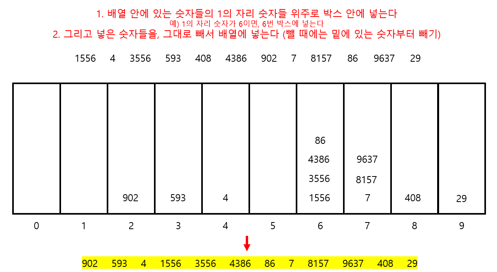
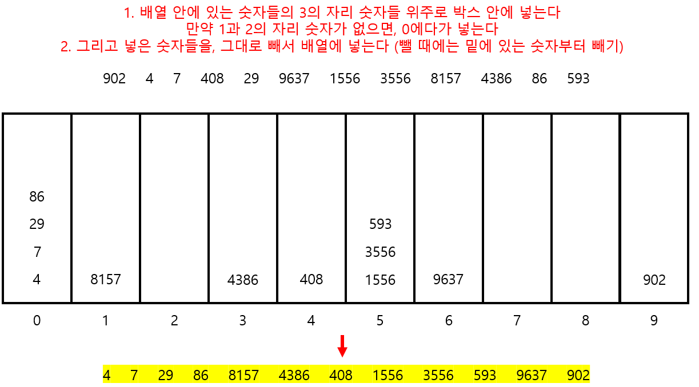
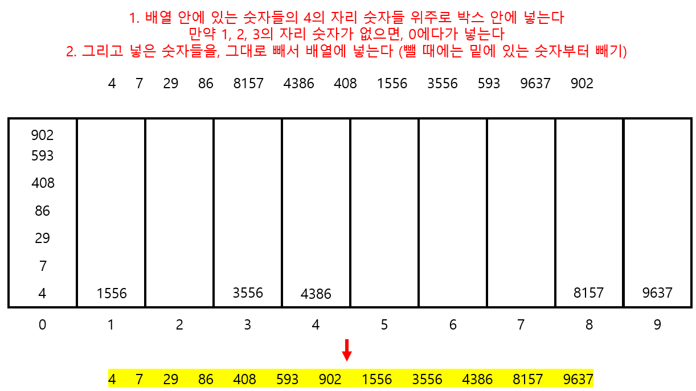

# Udemy - Javascript - Radix Sort


## 정렬이란?

> #### 데이터가 있으면, 데이터를 숫자 또는 단어별로 오름차순 또는 내림차순으로 나열하는 것이다

- 정렬을 하는 방법은 다양하다.
- 정렬하는 방법마다, 정렬을 하는 시간은 다르다


#### 버블, 선택, 삽입 정렬들은 숫자가 계속 늘어날 수록, 속도가 느려진다

#### 반대로 합병 정렬, 퀵 정렬, 지수 정렬은 위의 3개보다 더 빠르다


## 기수 정렬

> #### 버블, 선택, 삽입, 합병, 퀵 정렬들은 모두 숫자들끼리 비교를 하면서, 정렬을 하는 것이다

#### 정수만 정렬이 가는하다


#### 자릿수가 더 많은 숫자가, 더 크다 라는 로직을 사용해서 정렬을 한다

- 4자리 수는 두 자리 수보다 크다


#### 1




#### 2 - 1의 자리 숫자들은 앞에 숫자가 없음으로 0에다가 넣으면 된다


#### 3 - 0을 보면, 0에 들어오는 숫자들이 천천히 정렬이 되고 있다




#### 4 - 기수 정렬을 할 때에는, 배열 안에 있는 숫자들 중, 숫자가 제일 긴 숫자 만큼만 돌면, 정렬이 된




## 기수 정렬 코드 구현

```javascript

function getDigit(num, i) {
    return Math.floor(Math.abs(num) / (10 ** i)) % 10;
}

// 자리 수를 찾는 것
function digitCount(num) {
    if (num==0) return 1;
    return Math.floor(Math.log10(Math.abs(num))) + 1
}

function mostDigits(array) {
    let maxDigits = 0;
    for (let i = 0; i < array.length; i++) {
        maxDigits = Math.max(digitCount(array[i]), maxDigits)
    }
    return maxDigits
}


function radixSort(array) {
    let maxDigitCount = mostDigits(array)
    let temp = []

    for (let i=0; i < maxDigitCount; i++) {
        let digitBuckets = Array.from({length: 10}, () => [])
        
        for (let j=0; j < array.length; j++) {
            digitBuckets[getDigit(array[j], i)].push(array[j])
        }

        array = [].concat(...digitBuckets);
    }

    return array
}
```


#### `function getDigit(num, i)`

- 계산을 통해서 특정 자리에 어떤 숫자가 있는지 찾는 함수이다
  - getDigit(1234, 0) = 4
  - getDigit(1234, 2) = 2
- 나중에 박스 안에 숫자를 넣으려면 필요하는 함수


#### `function digitCount(num)`

- 각 숫자들의 자리 수를 구한다
- 제일 큰 자리 수를 구하기 위한 함수이다


#### `function mostDigits(array)`

- `maxDigits = Math.max(digitCount(array[i]), maxDigits)`
  - 배열을 순회한
  - 위의 `digitCount()`를 사용하면서, 최대 자리 수를 구한다


#### `function radixSort(array)`

- `let digitBuckets = Array.from({length: 10}, () => [])`
  - 파이썬에서 `array = [[] for _ in range(10)]`과 같은 식이
- `digitBuckets[getDigit(array[j], i)].push(array[j])`
  - 배열에 있는 숫자들을 순회하면서 digitBucket에 넣는다
  - i 번째 자리에 있는 숫자를 가지고 와서 digitBucket의 인덱스 안에 넣는다
    - 즉 digitBucket의 `getDigit(array[j],j)` 번째에 `array[j]`를 넣는다
- `array = [].concat(...digitBuckets);`
  - digitBuckets은 배열안에 10개의 배열이 들어가 있다
  - `...`를 통해, digitBuckets에 있는 모든 배열을 array 안에, 넣는다
  - [[123] , [124,125], [126, 127]] => [123, 124,125, 126, 127]
