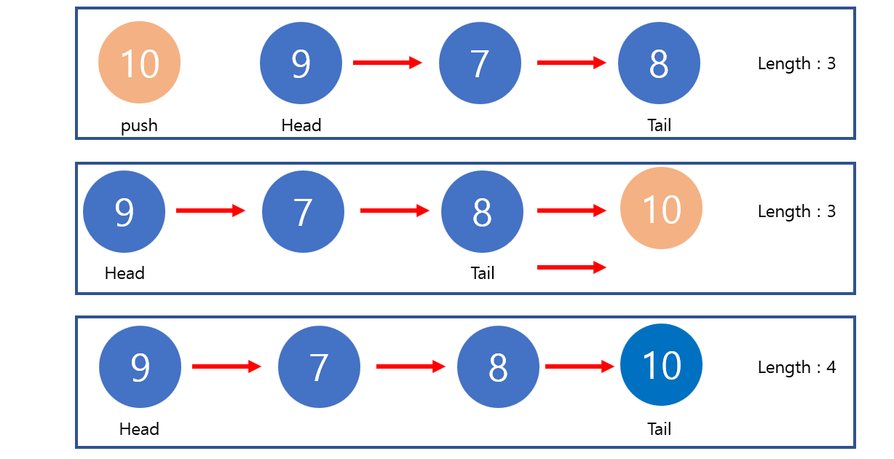
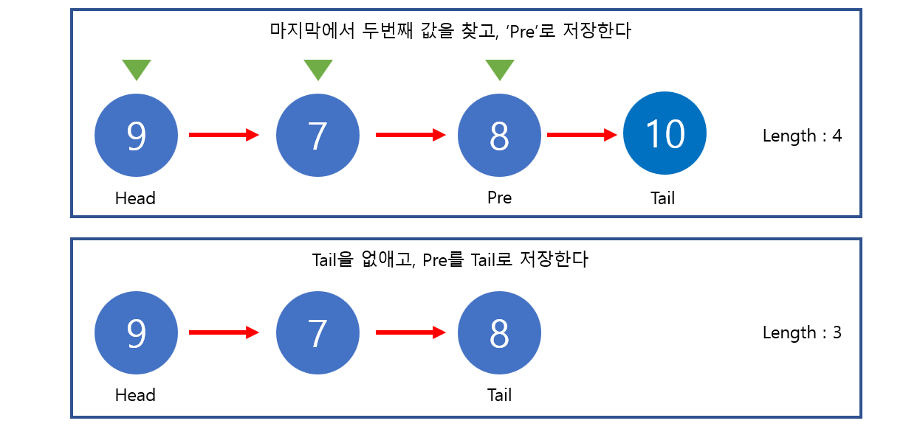

# Udemy - Javascript - Data Structure

#### Singly Linked Lists (단일 연결 리스트)


## 자료구조

> #### 자료 구조는 데이터에 적용될 수 있는 값들 및 기능 혹은 작업들 사이의 관계를 포함한다

예를 들어 배열을 생각한다

- 배열 안에는 값들 사이에 관계가 있다 (정렬을 하거나, 값을 추가할 수 있거나 없앨 수 있다)


자료 구조에는 많은 종류가 있고, 각자 쓰임세가 다르다


## 연결 리스트

> #### 제일 앞과 뒤, 그리고 리스트의 길이 속성만 존재한다
>
> - 즉 리스트 안에 index가 없다
>
> #### 노드로 존재한다 (노드끼리 연결되어 있음)


#### 리스트 vs 배열

- **리스트**
  - 인덱스가 없다
  - 노드들끼리 연결되어 있다. 그리고 노드들은 다음 노드를 POINT한다
  - 랜덤으로 노드를 사용할 수 없다
- **배열**
  - 인덱스에 따라 나열되어 있다
  - 값을 추가 혹은 삭제하는 것은 비용이 들어갈 수 있다
  - 빠르게 특정 인덱스를 찾을 수 있다


```javascript
class Node {
    constructor(value){
        this.value = value;
        this.next = null;
    }
}

class SinglyLinkedList{
    constructor(){
        this.head = null;
        this.tail = null;
        this.length = 0;
    }
    
    // 새로운 노드를 리스트에 넣는 것
    push(val){
        var newNode = new Node(val);
        
        if (!this.head) {
            this.head = newNode;
            this.tail = this.head;
        } else {
            this.tail.next = newNode;
            this.tail = newNode;
        }
        this.length += 1;
        return this
    }
    
    pop() {
        if (!this.head) return undefined;
        var current = this.head;
        var newTail = current;
        
        // current 뒤가 undefined가 아니면, while문을 실행
        // 즉 마지막 current가 마지막 요소면 while문 끝
        while (current.next) {
            newTail = current;
            current = current.next;
        }
        this.tail = newTail
        this.tail.next = null
        this.length -= 1
        
        if (this.length === 0) {
            this.head = null;
            this.tail = null;
        }
        
        return current
    }
    
    shift() {
        if (!this.head) return undefined;
        var current = this.head;
       	this.head = current.next;
        this.length -= 1 
        if (this.length === 0) {
            this.tail = null;
        }
        return current   
    }
    
    unshift(value) {
        var newNode = Node(value);
        
        if (!this.head) {
            this.head = newNode;
            this.tail = this.head;
        } else {
            newNode.next = this.head;
            this.head = newNode
    	}
        this.length += 1
        return this
    }
}
```


#### `push(value)` : 새로운 노드를 리스트에 넣는 것 (제일 뒤에)

- Tail을 새로운 값으로 갱신하면 된다




#### `pop()` : 제일 뒤에 있는 값을 빼는 것

- while문을 실행한다
  - while문을 돌 때에, `current.next`를 확인한다
    - 즉 지금 노드 기준에서, 다음 노드가 있는지 없는지 확인
    - 다음 노드가 없으면 `undefined`를 출력하고, while문이 끝난다
  - while문이 끝나게 되면 `tail`은 마지막에서 2번째 노드가 된다
    - 그렇게 Tail 값을 current로 바꿔준다
    - 그리고 `tail.next`, 즉 제일 마지막 노드를 null로 바꿔서 pop을 해준다

 


#### `shift()` : 제일 첫번째 노드를 빼는 것

- `head`를 다음 노드로 저장을 한다


#### `unshift(value)` : 제일 앞에다가 새로운 노드를 넣는 것

- `head`가 없으면 노드를 새로 만들고, `head`와 `tail`에 막 들어온 값을 노드로 만든다
  - `head`가 없다는 것은, 리스트에 아무것도 없다는 것
- 그게 아니면, **새로 들어갈 노드의 다음 노드 `newNode.next`**를 현재 `this.head`로 저장을 한다
- 그리고 새로 노드를 `this.head`로 넣는다
