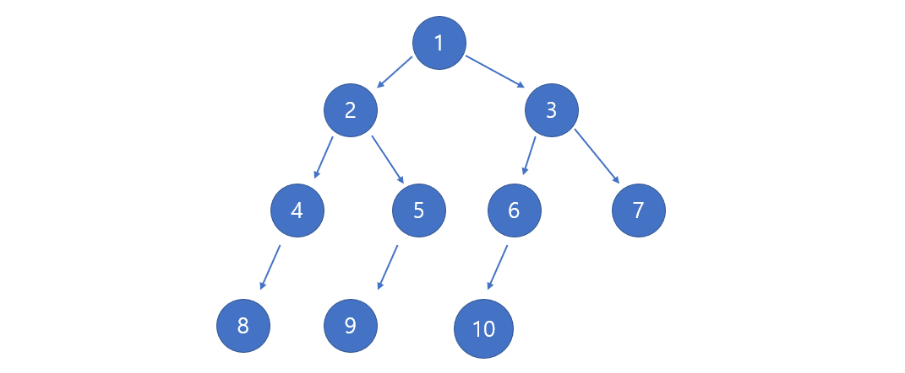
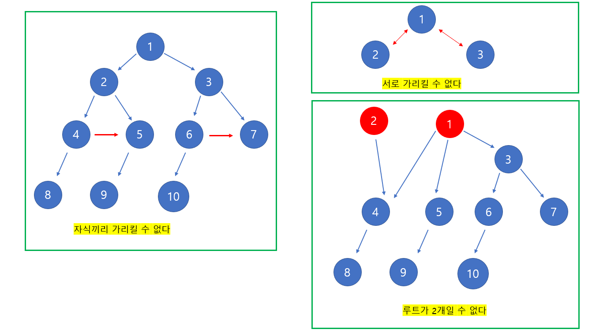
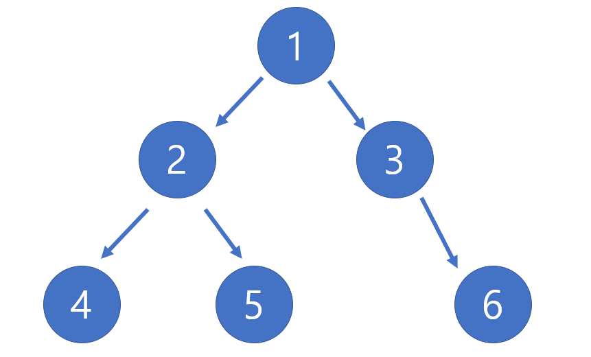
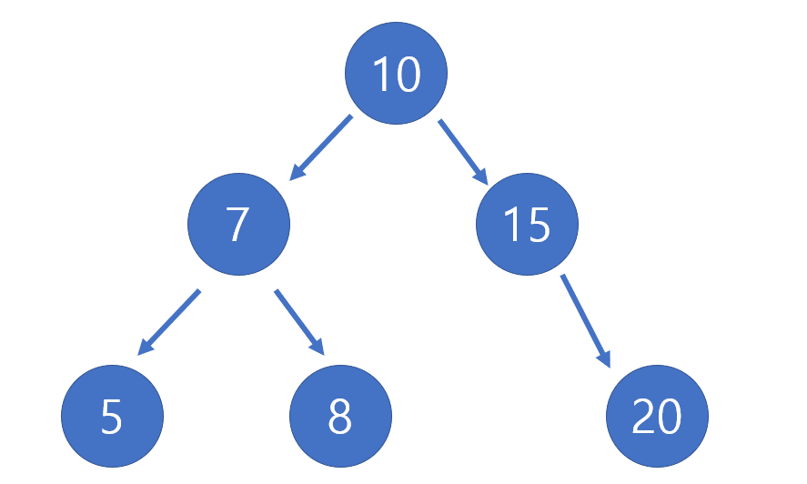
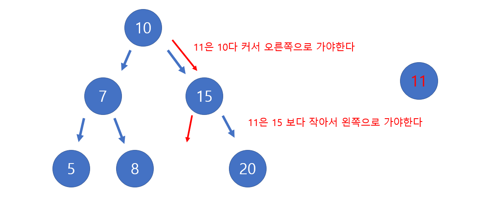

# Udemy - Javascript - Binary Tree Search

*Udemy JavaScript*


## Tree

> #### 트리는 간선과 노드로 이루어져 있고, 노드들 간에 부모와 자식 노드라는 관계가 있다



- `1`은 루트 노드이다
- `2`와 `3`은 `1`의 자식 노드고, `1`은 `2`와 `3`의 부모 노드다


#### 트리가 아닌 것




## 이진 트리 / 이진 검색 트리



### 이진 트리 (Binary Tree)

> #### 이진 트리는 부모 노드가, 최대 2개의 자식 노드를 가지는 것이다
>
> - 3개 이상의 자식 노드를 가지고 있으면 이진 트리가 아니다


### 이진 검색 트리 (Binary Search Tree)

> #### 이진 검색 트리는 정렬이 되어 있다

- 부모 노드보다 숫자가 적으면 왼쪽에 배치가 되어 있고, 크면 오른쪽에 배치가 되어 있



- **루트** 노드를 보면, 왼쪽에 있는 자식 노드는, 루트 노드보다 작고, 오른쪽에 있는 자식 노드는, 루트 노드보다 크다


```javascript
class Node {
    constructor(value){
        this.value = value;
        this.left = null;
        this.right = null;
    }
}

class BinarySearchTree {
    constructor() {
        this.root = null;
    }
    
    insert(value) {
        var newNode = new Node(value)
        if (this.root === null) {
            this.root = newNode;
            return this;
        } else {
            // 현재 노드를 루트로 설정한다
            var current = this.root;
            
            // 트리를 탐색을 한다
            while(true) {
                
                // 값이 트리에 있는 노드의 값가 같으면 undefined를 반환한다
                if (value === current.value) return undefined;
                
                // 값이 트리에 있는 현재 노드의 값보다 작으면, 왼쪽을 탐색한다
                if (value < current.value) {
                    
                    // 왼쪽에 노드가 없으면, 현재 값을 왼쪽의 노드 값으로 설정한다
                    if (current.left === null) {
                        current.left = newNode;
                        return this
                        
                    // 왼쪽에 노드가 있으면, 그 노드를 현재 노드로 설정한다
                    } else {
                        current = current.left;
                    }
                
                // 현재 노드 값이, 입력 값보다 클 때에
                } else if (value > current.value) {
                    if (current.right === null) {
                        current.right = newNode;
                        return this
                    } else {
                        current = current.right
                    }
                }
            }
        }
    }
    
    find(value) {
        if (this.root === null) return false;
        var current = this.root;
        while (true) {
            if (current.value === value) return true;
            if (current.value > value) {
                if (current.left === null) {
                    return false
                }
                current = current.left;
            } else if (current.value < value) {
                if (current.right === null) {
                    return false
                }
                current = current.right;
            }
        }
    }
}
```


### .insert(value)



- 루트가 없으면, 루트에 value를 저장한다
- 루트보다 작으면 왼쪽을 탐색하고, 크면 오른쪽을 탐색한다
- 자신의 자리에 도착할 때까지 위를 반복한다


### . find(value)

> 이진 트리 안에, value가 있는지 확인하는 것

- 위에 .insert와 로직이 같다
- 단 추가를 하는 것이 아니라, 해당 값이 트리에 있는지 없는지 확인하는 것이다
