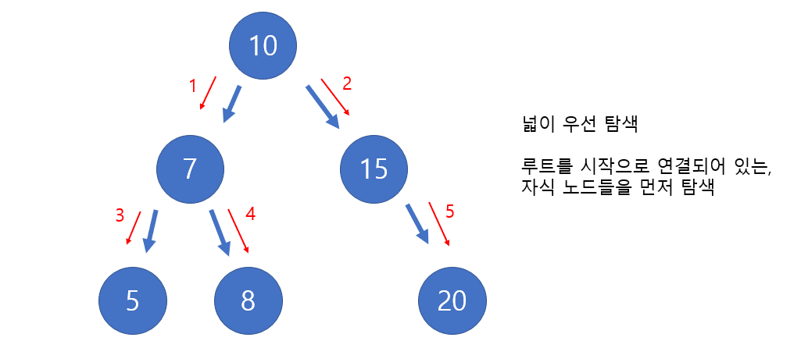
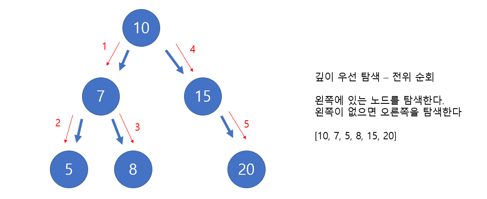
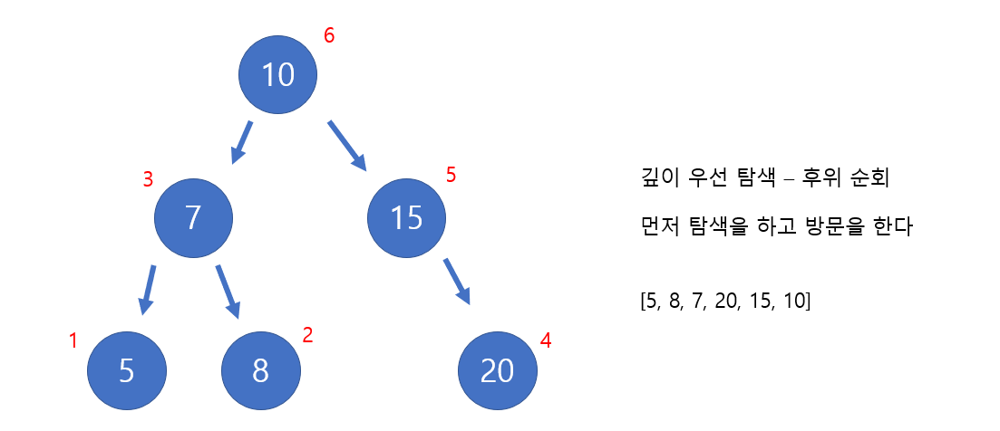

# Udemy - Javascript - Tree Traversal

*Udemy JavaScript*


## 트리 순회


### 너비 우선 탐색 (Breadth First Search, BFS)

> Queue를 사용한다



- [10, 7, 15, 5, 8, 20]
- 위의 리스트의 순서대로 탐색을 한다


```javascript
class Node {
    constructor(value){
        this.value = value;
        this.left = null;
        this.right = null;
    }
}

class BinarySearchTree {
    constructor() {
        this.root = null;
    }

    insert(value) {
        var newNode = new Node(value)
        if (this.root === null) {
            this.root = newNode;
            return this;
        } else {
            var current = this.root;

            while(true) {
                if (value === current.value) return undefined;

                if (value < current.value) {
                    if (current.left === null) {
                        current.left = newNode;
                        return this
                    } else {
                        current = current.left;
                    }
                } else if (value > current.value) {
                    if (current.right === null) {
                        current.right = newNode;
                        return this
                    } else {
                        current = current.right
                    }
                }
            }
        }
    }

    find(value) {
        if (this.root === null) return false;
        var current = this.root;
        while (true) {
            if (current.value === value) return true;
            if (current.value > value) {
                if (current.left === null) {
                    return false
                }
                current = current.left;
            } else if (current.value < value) {
                if (current.right === null) {
                    return false
                }
                current = current.right;
            }
        }
    }
    
    BFS(){
        var queue = [];
        var visited = [];
        var node = this.root;
        
        queue.push(node);
        while (queue.length) {
            node = queue.shift();
            visited.push(node.value);
            
            if (node.left) queue.push(node.left);
            if (node.right) queue.push(node.right);
        }
        
        return visited;
    }
}
```

- `queue`에 요소가 없을때까지 while문을 순회한다
- node의 자식 노드가 있으면 `queue`에 자식 노드를 넣는다.
  - 자식 노드들을 `queue`에 넣어야, 모든 부모 노드들을 탐색한 후에, 자식 노드를 탐색할 수 있다
  - 자식 노드가 없다는 것은, 해당 노드가 제일 밑에 있다는 것이다.


### 깊이 우선 탐색 (Depth First Search, DFS)

> #### 전위 순회
>
> - root, left, right
>
> - 왼쪽 노드를 먼저 탐색을 한다
> - 왼쪽 노드가 없으면, 오른쪽을 탐색한다



```javascript
// 위에 BinarySearchTree 클래스에 넣으면 됨
DFSPreOrder() {
    var currentNode = this.root;
    var visited = [];
    
    function traverse(currentNode) {
        visited.push(currentNode.value);
        if (currentNode.left) traverse(currentNode.left);
        if (currentNode.right) traverse(currentNode.right);
    }
	
    traverse(currentNode)
    return visited
}
```

- `function traverse(currentNode)` 안에서 재귀로 돌아간다
  - `currentNode` 기준 왼쪽 또는 오른쪽에 자식 노드가 있으면, 왼쪽 자식 노드 우선으로, 그 함수에 들어간다
    - 즉 왼쪽에 자식 노드가 있으면, 지속적으로 왼쪽으로 깊이 탐색을 한다
    - 왼쪽에 없으면, 오른쪽이 있는 노드 기준으로 재귀를 통해 깊이를 탐색한다


> #### 후위 순회
>
> - left, right, root
>
> - 먼저 탐색을 한 후 방문을 하는 것이다
> - 즉 왼쪽 기준 제일 하단에 있는 노드들을 방문하고, 올라오면서 오른쪽에 노드가 있으면, 그 노드를 방문한다



```javascript
// 위에 BinarySearchTree 클래스에 넣으면 됨
DFSPostOrder() {
    var visited = [];
    var node = this.root;

    function traverse(node) {
        if (node.left) traverse(node.left);
        if (node.right) traverse(node.right);
        visited.push(node.value)
    }

    traverse(node)
    return visited;
}
```

- 전위 순회랑 다르게 `visited.push()`가 if문들이 다 끝나고 들어간다
  - 즉 자식 노드가 없거나, 이미 탐색한 자식 노드일 때에 방문을 하는 것이다


> #### 중위 순회
>
> - Left, root, right
> - 왼쪽에 노드가 있으면 왼쪽이 없을 때까지 순회를 한다
> - 왼쪽 노드가 있으면 노드를 방문하고, 위에 루트 노드도 방문한다
> - 루트 노드 기준 오른쪽 자식 노드가 있으면, 자식 노드에 가고, 없으면 또 위에 부모 노드로 간


```javascript
// 위에 BinarySearchTree 클래스에 넣으면 됨
DFSInOrder() {
    var node = this.root;
    var visited = [];

    function traverse(node){
        if (node.left) traverse(node.left);
        visited.push(node.value);
        if (node.right) traverse(node.right);
    }

    traverse(node);
    return visited;
}
```


