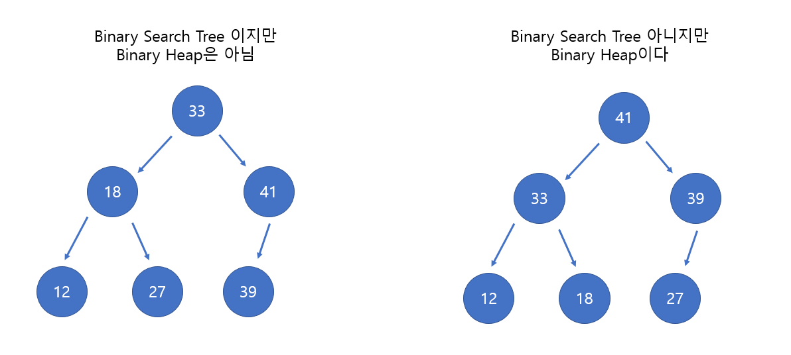
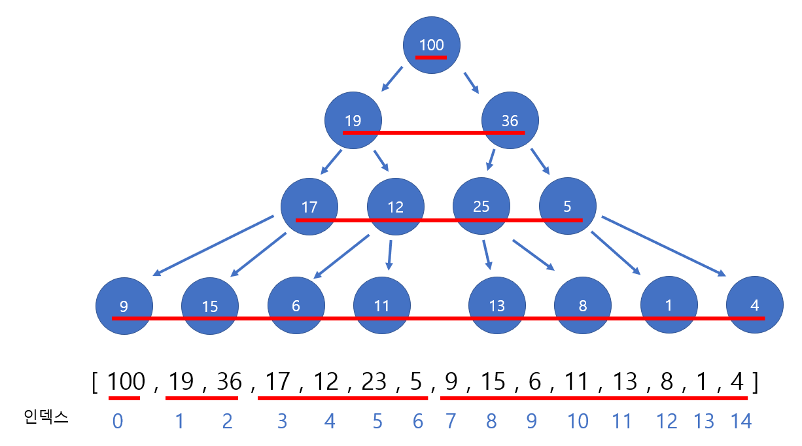
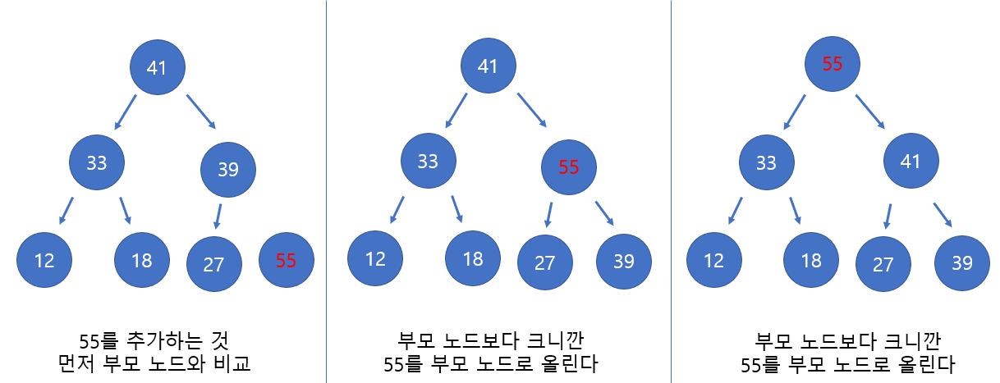
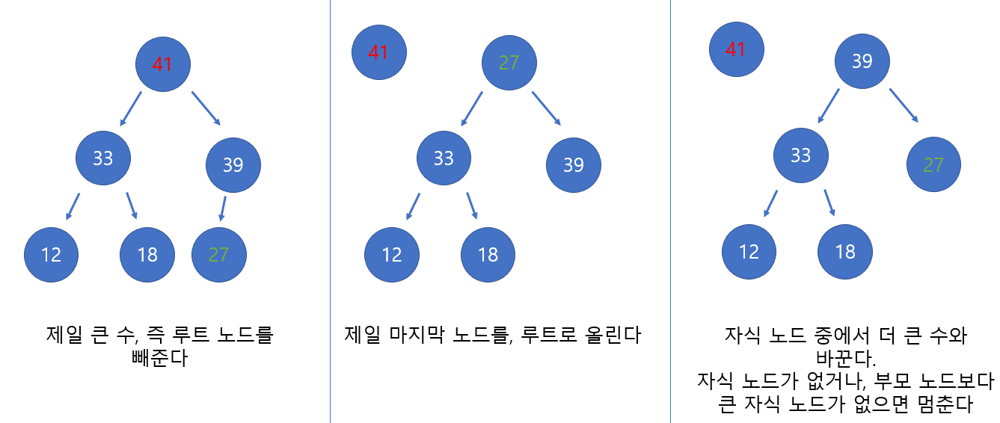

# Udemy - Javascript - Binary Heaps

*Udemy JavaScript*


## 이진 힙

> #### MaxBinaryHeap : 부모 노드가 항상 자식 노드보다 크다
>
> #### MinBinaryHeap : 부모 노드가 항상 자식 노드보다 작다
>
> #### 이진 힙은 항상 오른쪽과 왼쪽의 자식 노드를 채운다



- MaxBinaryHeap 에서는 루트 노드가 제일 커야 한다
- 각 노드는 최대 2개의 자식을 가지고 있다
- 같은 층에 있는, 자식들은 부모 노드보다 작거나 큰거지, 서로의 관계는 상관이 없




- 인덱스 `0`의 자식은 `1`, `2`
- 인덱스 `1`의 자식은 `3`과 `4`
- 인덱스 `2`의 자식은 `5`와 `6`
- 인덱스 `3`의 자식은 `7`, `8`

> #### 즉 인덱스 n의 자식 노드를 구할 때에는
>
> - 왼쪽 노드는 2n + 1
> - 오른쪽 노드는 2n + 2
>
> #### 반대로 부모 노드를 구할 때에는
>
> - (n-1)/2 을 하고 내림을 한다


```javascript
class MaxBinaryHeap{
    constructor () {
        this.values = [];
    }

    insert(value){
        this.values.push(value);
        this.bubbleUp(value);
    }

    bubbleUp(value){
        let index = this.values.length - 1;
        const element = value;

        while(index > 0) {        
            let parentIndex = Math.floor((index - 1) / 2);
            if (element <= this.values[parentIndex]) break;
            
            this.values[index] = this.values[parentIndex];
            this.values[parentIndex] = element;
            index = parentIndex;
        }
    }

    extractMax(){
        const max = this.values[0];
        const end = this.values.pop();

        if (this.values.length > 0){
            this.values[0] = end;
            this.sinkdown();            
        }
        return max;
    }

    sinkdown(){
        let idx = 0;
        const length = this.values.length;
        const element = this.values[0];

        while (true) {
            let leftIdx = 2 * idx + 1;
            let rightIdx = 2 * idx + 2;
            let leftChild, rightChild;
            let swap = null;

            if (leftIdx < length) {
                leftChild = this.values[leftIdx];
                if (leftChild > element) {
                    swap = leftIdx;
                }
            }
			
            // 오른쪽 자식이 부모 노드 값보다 더 클 때에
            if (rightIdx < length) {
                rightChild = this.values[rightIdx];
                
                // swap === null 이란 뜻은 왼쪽 자식은 부모 노드 값보다 작다는 것
                // 이때는, 그냥 오른쪽 자식이 더 크면, 부모 노드와 오른쪽 자식 노드와 바꾸면 된다
                // 만약 swap !== null 이란 것은 왼쪽 자식이 부모 노드 값보다 크다는 것이다
                // 이때에는, 오른쪽 자식 노드 값이, 왼쪽 노드 자식 값보다 크면, 부모 노드 값과 오른쪽 노드 값과 바꾼다
                if ((swap === null && rightChild > element) || 
                    (swap !== null && rightChild > leftChild)) {
                        swap = rightIdx
                    }
                }

            if (swap === null) break;
        
            this.values[idx] = this.values[swap];
            this.values[swap] = element;
            idx = swap
        }
    }
}
```


#### .insert(value)




#### .extractMax()




## 우선순위 큐

> #### 요소들이 모두 우선순위가 주어진다
>
> #### 우선순위가 높은 요소부터, 빠지거나 추가를 한다

```javascript
class PriorityQueue{
    constructor() {
        this.values = []
    }

    enqueue(value, priority){
        let newNode = new Node(value, prority)
        this.values.push(newNode);
        this.bubbleUp(newNode);
    }

    bubbleUp(newNode){
        let index = this.values.length - 1;
        const element = this.values[index];

        while(index > 0) {        
            let parentIndex = Math.floor((index - 1) / 2);
            if (element.priority <= this.values[parentIndex].priority) break;
            
            this.values[index] = this.values[parentIndex];
            this.values[parentIndex] = element;
            index = parentIndex;
        }
    }

    dequeue(){
        const max = this.values[0];
        const end = this.values.pop();

        if (this.values.length > 0){
            this.values[0] = end;
            this.sinkdown();            
        }
        return max;
    }

    sinkdown(){
        let idx = 0;
        const length = this.values.length;
        const element = this.values[0];

        while (true) {
            let leftIdx = 2 * idx + 1;
            let rightIdx = 2 * idx + 2;
            let leftChild, rightChild;
            let swap = null;

            if (leftIdx < length) {
                leftChild = this.values[leftIdx];
                if (leftChild.priority > element.priority) {
                    swap = leftIdx;
                }
            }

            if (rightIdx < length) {
                rightChild = this.values[rightIdx];
                if ((swap === null && rightChild.priority > element.priority) || 
                    (swap !== null && rightChild.priority > leftChild.priority)) {
                        swap = rightIdx
                    }
                }

            if (swap === null) break;
        
            this.values[idx] = this.values[swap];
            this.values[swap] = element;
            idx = swap
        }
    }
}

class Node {
    constructor(value, priority){
        this.value = value;
        this.priority = priority;
    }
}
```

- 노드 클래스를 만든다
- 전에는 그냥 숫자들끼리 비교했는데, 노드에 있는 `priority`들을 비교한다
