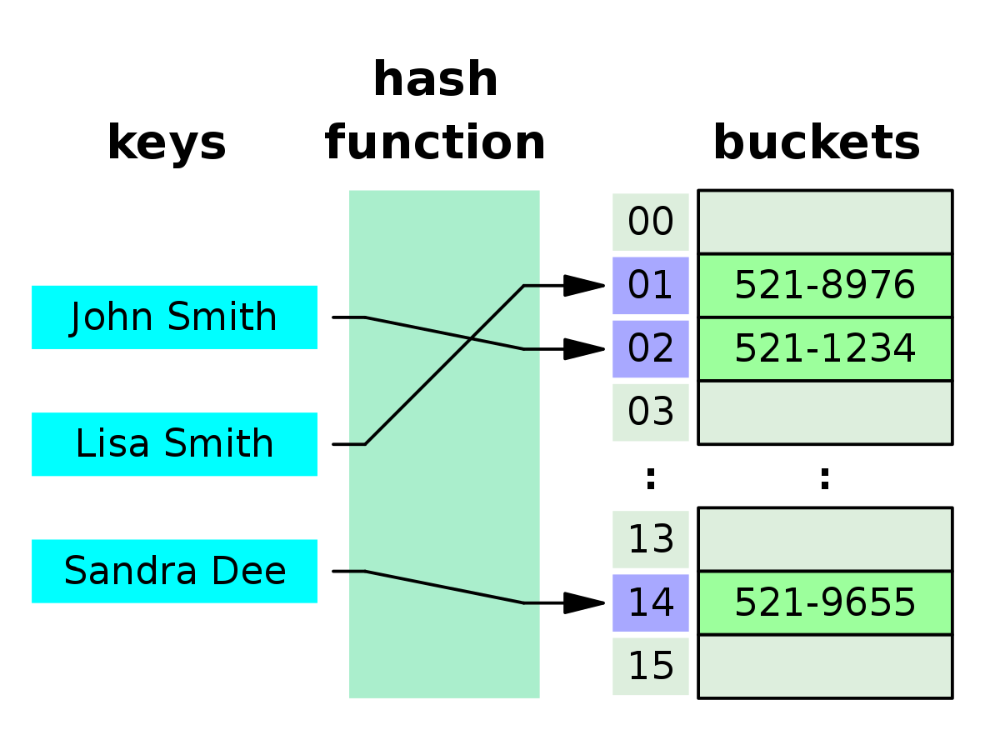

# Udemy - Javascript - Hash Table

*Udemy JavaScript*

## 해시 테이블

> #### 해시 테이블은, key와 value의 집합들이다
>
> #### 해시 테이블의 key들은 정렬이 안 되어 있다
>
> #### 파이썬에서는 Dictionary로 불린다

#### 배열과 달리, 해시 테이블은, 요소를 찾을때, 삭제할 때, 새로운 요소를 추가할 때에 매우 빠르다

- 속도 때문에 해시 테이블을 많이 사용한다

## 해시 함수

- key를 index같이 활용하고, value를 `buckets` 안에 넣는 것이다
- key를 넣을때마다, key는 `buckets`의 특정 인덱스에  넣어지게 된다

