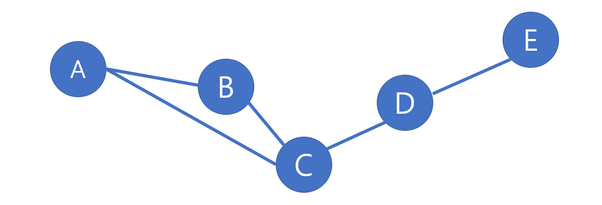
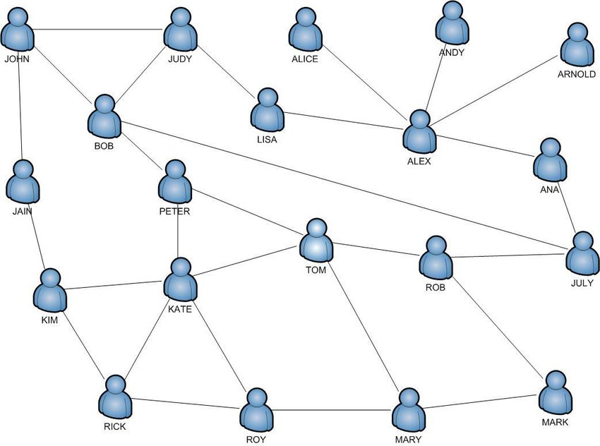
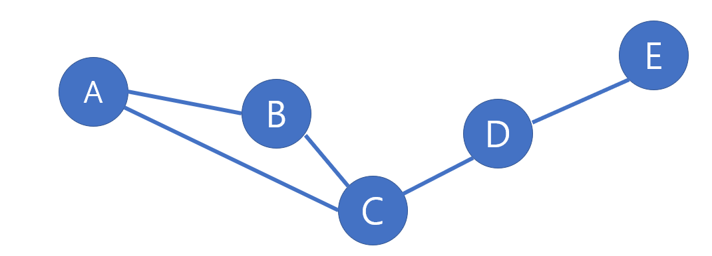
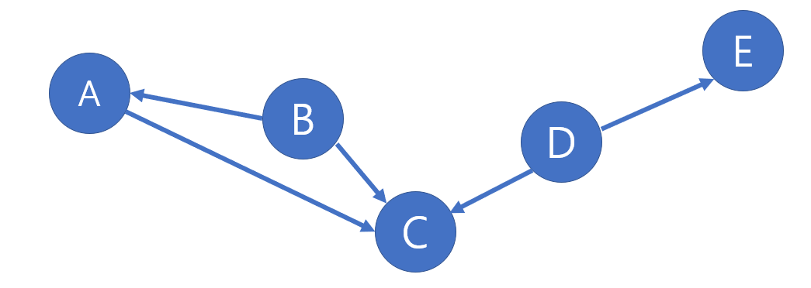
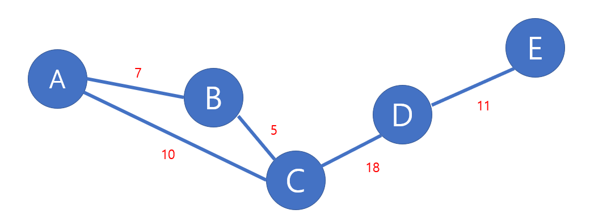
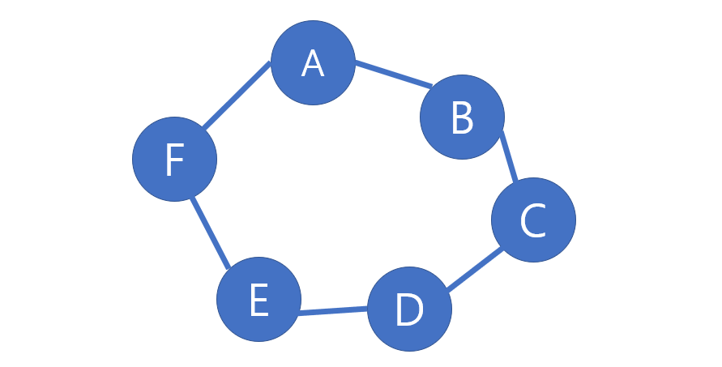
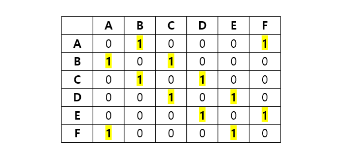
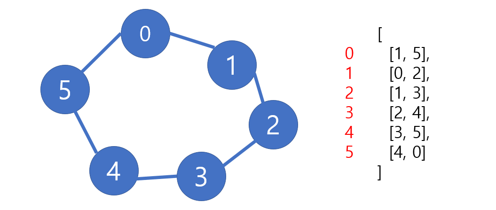

# Udemy - Javascript - Graph

*Udemy JavaScript*


## 그래프

> #### 그래프는 유한하고 변할 수 있는 꼭지점이나 노드나 점들의 집합으로 구성된 데이터 구조다
>
> #### 그래프는 노드나 노드들의 연결을 모은 것이다



#### 이진 트리와 다르게, 노드들끼리 연결만 되어 있으면 된다


### 그래프의 쓰임새

- 소셜 네트워크
- 좌표 / 지도
- 라우팅 알고리즘 (Routing Algorithms)
- 시각적 위계 (Visual Hierarchy)
- 등등




### 그래프의 유형

- **vertex : 노드**

- **edge : 노드와 노드의 연결하는 선**

- **Directed / Undirected Graph**

  - Undirected Graph : 특정한 경로가 없이, 두 노드 사이에서 왔다갔다 할 수 있다 / 방향이 없음

  

  - Directed Graph : edge마다 방향이 있다. 방향이 설정된 곳만 방문할 수 있다

    


- **Weighted / Unweighted Graph**

  - Weighted Graph : 경로마다 값이 추가된 그래프
    - 예를 들면, 제일 짧은 길을 찾을 때 사용된다

  

  - Unweighted Graph : 값이 없는 그래프


### 그래프 정렬

> #### Adjacency Matrix (인접 행렬)






#### 연결되어 있는 VERTEX는 1로 표현하여 테이블 (행) 식으로 그래프를 만들었음


> #### Adjacent List (인접 리스트)



- 0과 연결되어 있는 노드 [1, 5]
- 1과 연결되어 있는 노드 [0, 2]
- 2와 연결되어 있는 노드 [1, 3]
- 3과 연결되어 있는 노드 [2, 4]
- 4와 연결되어 있는 노드 [3, 5]
- 5와 연결되어 있는 노드 [4, 0]


#### Edge들을 저장하기 위해 배열이랑 리스트를 사용한다


## 인접 리스트

```javascript
class Graph {
    constructor(){
        this.adjacencyList = {}
    }

    addVertex(vertex){
        // 똑같은 vertex가 들어오면, 이미 있는 것을 덮어 쓴
        if(!this.adjacencyList[vertex]) this.adjacencyList[vertex] = [];
    }

    addEdge(v1, v2) {
        this.adjacencyList[v1].push(v2);
        this.adjacencyList[v2].push(v1);
    }

    removeEdge(v1, v2) {
        this.adjacencyList[v1] = this.adjacencyList[v1].filter(
            v => v !== v2
        );
        this.adjacencyList[v2] = this.adjacencyList[v2].filter(
            v => v !== v1
        );
    }

    removeVertex(vertex) {
        while (this.adjacencyList[vertex].length){
            const adjacencyVertex = this.adjacencyList[vertex].pop();
            this.removeEdge(vertex, adjacencyListVertex);
        }
        delete this.adjacencyList[vertex]
    }
}
```

