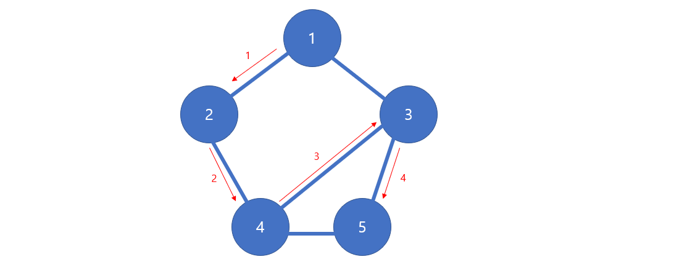

# Udemy - Javascript - Graph Traversal

*Udemy JavaScript*


## 그래프 순회

> #### 그래프에 있는 모든 노드들을 방문할 필요까지는 없다
>
> #### 그래프 순회를 할 때에는 visiting / updating / checking 이 중요하다


## 깊이 우선 그래프 (Depth First)

> #### vertex의 이웃 중 방문하지 않은 하나의 이웃으로 가는 것이다
>
> #### 이것을 모든 Vertex를 방문할때까지 순회를 한다



- 더 작은 이웃을 기준으로 깊이 우선 순회하기


## 넓이 순회 (Breadth First)

> #### 이웃된 노드가 2개면, 그 2개를 모두 순회하며 그래프를 순회한다


## 기본 그래프 만드는 코드

> #### Graph 클래스에 DFS와 BFS를 넣을 것

```javascript
class Graph {
    constructor(){
        this.adjacencyList = {}
    }

    addVertex(vertex){
        // 똑같은 vertex가 들어오면, 이미 있는 것을 덮어 쓴
        if(!this.adjacencyList[vertex]) this.adjacencyList[vertex] = [];
    }

    addEdge(v1, v2) {
        this.adjacencyList[v1].push(v2);
        this.adjacencyList[v2].push(v1);
    }

    removeEdge(v1, v2) {
        this.adjacencyList[v1] = this.adjacencyList[v1].filter(
            v => v !== v2
        );
        this.adjacencyList[v2] = this.adjacencyList[v2].filter(
            v => v !== v1
        );
    }

    removeVertex(vertex) {
        while (this.adjacencyList[vertex].length){
            const adjacencyVertex = this.adjacencyList[vertex].pop();
            this.removeEdge(vertex, adjacencyListVertex);
        }
        delete this.adjacencyList[vertex]
    }
}
```


## DF 재귀 코드

> #### forEach 문을 통해, 이웃 중 제일 앞에 있는 vertex부터 순회를 한다

```javascript
DFRecursive(start) {
    const result = [];
    const visited = {};
    const adjacencyList = this.adjacencyList;

    (function dfs(vertex) {
        if (!vertex) return null;
        visited[vertex] = true;
        result.push(vertex);
        adjacencyList[vertex].forEach(neighbor => {
            if (!visited[neighbor]) {
                return dfs(neighbor);
            }
        })


    }) (start)

    return result;   
}
```


## DF Iterative 코드

> #### stack에 넣고, pop을 하기 때문에 제일 뒤에 있는 요소부터 순회를 한다
>
> #### 재귀랑 같은 깊이 탐색이지만, 나오는 값은 다를 수도 있다 (상관 없음)

```javascript
DFIterative(start) {
    const stack = [start];
    const result = [];
    const visited = {};
    let currentVertex

    visited[start] = true;

    while (stack.length) {
        currentVertex = stack.pop()
        result.push(currentVertex)

        this.adjacencyList[currentVertex].forEach(neighbor => {
            if (!visited[neighbor]) {
                visited[neighbor] = true;
                stack.push(neighbor)
            }  
        });
    }
    return result;
}
```


## 넓이 순회 (Breadth First) 코드

```javascript
BFS(start) {
    const queue = [start];
    const result = [];
    const visited = {};
    let currentVertex;
    
    visited[start] = true;

    while (queue.length) {
        currentVertex = queue.shift()
        result.push(currentVertex)

        this.adjacencyList[currentVertex].forEach(neighbor => {
            if (!visited[neighbor]) {
                visited[neighbor] = true;
                queue.push(neighbor);

            }
        });
    }
    return result;
}
```

