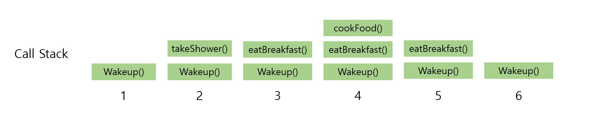

# Udemy - Javascript - 재귀


## 재귀 (Recursion)

> 재귀는 자기 자신을 부르는 과정, (Javascript 같은 경우 함수) 이다
>
> 함수가 함수를 부르는 것이다

- 재귀 함수는 많은 곳에서 쓰인다
  - JSON.parse / JSON.stringify
  - `document.getElementById` 그리고 DOM 등 많은 `div`가 있는데, 그것을 찾기 위해 재귀 함수를 사용할 수도 있다
  - 더 복잡한 자료구조를 해결할 때 유용할 수 있다
  - iteration보다 더 깔끔할 대체자가 될 수 있다


### 스택 호출하기

> #### Call Stack

- 스택 자료 구조다 (스택은 LIFO - Last In First Out)
- 함수가 적용될 때마다 `Call Stack` 위에 쌓이게 된다 (**PUSH**)
- 그리고 JavaScript가 `return` 단어를 보게 되거나, 함수가 끝났을 때에, 쌓여진 `Call Stack`의 함수들은 위에서 부터 하나씩 빠지게 된다 (**POP**)

```javascript
function takeShower() {
    return "Showering!"
}

function eatBreakfast() {
    let meal = cookFood()
    return `Eating ${meal}`
}

function cookFood() {
    let items = ["Oatmeal", "Eggs", "Protein Shake"]
    return items[Math.floor(Math.random() * items.length)];
}

function wakeUp() {
    takeShower()
    eatBreakfast()
    console.log("Ok ready to go to work!")
}

wakeUp()
```



1. `wakeUp()` 함수를 실행한다 (이미지에 Wakeup()은 무시...)
2. 코드에서 `wakeUp()` 함수를 보게 되면 `takeShower()`라는 함수를 실행하게 된다
   - `takeShower()`를 Call Stack에 넣고, 그 함수를 실행한다
   - `takeShower()`에서 "Showering!"을 **return** 하면, `takeShower()`를 Call Stack에서 pop을 한다
3. 그 다음은 `eatBreakfast()` 함수를 Call Stack에 push하며 함수를 호출하는 것이다
4. `eatBreakfast()` 같은 경우 `cookFood()` 함수를 호출한다. 즉 `cookFood()` 함수를 Call Stack에 push 하는 것이다
   - `cookFood()` 함수에서 `items`를 **return** 하면 Call Stack에서 pop을 한다 
5. `eatBreakfast()`에서 `cookFood()`함수를 통해 `meal`의 값을 가져왔으니, `Eating ${meal}`을 **return** 할 수 있다
   - **return**을 하며, `eatBreakfast()`도 Call Stack에서 pop을 한다
6. 마지막은 `wakeUp()` 함수에, 이제 남은 함수가 없으니 "Ok ready to go to work!" 를 출력하고 Call Stack에서 pop을 하면 된다


### 재귀함수에서 필요한 두 가지

> Base Case

- 재귀함수, 즉 함수를 계속 부르는 것을 끝내는 코드가 꼭 있어야 한다

> Difference Input

- 같은 입력값을 계속 있으면, 재귀 함수가 끝나지 않거나, 제대로된 답을 얻지 못 할 것이다


```javascript
function countDown(num) {
    if (num <= 0) {
        console.log("All done!")
        return;
    }
    console.log(num)
    num --;
    countDown(num)
}
```

- num 이 0 이하일때, `countDown(num)` 함수를 끝낸다
- num이 1 이상일 때
  - `console.log(num) `  :  `num`을 출력한다
  - `num --`  :  `num`을 1씩 뺀다
  - `countDown(num) ` :  `countDown(num)` 함수를 다시 실행한다


```javascript
function sumRange(num) {
    if (num === 1) return 1;
    return num + sumRange(num-1);
}

sumRange(3)
//  1.	return 3 + sumRange(2)
//	2.		return 2 + sumRange(1)
//	3.			return 1
```

- 1번부터 3번까지 sumRange(num)에 num의 값이 1이 될때까지 Call Stack에 push 해 놓는다
  - base case가 `num === 1`이기 때문이다
  - `num === 1` 이 아닐 경우 `num + sumRange(num-1)` 을 해줘야 한다
- 그리고 num의 값이 1이 되었을 때
  - 3번에서 `1`을 `return`해준다. 즉 `sumRange(1)은 1이라는 뜻`
  - 2번에서 `return 2 + 1` 을 한다
  - 1번에서 `return 3 + 3`을 하면 값이 나온다


### 팩토리얼 (재귀로 풀기)

```javascript
function factorial(num) {
    if (num === 1) {
        return 1
    }
    return num * factorial(num - 1)
}
```

- sumRange() 함수와 로직은 같다


## Helper Method Recursion

함수 안에 함수를 넣는 것

리스트 안에 값을 넣을 때 유용하다

```javascript
function collectOdds(nums) {
    let result = [];
    
    function helper(helperInput) {
        if (helperInput.length === 0) {
            return ;
        }
        if (helperInput[0] % 2 !== 0) {
            result.push(helperInput[0])
        }
        helper(helperInput.slice(1))
    }
    
    helper(arr)
    
    return result;
}
```

- 원래 result 리스트를 function 밖에다 넣어도 되지만, helper method recursion을 사용해서 함수 안에 리스트를 넣어서, 리스트 안에 값을 채워 넣을 수 있다


