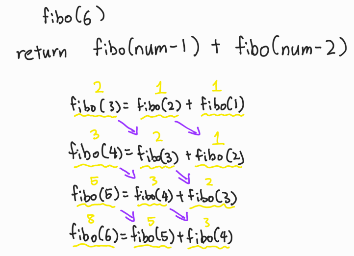

# Udemy - Javascript - 재귀 문제풀이


## Power()

> 거듭제곱을 재귀로 만든다

```javascript
function power(num1, num2) {
    if (num2 === 0) return 1;
    return num1 * power(num1, num2 - 1)
}
```

- `num2` 가 0이면 1을 반환한다
  - 예) `2 ^ 0 = 1` / `4 ^ 0 = 1 `
- `num2`가 0이 될때까지 `return num1 * power(num1, num2 - 1)`를 call stack에 넣어준다
- `num2`가 0이 되면 `if (num2 === 0) return 1;`을 통해 1을 반환한다
- call stack에 넣어둔 만큼 `num1`을 `power(num1, num2 - 1)`과 곱하면 결과값이 나온다


## Factorial()

> 팩토리얼을 계산 하는 것이다
>
> 주어진 수 부터, 그 아래에 있는 모든 수들을 곱하는 것
>
> 예) 5! = 5 * 4 * 3 * 2 * 1
>
> 예2) 8! = 8 * 7 * 6 * 5 * 4 * 3 * 2 * 1

```javascript
function factorial(num1) {
    if (num1 <= 1) return 1;
    return num1 * factorial(num1 - 1)
}
```

- `power()`보다 간단하다
- `return num1 * factorial(num1 - 1)`을 `num1 - 1`이 1이 될때까지 call stack에 넣어준다
- `factorial(num1 - 1)`이 1을 반환하게 되면, 그때부터 call stack에 있던 함수들을 pop 해서 `num1`과 곱해준다
  - 즉 `num1 - 1` 이 1보다 작거나 같을 경우 1을 반환하는 것이고, 이것이 base case/ 재귀함수를 끝내는 공식이다


## ProductOfArray()

> 배열에 있는 숫자들을 모두 곱하는 것
>
> product = 곱샘

```javascript
function productOfArray(array) {
    if (array.length === 0) return 1;
    return array.pop() * productOfArray(array)
}
```

- 이 함수는 리스트를 입력 값으로 받아낸다
- 리스트의 길이가 0일 때 1을 반환해준다 (Base Case)
- `return array.pop() * productOfArray(array)` 리스트에 있는 숫자를 pop을 통해 빼내고 call stack에 넣어준다
  - 이것을 리스트에 아무 숫자가 없을때까지 반복
  - 숫자가 없을 때 1을 반환할 것이고, 그전에 pop으로 빼냈던 숫자들을 call stack에서 빼내서, 곱해주면 값이 나온다


## Recursive Range

> 숫자가 주어지면, 숫자를 포함해, 그 밑에 있는 모든 숫자들을 더하는 것

```javascript
function recursiveRange(num) {
    if (num < 0) return 0;
    return num + recursiveRange(num - 1)
}
```


## 피보나치

> 피보나치 수열을 구하는 것




```javascript
function fib(num) {
    if (num <= 2) return 1;
    return fib(num - 1) + fib(num - 2)
}
```

